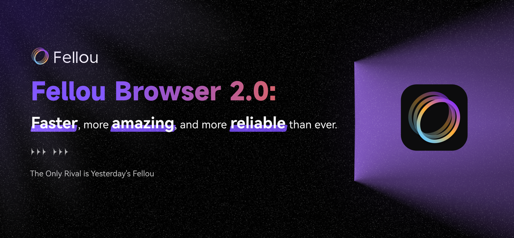
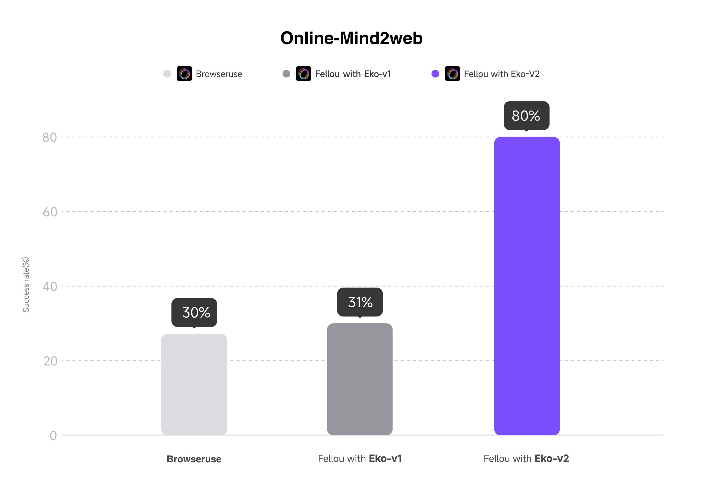

> In the Marvel Cinematic Universe, Jarvis is Iron Man Tony Stark's personal AI assistant, omnipresent and ready to support and assist Tony at any time. Jarvis is not just a simple voice assistant; it is deeply integrated into Tony's life, managing his daily affairs, controlling his high-tech devices, and even providing real-time tactical advice during battles. Jarvis's presence allows Tony to focus on more important matters, knowing that a reliable assistant is supporting him in the background.

Over the past month, we have undertaken deep architectural adjustments and comprehensive optimizations of the Fellou browser. This series of improvements not only enhances performance and stability but also provides users with a smoother experience. Today, we are very proud to announce that Fellou 2.0 has taken a significant step towards our dream of a Jarvis-like general intelligence agent.

We hope that Fellou is not just a tool but an intelligent partner that can integrate into users' daily lives. Our vision is for Fellou to become an indispensable part of users' lives, providing help and support anytime, anywhere, rather than just being a virtual assistant floating in the cloud.

From this article, you will learn:

1. Why we are building our dream Jarvis centered around an Agentic Browser.
2. Fellou Browser 2.0: Initiating Mass Production of AI.
3. The key to Fellou 2.0's success — Eko 2.0, a crucial open-source Browser-use infrastructure.
4. Fellou's next steps.

## Why Agentic Browser?

Agentic Browser represents a type of general-purpose intelligent agent based on a browser. It not only can access the internet but also understands user needs and automatically breaks down complex tasks. Its design aims to deliver better results for users by having the complete context of the user, fundamentally changing the way users interact with the web and computers.

Fellou, with its unique Browser + Workflow + Agent architecture, pioneered the new category of Agentic Browser, creating a browser agent that can "surf automatically" like an "autonomous car."

Imagine no longer needing to switch between multiple applications to complete a task. Fellou can automate the entire process for you, from information gathering and data analysis to final task execution and result delivery. Whether it's conducting market research, generating reports, creating music, generating 3D design environments, or making logos, Fellou can provide you with end-to-end solutions.

Fellou's goal is to bring happiness to users through its existence—happiness that comes from freeing hands, liberating repetitive labor, and escaping from cubicles, computers, and office buildings—but not from work. People derive satisfaction from work, and Fellou's existence allows people to engage in more dopamine-inducing tasks, leaving those that drain spirit, patience, and energy to Fellou.

Time is a non-renewable resource for everyone, and giving people the time and freedom to be themselves is Fellou's original intention.

This is also the fundamental reason why we designed and developed Fellou and adhered to the direction of Agentic Browser—we believe that the development of AI will accelerate the demand for more creativity rather than reduce job opportunities. Humans and AI are in a relationship of collaboration and achievement, not opposition. As a browser client on the user's local device, Fellou is the general-purpose intelligent agent that holds the most memories, preferences, understands the user best, is ubiquitous, responsive, and integrated into the user's life.

With this expectation, we have completed the upgrade to Fellou 2.0 to deliver even better results to users.

## Fellou Browser 2.0: Initiating Mass Production of AI

**Summary of Fellou 2.0 Upgrade:**

1. **Faster**: Parallel multitasking reduces wait time and delivers more results.
2. **More Amazing**: Supports a wide range of task outputs—files, images, websites, and more—executed automatically 24/7.
3. **More Reliable**: Handles complex, production-ready scenarios, with task success rates rising from 31% to 80%, far surpassing previous versions.

### Faster: Parallel multitasking reduces wait time and delivers more results

Due to extensive, comprehensive, and multi-dimensional optimizations, Fellou 2.0 has achieved a breakthrough in speed. Compared to Fellou 1.x versions, Fellou has improved execution speed by **1.3 to 1.5 times** across different tasks. Compared to some general agents, we have significant speed advantages in various scenarios:

- **Task 1: Generate a 3D Minecraft scene featuring the Eiffel Tower.**

  <video width='800' controls>
  	<source
  		src='https://fellou.s3.us-west-1.amazonaws.com/videos/Fellou_2.0_MKT_Video/37_Final.mp4'
  		type='video/mp4'
  	/>
  </video>

  Fellou Time: 1 minute 20 seconds

  Other agent product's time: 4 minutes 30 seconds

  Fellou Deliverable: [https://chat.dev.fellou.ai/sites/3d-minecraft-eiffel-tower-NdSWZGi\_](https://chat.dev.fellou.ai/sites/3d-minecraft-eiffel-tower-NdSWZGi_)

- **Task 2: Convert "Fellou is the World's First Agentic Browser" into Morse code, then generate an audio file in MP3 format.**

  <video width='800' controls>
  	<source
  		src='https://fellou.s3.us-west-1.amazonaws.com/videos/Fellou_2.0_MKT_Video/39_Final.mp4'
  		type='video/mp4'
  	/>
  </video>

  Fellou Time: 1 minute 30 seconds

  Other agent product's time: 2 minutes 30 seconds

  Fellou Deliverable:

  <audio width='800' controls>
  	<source
  		src='https://fellou.s3.us-west-1.amazonaws.com/download/MKT_Download/Fellou_2.0_Deliverable/fellou_morse_code.mp3'
  		type='audio/mpeg'
  	/>
  </audio>

  
	<a
	href="https://fellou.s3.us-west-1.amazonaws.com/download/MKT_Download/Fellou_2.0_Deliverable/fellou_morse_code.zip"
	download
	style="
		display: inline-flex;
		align-items: center;
		gap: 10px;
		padding: 4px 14px;
		font-size: 16px;
		font-weight: 500;
		color: #333;
		text-decoration: none;
		background: white;
		border: 1px solid rgba(0, 0, 0, 0.1);
		border-radius: 8px;
		transition: all 0.2s ease;
		box-shadow: 0 2px 8px rgba(0, 0, 0, 0.08);
		font-family: -apple-system, BlinkMacSystemFont, 'Segoe UI', Roboto, Helvetica, Arial, sans-serif;
		margin-top: 20px;
	"
	onMouseEnter="this.style.background='#f8f9fa'; this.style.boxShadow='0 4px 12px rgba(0, 0, 0, 0.12)'; this.style.borderColor='rgba(0, 0, 0, 0.15)'"
	onMouseLeave="this.style.background='white'; this.style.boxShadow='0 2px 8px rgba(0, 0, 0, 0.08)'; this.style.borderColor='rgba(0, 0, 0, 0.1)'"
	onMouseDown="this.style.transform='translateY(1px)'; this.style.boxShadow='0 1px 4px rgba(0, 0, 0, 0.1)'"
	onMouseUp="this.style.transform='translateY(0px)'; this.style.boxShadow='0 4px 12px rgba(0, 0, 0, 0.12)'"
	>
	<svg
		width="18"
		height="18"
		viewBox="0 0 24 24"
		fill="none"
		stroke="currentColor"
		stroke-width="2"
	>
		<path d="M21 15v4a2 2 0 0 1-2 2H5a2 2 0 0 1-2-2v-4" />
		<polyline points="7,10 12,15 17,10" />
		<line x1="12" y1="15" x2="12" y2="3" />
	</svg>
	Download all deliverables
	</a>

- **Task 3: Create a Snake game using HTML.**

  <video width='800' controls>
  	<source
  		src='https://fellou.s3.us-west-1.amazonaws.com/videos/Fellou_2.0_MKT_Video/43_Final.mp4'
  		type='video/mp4'
  	/>
  </video>

  Fellou Time: 1 minute 20 seconds

  Other agent product's time: 6 minutes

  Fellou Deliverable: https://chat.dev.fellou.ai/sites/snake-game-classic-retro-fun-aiz5HkaM

- **Task 4: Based on [notion webpage](https://www.notion.so/A-Quick-Tour-of-What-Fellou-Can-Do-1ca36270eaab80f8b8afde217a2942a8?pvs=4), generate promotional content and post it to Twitter, LinkedIn, and Hacker News.**

  <video width='800' controls>
  	<source
  		src='https://fellou.s3.us-west-1.amazonaws.com/videos/Fellou_2.0_MKT_Video/10_Final.mp4'
  		type='video/mp4'
  	/>
  </video>

  Fellou successfully executed the task, while some general agents failed to post the generated promotional content to Twitter, LinkedIn, and Hacker News, only managing to generate the promotional copy.

At the same time, we have optimized the multitasking capabilities, allowing users to assign multiple tasks to Fellou simultaneously, greatly enhancing users' multitasking abilities:

- **Task A**: Create a website based on the specified YouTube AI-related video, summarizing the core knowledge of the video. This includes the main points of the video, how it explains AI Agents and Agentic Reasoning, and the significance and application trends in AI development. The website should conclude with a few questions to test whether the knowledge has been acquired.
- **Task B**: Use the specified Google Sheet bill as a data source and generate a bill analysis website. The website should allow for custom filtering from various dimensions.

  <video width='800' controls>
  	<source
  		src='https://fellou.s3.us-west-1.amazonaws.com/videos/Fellou_2.0_MKT_Video/Task_parallelism.mp4'
  		type='video/mp4'
  	/>
  </video>

> **Note:** The parallel task feature is currently in the Alpha stage and will be significantly different in the official release.

### **More Amazing:** Supports a wide range of task outputs—files, images, websites, and more—executed automatically 24/7

By offering a diverse range of agents (such as Browser Agent, Coding Agent, File Agent, Shell Agent, Computer-use Agent, etc.), we facilitate cross-application productivity workflows. This includes delivering a variety of outputs such as reports, text, images, websites, PPTs, CSVs, Excel, Word documents, MP3s, video-to-audio conversions, logo generation, and summarizing YouTube videos.

- **Marketing Delivery Task (cross-application workflow):**  
  Search for posts about the browser on Reddit, Twitter, YouTube, TikTok in the past week, and comment on the posts to recommend Fellou AI.

      <video width='800' controls>
      	<source src='https://fellou.s3.us-west-1.amazonaws.com/videos/Fellou_2.0_MKT_Video/4_Final.mp4' type='video/mp4' />
      </video>

- **Website Delivery Task:**  
  Create an adaptive meditation app that generates personalized audio guidance based on the user's current emotional state and meditation goals. Combine binaural beats, natural sounds, and dynamic guided voiceovers to create a sound environment that supports effective meditation.

      <video width='800' controls>
      	<source src='https://fellou.s3.us-west-1.amazonaws.com/videos/Fellou_2.0_MKT_Video/30_Final.mp4' type='video/mp4' />
      </video>

  Fellou Deliverable: https://chat.dev.fellou.ai/sites/adaptive-meditation-personalized-mind-wellness-_CNAb5A0

- **Audio Delivery Task:**  
  Generate a complete set of feedback sound effects for smart home devices.

  <video width='800' controls>
  	<source
  		src='https://fellou.s3.us-west-1.amazonaws.com/videos/Fellou_2.0_MKT_Video/42_Final.mp4'
  		type='video/mp4'
  	/>
  </video>

  Fellou Deliverable:

  <audio width='800' controls>
  	<source
  		src='https://fellou.s3.us-west-1.amazonaws.com/download/MKT_Download/Fellou_2.0_Deliverable/alarm_clock.wav'
  		type='audio/mpeg'
  	/>
  </audio>

    

  <audio width='800' controls>
  	<source
  		src='https://fellou.s3.us-west-1.amazonaws.com/download/MKT_Download/Fellou_2.0_Deliverable/error_alert.wav'
  		type='audio/mpeg'
  	/>
  </audio>

	<a
	href="https://fellou.s3.us-west-1.amazonaws.com/download/MKT_Download/Fellou_2.0_Deliverable/smart_home_sounds_complete.zip"
	download
	style="
		display: inline-flex;
		align-items: center;
		gap: 10px;
		padding: 4px 14px;
		font-size: 16px;
		font-weight: 500;
		color: #333;
		text-decoration: none;
		background: white;
		border: 1px solid rgba(0, 0, 0, 0.1);
		border-radius: 8px;
		transition: all 0.2s ease;
		box-shadow: 0 2px 8px rgba(0, 0, 0, 0.08);
		font-family: -apple-system, BlinkMacSystemFont, 'Segoe UI', Roboto, Helvetica, Arial, sans-serif;
		margin-top: 20px;
	"
	onMouseEnter="this.style.background='#f8f9fa'; this.style.boxShadow='0 4px 12px rgba(0, 0, 0, 0.12)'; this.style.borderColor='rgba(0, 0, 0, 0.15)'"
	onMouseLeave="this.style.background='white'; this.style.boxShadow='0 2px 8px rgba(0, 0, 0, 0.08)'; this.style.borderColor='rgba(0, 0, 0, 0.1)'"
	onMouseDown="this.style.transform='translateY(1px)'; this.style.boxShadow='0 1px 4px rgba(0, 0, 0, 0.1)'"
	onMouseUp="this.style.transform='translateY(0px)'; this.style.boxShadow='0 4px 12px rgba(0, 0, 0, 0.12)'"
	>
	<svg
		width="18"
		height="18"
		viewBox="0 0 24 24"
		fill="none"
		stroke="currentColor"
		stroke-width="2"
	>
		<path d="M21 15v4a2 2 0 0 1-2 2H5a2 2 0 0 1-2-2v-4" />
		<polyline points="7,10 12,15 17,10" />
		<line x1="12" y1="15" x2="12" y2="3" />
	</svg>
	Download all deliverables
	</a>

- **Musical Conversion Task:**  
  Generate sheet music in the style of Lady Gaga's "Bad Romance," then convert it into an MP3 format.

  <video width='800' controls>
  	<source
  		src='https://fellou.s3.us-west-1.amazonaws.com/videos/Fellou_2.0_MKT_Video/50_Final.mp4'
  		type='video/mp4'
  	/>
  </video>

  Fellou Deliverable:

  <audio width='800' controls>
  	<source
  		src='https://fellou.s3.us-west-1.amazonaws.com/download/MKT_Download/Fellou_2.0_Deliverable/electric_hearts.mp3'
  		type='audio/mpeg'
  	/>
  </audio>

	<a
	href="https://fellou.s3.us-west-1.amazonaws.com/download/MKT_Download/Fellou_2.0_Deliverable/electric_hearts.zip"
	download
	style="
		display: inline-flex;
		align-items: center;
		gap: 10px;
		padding: 4px 14px;
		font-size: 16px;
		font-weight: 500;
		color: #333;
		text-decoration: none;
		background: white;
		border: 1px solid rgba(0, 0, 0, 0.1);
		border-radius: 8px;
		transition: all 0.2s ease;
		box-shadow: 0 2px 8px rgba(0, 0, 0, 0.08);
		font-family: -apple-system, BlinkMacSystemFont, 'Segoe UI', Roboto, Helvetica, Arial, sans-serif;
		margin-top: 20px;
	"
	onMouseEnter="this.style.background='#f8f9fa'; this.style.boxShadow='0 4px 12px rgba(0, 0, 0, 0.12)'; this.style.borderColor='rgba(0, 0, 0, 0.15)'"
	onMouseLeave="this.style.background='white'; this.style.boxShadow='0 2px 8px rgba(0, 0, 0, 0.08)'; this.style.borderColor='rgba(0, 0, 0, 0.1)'"
	onMouseDown="this.style.transform='translateY(1px)'; this.style.boxShadow='0 1px 4px rgba(0, 0, 0, 0.1)'"
	onMouseUp="this.style.transform='translateY(0px)'; this.style.boxShadow='0 4px 12px rgba(0, 0, 0, 0.12)'"
	>
	<svg
		width="18"
		height="18"
		viewBox="0 0 24 24"
		fill="none"
		stroke="currentColor"
		stroke-width="2"
	>
		<path d="M21 15v4a2 2 0 0 1-2 2H5a2 2 0 0 1-2-2v-4" />
		<polyline points="7,10 12,15 17,10" />
		<line x1="12" y1="15" x2="12" y2="3" />
	</svg>
	Download all deliverables
	</a>

- **Logo Delivery Task:**  
  Redesign a logo for a cutting-edge technology company (OPENAI) using SVG, embodying innovation, modernity, and forward-thinking.

  <video width='800' controls>
  	<source
  		src='https://fellou.s3.us-west-1.amazonaws.com/videos/Fellou_2.0_MKT_Video/34_Final.mp4'
  		type='video/mp4'
  	/>
  </video>

  Fellou Deliverable: https://chat.dev.fellou.ai/sites/openai-logo-redesign-showcase-WQmkVWkq

In addition, Fellou 2.0 offers extended context management, especially for monitoring tasks (such as listening for new messages on Slack, Discord, email monitoring, and webpage content change monitoring). This has achieved unlimited step length, truly addressing the challenges of long processes and complex scenarios.

- **Gmail Delivery Task:**  
  Monitor my Gmail account and reply to user product feedback emails in a friendly way to express my gratitude. Break down the requirements and bugs mentioned in the user emails and fill them in the Airtable feedback form.

  <video width='800' controls>
  	<source
  		src='https://fellou.s3.us-west-1.amazonaws.com/videos/Fellou_2.0_MKT_Video/27_Final.mp4'
  		type='video/mp4'
  	/>
  </video>

### More Reliable: Handles complex, production-ready scenarios, with task success rates rising from 31% to 80%, far surpassing previous versions

“Production-ready” means being more aligned with users' actual needs, more end-to-end, more autonomous, and closer to “money.” This includes diverse scenario applications such as information reporting, data transfer, social media management, recruitment process closure, and automated negotiations in cross-border e-commerce.

- **People-Finding Task:**  
  Identify the first five authors from the uploaded PDF, then help me find their complete background information and contact details. Background information includes their Homepage, Google Scholar link, and GitHub link. Contact details include email and phone number. You can find their commit email by using their GitHub repo commit history URL and `.patch`. Additionally, use ContactOut (www.contactout.com) to find their email and phone number. All links must be complete URLs.

  <video width='800' controls>
  	<source
  		src='https://fellou.s3.us-west-1.amazonaws.com/videos/Fellou_2.0_MKT_Video/8_Final.mp4'
  		type='video/mp4'
  	/>
  </video>

- **Marketing Task:**  
  Find two pet bloggers with 10k+ followers on Twitter/Instagram/YouTube/TikTok, and send them private messages to ask if they can cooperate in promoting Brand A cat food. Ignore the private message step for YouTube. Summarize the basic information of the bloggers into a web report.

  <video width='800' controls>
  	<source
  		src='https://fellou.s3.us-west-1.amazonaws.com/videos/Fellou_2.0_MKT_Video/22_Final.mp4'
  		type='video/mp4'
  	/>
  </video>

- **Job-Finding Task:**  
  Based on the uploaded resume content, help me find suitable jobs in Silicon Valley on LinkedIn, find the hiring managers on LinkedIn, fill in their application forms based on my resume content, and submit them.

  <video width='800' controls>
  	<source
  		src='https://fellou.s3.us-west-1.amazonaws.com/videos/Fellou_2.0_MKT_Video/17_Final.mp4'
  		type='video/mp4'
  	/>
  </video>

These tasks are just the tip of the iceberg, with more awaiting discovery, thanks to the new architecture of Eko 2.0. In the Online-mind2web benchmark, the task completion rate has increased from 31% to 80%.

## The key to Fellou 2.0’s success — Eko 2.0, a crucial open-source Browser-use infrastructure

Based on the new Eko 2.0 architecture, the task success rate has increased from 31% to 80%, achieving state-of-the-art performance in the Online-mind2web benchmark.

Eko is positioned as a framework for Browser-use and Computer-use. In Eko 2.0, we provide essential infrastructure capabilities such as Multi-Agent, DOM state change monitoring, Loop Tasks management, and Workflow planning. The decision to open-source Eko 2.0 to the community is deeply rooted in our technical beliefs—not only a love for technology itself but also a firm conviction in better shaping the future of GUI Agents.

## Fellou’s Next Steps

Fellou is rapidly becoming smarter.

**Brief Summary:**

1. Fellou will soon release a Windows version.
2. The invitation code mechanism will soon be removed.
3. Fellou's model intelligence will rapidly improve, offering more diverse deliverables.
4. Fellou will continue to optimize user experience, reflected in:
   - Faster speed, combining Agentic Workflow and browser performance.
   - Better interaction with more complete context awareness, memory, multi-turn dialogue, and an interface better integrated with AI capabilities.
   - Addition of highly anticipated features like migration tools and password managers.

**Next Steps for You:**

1. For users who haven't used Fellou, visit [fellou.ai](https://fellou.ai) to apply for access. We will continue to distribute invitation codes.
2. For existing Fellou users:
   - The architecture update is significant, and versions below 2.0 are no longer usable. You will receive updates gradually when opening the installed Fellou, or you can manually download the latest version from the website ([fellou.ai/download](https://fellou.ai/download)).
   - Fellou 2.0 is still in the beta testing phase. You can use `Use Workflow: ` in the dialogue box to enable the latest capabilities.
   - When executing long tasks, it's recommended to prompt Fellou to search. The more you search and the more precise the prompts, the better the output will be.

> Dominic-Y · X, Founder of Fellou  
> Follow me on X: [@domioak](https://x.com/domioak)  
> June 3, 2025