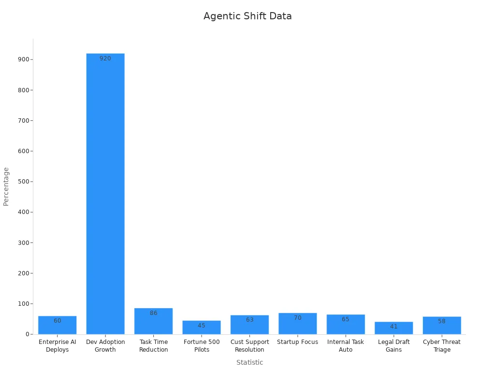
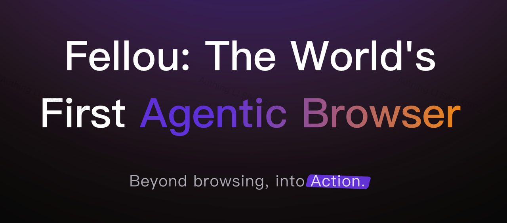
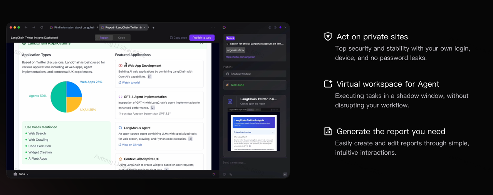
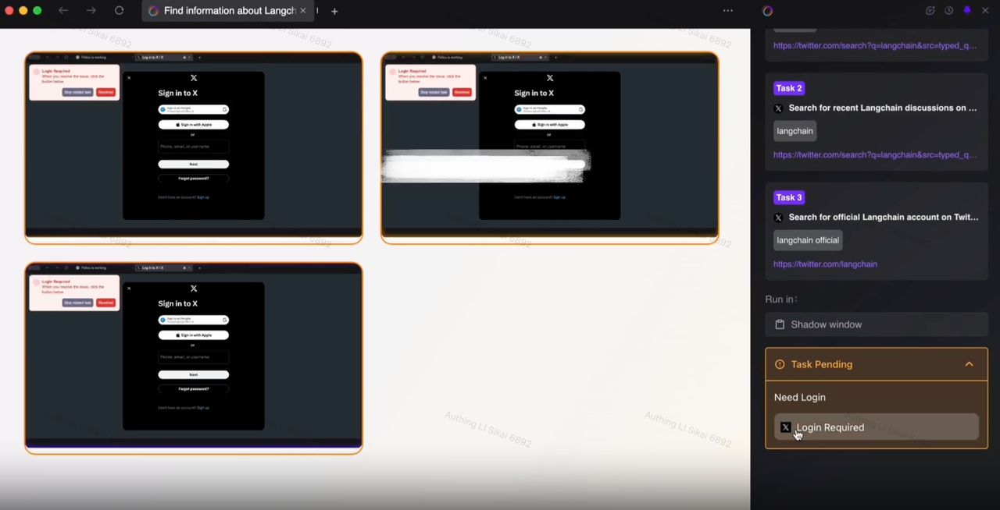
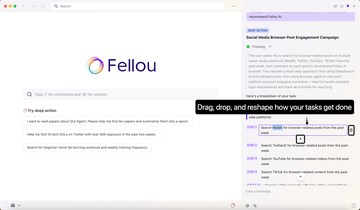
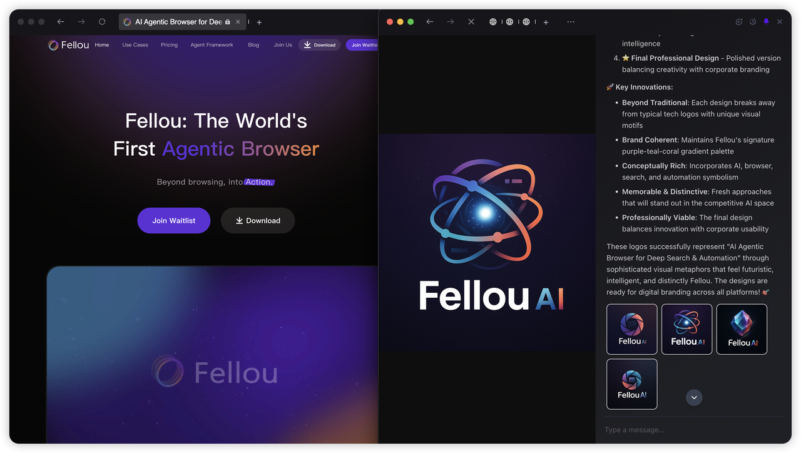
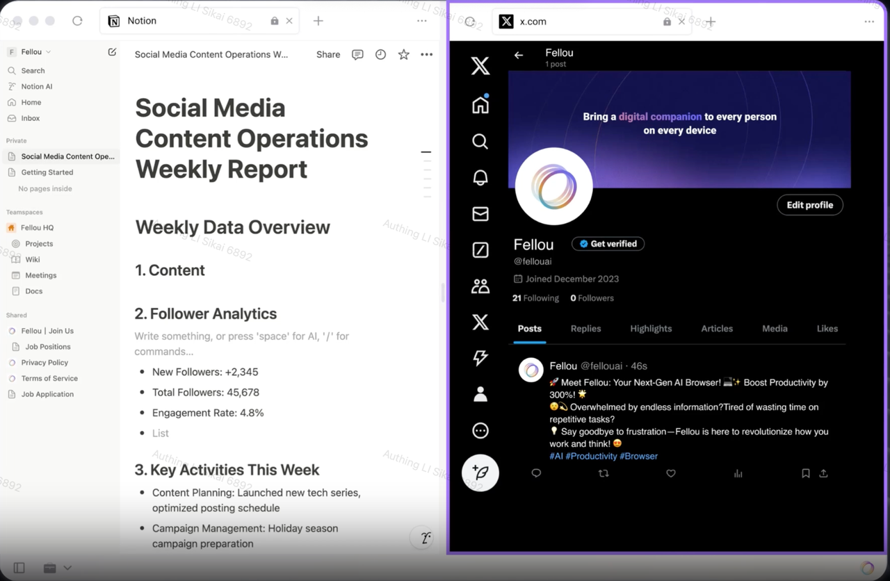

An agentic browser helps you by knowing what you want. It does things for you to get results, not just show information. A traditional browser only lets you look at web pages. An AI browser answers questions. But an agentic browser can plan and finish tasks by itself. This change is happening in many digital tools now. The [agentic AI market will grow from $2.9 billion in 2024 to $48.2 billion by 2030](https://digitaldefynd.com/IQ/agentic-ai-statistics/). This shows people are moving from just browsing to taking action.

Today, Fellou is a leader as a digital productivity partner. It uses special agents to automate hard workflows. This helps you focus on creative work while the browser does the rest.

## Key Takeaways

*   ✨ Agentic browsers do more than just show websites. They know what you want and help finish tasks for you with little help.
    
*   🤖 Fellou is a leader in agentic browsers. It uses smart AI agents that work together to do hard jobs automatically.
    
*   ⏰ Agentic browsers save time by making tasks take fewer steps. They also help you finish more tasks successfully.
    
*   👤 These browsers learn what you like and change to fit your needs. This makes your online time easier and more personal.
    
*   🛠️ Fellou has special tools like a Shadow Workspace to watch tasks. You can control the AI agents and use teamwork for better results.
    
*   🚀 Agentic browsers help you get more done by doing simple jobs for you. This lets you spend more time on creative and important things.
    
*   🔮 In the future, browsing will feel like having a digital helper. It will learn from you, act for you, and help you reach your goals faster.
    

## Agentic Browser: The Next Evolution

### What Is an Agentic Browser

You use a browser to visit sites, search, or watch videos. An [agentic browser](https://chat.fellou.ai/report/27850769-adda-457e-88bd-4101ed6de666) makes this easier and smarter. It does more than just show pages or answer questions. It knows what you want and acts for you. The agentic browser can plan and finish tasks by itself. You give it a goal, and it figures out the steps. For example, if you want a report on AI trends, just ask. The agentic browser will search, collect data, study it, and give you the report.

This new browser uses agentic AI. It mixes smart thinking, memory, and action. The browser remembers what you like and learns from you. It changes to fit your needs. It works like a digital helper that gets results, not just facts.

> **Note:** Agentic browsers use reasoning-action cycles. They think, plan, act, and check their work. They repeat these steps until your goal is done.

### Next Evolution Beyond AI Browsers

Some AI browsers answer questions or sum up articles. These tools use artificial intelligence to help, but you still guide them. The agentic browser is the next step. It acts for you with less help from you.

Agentic AI systems use [many agents that work together](https://arxiv.org/html/2505.10468v1). One agent might search, another sums up, and another organizes. These agents talk and solve problems as a team. They break big jobs into small ones and check their work. This teamwork lets the agentic browser do hard jobs, like booking a trip or making a report, without you doing each step.

New technology shows agentic browsing is getting better. [More companies now make agentic AI products](https://medium.com/elaia/agentic-ai-the-next-r-evolution-384bd77f5c57). New tools can know what you want, use voice, and make things personal. These changes show agentic browsers are not just smart—they are more helpful and work on their own.

### Agentic Browser vs. Traditional Browsers

You may wonder how agentic browsers are different. Here is a simple table to show the differences:

| Feature / Metric | Traditional Browser | AI Browser | Agentic Browser |
| --- | --- | --- | --- |
| Main Function | Shows web pages | Answers questions, summarizes | Designed for executing complex web-based workflow |
| User Input Needed | High | Medium | Low |
| Autonomy | None | Some | High |
| Task Complexity | Simple | Moderate | Complex, multi-step |
| Workflow Automation | No | Limited | Full, end-to-end |
| Reasoning-Action Cycles | No | Basic | Advanced |
| Success Rate (Multi-step Tasks) | Low | Moderate | Up to 80% higher |
| Steps to Complete Tasks | Many | Fewer | One step |

Agentic browsers save you time and work. They cut down the steps you need and help you succeed. For example, you can ask the agentic browser to fill forms, gather data, or make documents. It does these jobs with little help from you.

> *   Agentic browsers use teamwork, smart planning, and memory.
>     
> *   They change when things go wrong, fix mistakes, and keep working until your job is done.
>     
> *   Traditional browsers need you to click, type, and do everything yourself.
>     

The market shows this change. In the early 2000s, people had about 5 web sessions a day. Now, you spend almost 7 hours online each day. Over half of all internet traffic comes from bots, and zero-click searches are common. This trend shows users want browsers that do more for them.

| Metric / Indicator | Early 2000s / Baseline | Recent / Current Data (2021-2024) | Notes |
| --- | --- | --- | --- |
| Average daily web sessions | 5.3 sessions/day | 7 hours/day, continuous use | Digital Wellness Institute (2021) |
| Bot traffic as % of internet | 47.4% (2022) | 51% (2024) | Imperva (2024) |
| Zero-click search rate (US/EU) | N/A | 58.5%-59.7% (2024) | SparkToro (2024) |
| Enterprise AI adoption | 50% (2022) | 78% (2024) | Gartner (2024) |

Agentic browsers like Fellou lead this change. They use [agentic AI](https://fellou.ai/blog/post/eko-first-launch/) to automate your work, know what you want, and get results. You get more done with less effort, making your digital life easier and better.

## Key Features of Agentic Browsers

### Autonomous Task Execution

An [agentic browser](https://fellou.ai/) does more than show web pages. It works as your digital helper and uses agentic AI to finish tasks for you. You give it a goal, and it figures out the steps. The browser collects information and gives you results. You do not have to tell it what to do every time. It makes its own choices and uses built-in agents for hard jobs.

Agentic AI systems work well in real life. They can get and use data, [make dashboards, and set limits without people coding](https://www.automationworld.com/analytics/article/55283897/aveva-agentic-ai-in-industrial-operations-autonomous-task-execution-and-human-ai-synergy). These agents work together, pick the right data, and even set alarms by themselves. This kind of automation helps save time and effort in places like factories and energy companies.

You can check how well these browsers work by looking at some [key numbers](https://www.joulica.io/blog/rethinking-performance-in-the-age-of-agentic-ai-a-new-kpi-framework). Here is a table that shows important ways to see their performance:

| Category | Key Metrics / KPIs | Description / Purpose |
| --- | --- | --- |
| Core KPIs | Task Resolution Time, Agent Latency, Goal Invocation Frequency, Input Acquisition Delay, Agent Downtime, Cognitive Load Time | Measure efficiency, responsiveness, and decision-making complexity of autonomous agents. |
| Agentic Path Analytics | Goal Path Diversity, Plan Recalibration Rate, Planning Complexity Score, Outcome Fidelity, Multi-Goal Execution Rate | Evaluate the flexibility, coherence, and optimality of agent task execution paths. |
| Success and Error Rate KPIs | Autonomous Resolution Rate, Human Intervention Rate, Instruction Comprehension Rate, Intent Drift Rate, Agent Adoption Rate | Assess operational success, error rates, autonomy level, and human intervention frequency. |
| Business KPIs | Value per Agent, Cost per Goal Achieved, Time Efficiency Gain, Agentic UX Score | Measure business impact, cost efficiency, time savings, and user experience improvements from agentic systems. |

These numbers help you see how agentic browsers make your work faster and easier.

### Workflow Automation

Agentic browsers help you [automate daily business tasks](https://fellou.ai/use-cases). You can set up complex workflows that used to take a long time. The browser uses many agents to do each step, like collecting data, sending emails, or making reports. You just set your goal, and the browser does the rest.

Many companies have seen big changes with agentic AI. Here are some examples:

*   [Bank of America grew its sales pipeline by 300%](https://superagi.com/case-studies-in-agentic-ai-how-companies-are-transforming-their-go-to-market-efforts-with-autonomous-ai-agents/) after using AI-powered sales outreach.
    
*   Mercedes-Benz improved customer experiences by connecting their virtual assistant with sales tools.
    
*   Small businesses scaled up without hiring more staff by automating sales, customer service, and marketing.
    
*   Bayer used predictive analytics to better understand health trends and engage customers.
    
*   AES saved money and improved safety by automating energy audits.
    
*   Indeed cut recruitment time by 30% with a hybrid human-AI model.
    
*   Finnair reduced customer service response times by 25% using AI chatbots.
    
*   Heathrow Airport lowered flight disruptions by 90% with intelligent automation.
    

These stories show agentic browsers help companies work better, serve customers, and save money. You can use them to do boring tasks, so you have more time for creative ideas.

### User Intent Understanding

Agentic browsers are special because they know what you want. You do not need to give every step. The browser uses AI to figure out your intent and acts on it. For example, if you want to manage digital assets or do a money task, the browser can do it with a simple request.

Modern agentic browsers use smart AI to understand your big goals. They can [handle blockchain jobs, automate DeFi plans, and even watch NFT prices](https://medium.com/%40ayushkmrjha/why-im-excited-about-the-future-of-agentic-crypto-browsers-bcbd22a43655) for you. The browser acts like a helper, making hard things easy. It remembers what you like and learns from your feedback.

You get many benefits from this intent understanding:

*   The browser [remembers what you did before and changes to fit you](https://ninepeaks.io/what-is-agentic-search).
    
*   It breaks big jobs into small steps and finishes them for you.
    
*   It can guess what you need and helps before you ask.
    
*   It makes things easier for your mind, so you can focus on big choices.
    

Agentic browsers change your experience from clicking and searching to just saying your goal and letting the browser do the work. This makes your digital life easier, safer, and helps you get more done.

### Proactive Assistance

When you use an agentic browser, you get more than a tool. It acts like a digital partner that makes choices for you. The browser does not wait for you to ask for help. It tries to guess what you need and helps before you ask.

Think about working on a school project. The agentic browser can find research and organize your notes. It can even suggest websites or pictures that might help. You do not have to look up every single thing. The browser learns what you like and remembers your habits. It gets better at helping you as time goes on.

Proactive assistance changes how you get things done. You save time because the browser does small jobs for you. If you check the weather a lot, the browser can show it right away. If you need to book a flight, it can compare prices and fill in your details. It also reminds you about important dates.

> Proactive agentic browsers do not just wait for you. They try to guess your goals and help you finish faster.

Many companies see why this is useful. A report from Microsoft says [82% of IT leaders](https://www.cio.com/article/4016392/how-agentive-ai-is-making-an-impact-an-industry-by-industry-overview.html) want to use agentic AI agents soon. They think these tools will help workers do more and create new jobs for managing AI agents. This shows proactive help is becoming very important at work.

Studies show agentic AI [helps people work better, saves money, and brings new ideas](https://www.sciencedirect.com/science/article/pii/S2590005625000268). When your browser can do hard tasks and manage your work, you get more done with less effort. In real life, agentic AI helps businesses by making smart choices and learning from data. It can set what is most important. For example, [agentic AI chatbots can answer questions any time and fix problems before people ask](https://www.splunk.com/en_us/blog/learn/agentic-ai.html). In supply chains, agentic AI can guess what products are needed and handle inventory without people.

You use these features every day. The browser cuts down the steps you need to take. It lets you focus on big choices while it does the easy stuff. With agentic browsers, you get a smarter web experience that keeps getting better as it learns from you.

## The New Agentic Web Experience

### Personalized Browsing

You can now control how you browse the web. The [agentic web](https://fellou.ai/) lets you pick what you like. You can change settings and features to fit your needs. The browser watches what you do and learns from it. Over time, it gets better at showing you things you care about. You get help when you need it most.

*   [Agentic experiences give you more freedom and choices](https://medium.com/kainosxd/agentic-experiences-designing-for-ai-agents-9b57655dde7c).
    
*   You can set up the browser to match your style.
    
*   The browser learns from what you do and helps more.
    
*   You get advice if you want, but you stay in charge.
    
*   [Designers talk to users and test features](https://www.optimalworkshop.com/blog/agentic-ai-the-next-frontier) to make sure they work for everyone.
    
*   The design keeps your well-being in mind and does not use tricks.
    

With the agentic web, you feel in charge. You can trust [the browser](https://fellou.ai/) to help you make good choices and reach your goals.

### Multi-Modal Output

You can use your browser in many ways now. The agentic web lets you use text, voice, pictures, and more. This makes your time online easier and more fun. You might talk to the browser and get a chart, a summary, or even a song.

Here is how multi-modal output works in agentic browsing tools:

| Metric | Description | Example Values |
| --- | --- | --- |
| Throughput (tokens/second) | How many tokens are made each second during multi-modal output | 2,302 tokens/sec at 256 users (input length 128 tokens) |
| Concurrency (number of users) | How many users can use the system at the same time | Works for 256 to 4,096 users at once |
| Scalability | If the system stays fast as more people use it | 5,142 tokens/sec at 1,024 users; 5,236 tokens/sec at 4,096 users |
| Task Completion Efficiency | How quickly and well the browser handles voice and text for real-time help | Gives fast customer support, faster than industry standards (10 tokens/sec) |
| Integration Effectiveness | How well the browser uses different input types and connects to its knowledge base | Can use voice, turn speech into text, make text, and use retrieval-augmented generation (RAG) |
| Reliability & Consistency | If the browser works the same way every time, even with lots of users | Proven by tests with Apache Bench and vLLM serving replicas |

You get fast, steady, and flexible results. This helps you finish tasks quickly and makes the web more fun to use.

### Real-Time Collaboration

You do not have to work by yourself anymore. The agentic web lets you work with others at the same time. You can share jobs, edit files together, and see changes right away. This helps you get more done and makes teamwork easier.

| Collaboration Performance Indicator | How It Supports Real-Time Collaboration Benefits |
| --- | --- |
| Project Completion Time | You finish projects faster when you work together. |
| Employee Engagement | You feel more involved and happy working with others. |
| Innovation Metrics | You and your team come up with new ideas more easily. |
| Customer Satisfaction | You see better results and higher quality from teamwork. |
| Cost Savings | You save money by needing less travel and office space. |

You finish projects faster, get better ideas, and enjoy working more. Real-time teamwork in the agentic web helps you connect, create, and succeed with others.

## Fellou: Leading the Agentic Revolution

In today's digital landscape, productivity isn't just about faster browsing; it's about intelligent collaboration. The future belongs to tools that don't just fetch information but act as true partners in our workflow. Enter Fellou, the next-generation **agentic browser** designed to be the "Jarvis" to your Tony Stark—an ever-present, deeply intelligent digital companion that redefines the very essence of productivity.

Fellou pioneers the **agentic browser** category, a revolutionary leap beyond traditional web browsers. It's engineered to liberate you from repetitive, time-consuming digital chores, empowering you to focus on what truly matters: high-level thinking and creativity.

### **Unique Architecture: The Power of a Browser, Workflow, and Agent Trinity**

Fellou fundamentally changes your relationship with your browser. You don't just visit websites; you command a fully integrated AI system. Its power lies in a unique **Browser + Workflow + Agent** trinity, an architecture that transforms the browser into a general agent capable of understanding user intent and executing complex, cross-application tasks autonomously.

Here’s how this **agentic browser** framework operates:

1.  **You Set a Goal:** Instead of a simple search query, you provide a high-level objective, like "Research the top AI applications trending this quarter and generate an analytical report."
    
2.  **The Agentic Browser Understands & Plans:** Fellou's AI interprets your intent. It leverages a sophisticated **AI agent framework** to dynamically generate a workflow, breaking your goal into logical steps from research and analysis to design and final delivery.
    
3.  **Autonomous Agents Execute:** A team of specialized **autonomous agents** gets to work. Some perform deep searches, others analyze data, and still others compile the report. The workflow engine ensures every step is executed in perfect sequence.
    

You don't need to code or perform manual steps. This advanced **agentic browser** architecture allows you to:

*   **Save critical time** by delegating complex, multi-step tasks to capable AI agents.
    
*   **Achieve results faster** through a fully automated, intelligent workflow.
    
*   **Focus on strategic and creative work** while your **AI-powered browser** handles the operational execution.
    

### **The Shadow Workspace: Non-Disruptive Automation in Action**

Fellou introduces a groundbreaking feature called the **Shadow Workspace**. This is an intelligent background environment where **autonomous agents** execute complex tasks without cluttering your main screen. You can continue your work uninterrupted while Fellou operates behind the scenes.

The Shadow Workspace provides the perfect balance of automation and oversight:

*   **Monitor agent activity in real-time**, like watching a live stream of your task's progress.
    
*   **Intervene and provide new instructions** on the fly if you need to adjust the course.
    
*   **Maintain focus** as the **agentic browser** performs its magic without intrusive pop-ups or distractions.
    

It's a seamless experience where the browser and its agents handle the heavy lifting, while you remain in complete control, ready to review the results at your convenience.

### **Controllable Collaboration: Not Just Smart, But Fully Steerable**

Fellou decisively solves the "black box" problem common in AI tasking. It places ultimate control in your hands, fostering a truly collaborative environment between you and the AI. This commitment to transparency and control is central to the Fellou **agentic browser** experience.

This principle of **Controllable Collaboration** means:

*   **Real-Time Intervention:** If you notice an agent heading in the wrong direction, there's no need to start over. Simply chat with Fellou to adjust the goal, modify a step, or change direction entirely. The agents will respond to your new instructions instantly.
    
*   **Visual Workflow Editing (Deep Action):** The AI-generated task plan is not final. You have the power to visually edit the entire workflow using a simple drag-and-drop interface. Add, remove, or reorder steps to ensure the **agentic browser** executes the task precisely according to your strategy.
    
*   **Post-Generation Refinement:** Unsatisfied with the generated report, image, or document? Every output is editable. You can fine-tune the logic in a report, beautify the formatting of a document, or correct details in an image until it's perfect.
    

With Fellou, you are always in charge. You and the **intelligent agents** work as a cohesive team, ensuring faster, more accurate outcomes every time.

### **Multi-Agent Capabilities & Diverse Deliverables**

Fellou's power is magnified by its **multi-agent capabilities**. It orchestrates numerous specialized agents that collaborate to tackle large-scale problems, delivering a range of outputs far beyond any conventional tool.

This **multi-agent browser** can produce an incredible variety of multimodal deliverables:

*   **Complex Creative Tasks:** Generate a "Jay Chou-style piano medley for a party" or "design a full suite of feedback sound effects for a smart home device."
    
*   **AI-Generated Music & Images:** Create an original AI-composed song to accompany a presentation or generate logos, illustrations, and scene visuals from a simple description.
    
*   **Rich, Data-Driven Reports:** The **agentic browser** can crawl web pages, understand and extract relevant images (like product shots or data charts), and automatically insert them into generated reports, dramatically improving quality and decision-making efficiency.A
    
*   **Comprehensive Multimodal Output:** Produce text, images, interactive websites, PowerPoint presentations, various document formats (CSV, Excel, Word), audio files (MP3), video-to-speech, and more.
    

This level of performance is backed by industry-leading success rates (benchmarked on Online-Mind2web) and the ability to handle parallel tasks efficiently.

### **Seamless Cross-Platform & Cross-Application Integration**

Your workflow shouldn't be tethered to a single device. The Fellou **agentic browser** ensures your work moves with you, seamlessly. Start a project on your macOS laptop, review it on your phone, and finish it on your Windows tablet. Everything remains perfectly in sync.

Fellou’s integration extends beyond devices:

*   **Effortless Cross-Application Synergy:** Transfer information between apps with a simple drag-and-drop or copy-paste. The **agentic browser** understands the context of the data and provides intelligent suggestions for its use.
    
*   **Unlock Hidden Information:** Fellou's agents are skilled at navigating obstacles like login walls and CAPTCHAs, allowing you to access protected or hidden data crucial for comprehensive research and creative work.
    
*   **Enhanced Team Collaboration:** Teams can collaborate on the same project across different devices. The browser’s **AI agents** manage the technical complexities, allowing your team to focus on ideas and co-create documents, images, and even music.
    

With Fellou, you gain the freedom to work anywhere, anytime. This powerful **agentic browser** and its team of **AI agents** are built to support your workflow, no matter where inspiration strikes.Practical Benefits and Use Cases

### Productivity Boost

Agentic browsers help you get more done in less time. They use ai to do boring jobs for you. This lets you focus on important work. Many companies see big changes in how they work each day. Decisions that took hours now take only seconds. You can do more work without hiring extra people. Ai agents work all day and night, so your business keeps going.

> ["The OneTouch® Assistant powered by AiseraGPT has really helped our customer support team."](https://aisera.com/blog/agentic-ai-employee-productivity/)
> 
> — Ehab Goldstein, VP OneTouch® Global Customer Care & Strategic Insights

You can see how agentic browsers help in many ways:

| Productivity Aspect | Description |
| --- | --- |
| Throughput Improvement | You get a big boost in work done without more workers. |
| Workforce Efficiency | You can do lots of jobs with fewer people. |
| Decision-Making Speed | You make choices in seconds, not hours. |
| Accuracy and Error Reduction | There are fewer mistakes and rules are followed better. |
| Scalability | Your business can grow without hiring more people. |
| Operational Continuity | Work goes on all day with less downtime. |

You can use ai to plan delivery routes, track inventory, and guess what you will need. These tools help you save money and give better service. Ai agents for shipping lower costs and help packages arrive on time. This kind of automation gives people more power and helps everyone do better.

### Creative Automation

Agentic browsers let you be more creative and work faster. You can use ai as a helper to keep your ideas new. Ai can act like a photo director or creative editor. It checks your work to make sure it matches your brand. It helps you start campaigns quickly.

*   Ai checks creative work fast, so approvals are easy.
    
*   You can make special content for each customer to keep them interested.
    
*   Ai helps you give each person a unique experience and smart product tips.
    
*   [Stores think ai shoppers are very important, and most will use them by 2026.](https://jivox.com/ai/will-agentic-ai-reshape-commerce-media/)
    
*   Ai creative tools let you do more projects without losing quality.
    

[You can use prompt libraries and style guides to help your team work better.](https://www.getmesa.com/blog/ai-tips/) Ai helps you use your resources well and makes your work flow smoother. With good planning, you can do more creative work and meet new needs. Ai does not take your ideas but helps you work faster and better.

### Research and Analysis

[Agentic browsers change how you find and study information.](https://www.damcogroup.com/blogs/agentic-automation-empowering-businesses) You can use ai to look through lots of data and find what you need fast. In schools, students and teachers use agentic browsers to read papers and get answers quickly. This lets you spend more time thinking and less time searching.

[In law, ai looks at old cases and finds weak spots in arguments.](https://legal.thomsonreuters.com/blog/agentic-ai-use-cases-in-the-legal-industry/) It also splits up research jobs so teams work faster. [Healthcare, finance, and shipping use ai for hard jobs like finding fraud or fixing things before they break.](https://www.genpact.com/insight/agentic-process-automation-the-future-of-intelligent-automation) These tools help you make smart choices using data.

Agentic browsers help students stay interested in school. [Ai learns what you need and gets better with feedback.](https://medium.com/%40byanalytixlabs/how-agentic-ai-is-transforming-data-science-use-cases-important-skills-future-prospects-3bbd3cb66345) It gives you quick answers and shows what might happen next, so you can pick the best plan. This makes learning and research more fun and helpful.

Agentic browsers also help businesses run better. They [handle long jobs, like getting approvals from different teams](https://www.moveworks.com/us/en/resources/blog/agentic-ai-examples-use-cases). Leaders think these tools will give big rewards, with [most expecting to double their investment](https://superagi.com/industry-specific-applications-of-open-source-agentic-ai-success-stories-and-best-practices-in-2025-2/). This shows people trust ai to change how they work.

### Accessibility

Everyone should have a web experience that works for them. [Agentic browsers like Fellou](https://fellou.ai/) help make the internet easier for all people. You can use these tools no matter who you are. They help you find information, finish tasks, and join groups online.

Some people have a hard time using the web. They might not see, hear, or move easily. Others may find reading or using hard websites tough. Agentic browsers use smart agents to help with these problems. You can ask for help in simple words. The browser knows what you want and gives you the right support.

> Did you know? Agentic browsers can read pages out loud, explain pictures, and turn words into speech or music. This helps people who cannot read or see well.

Here are some ways agentic browsers make things easier:

*   You can talk to the browser with your voice.
    
*   The browser can make long articles shorter so you do not get tired.
    
*   You can get facts as audio, video, or simple words.
    
*   The browser can change web pages into your language.
    
*   You can make text bigger, change colors, or fix the layout to see better.
    

Agentic browsers also help students and teachers at colleges. You can use these tools to read research, join classes, and work with others. If you have a disability, the browser helps you keep up with your class. You can listen to lessons, get notes in easy words, and ask the browser to explain hard ideas.

Professors can use agentic browsers to make class materials easier to use. They can help every student get what they need. You can work together, share things, and get feedback fast. This makes learning fair for everyone.

A table below shows how agentic browsers help different needs:

| Accessibility Feature | How It Helps You |
| --- | --- |
| Voice Control | Lets you browse hands-free |
| Text-to-Speech | Reads content out loud |
| Image Descriptions | Explains pictures and charts |
| Translation | Changes language for easy reading |
| Customizable Layouts | Adjusts for better visibility |

[Agentic browsers like Fellou](https://fellou.ai/) help you learn and work every day. You get tools that fit your needs. This means you can study, work, and talk to others without problems.

## The Future: Next Evolution of Agentic Browsing

### Evolving User Expectations

People will use the web in new ways soon. Browsers will do more than just help you find facts. You will want your browser to finish tasks and help you make good choices. It will feel like working with a teammate. Many companies use agentic technology for sales, marketing, and customer support. Surveys say [85% of businesses think AI will be very important in five years](https://superagi.com/the-future-of-go-to-market-emerging-trends-and-predictions-for-agentic-gtm-in-the-next-5-years/). Already, 75% of companies use or plan to use agentic AI for better results.

*   Agentic AI can lower sales and marketing costs by up to 30%.
    
*   Personalization matters. Studies show it can boost customer engagement by 50%.
    
*   You will see more [modular agent networks](https://www.fluid.ai/blog/future-trends-next-for-agentic-ai) that work together for you.
    
*   By 2025, there may be agent marketplaces to pick special agents for your job.
    
*   New jobs like AI Orchestrators and Ethics Officers will help guide these networks.
    

> The future of browsing will be about accuracy, personal help, and teamwork with your digital agents.

### Continuous Learning

Agentic browsing systems will keep getting smarter every day. Your browser will learn from what you do and what you say. These systems use real-time data to make fast choices and fix problems before they get big. In finance, agentic analytics help companies [react to threats 40% faster](https://celerdata.com/glossary/understanding-agentic-analytics). In factories, real-time sensors have cut downtime and made repairs better.

*   Multi-agent teamwork lets your browser do many jobs at once.
    
*   Feedback and user input help the system improve over time.
    
*   Adaptive AI can find and fix problems before you notice.
    
*   Customer [retention rates have gone up from 60% to 70%](https://superagi.com/hyper-personalization-through-continuous-learning-case-studies-of-ai-powered-crm-successes-in-2025/) with adaptive help.
    
*   Revenue growth has increased from 5% to 12% each year because of continuous learning.
    

> You will have a browser that learns, changes, and helps you more every day.

### Toward a Jarvis-Like Digital Partner

Think about a future where your browser is like a real digital partner, like Jarvis in the movies. You will not just search or click. You will set goals, and your browser will plan, act, and give you results. This is what the future of browsing will look like.

*   Your agentic browser will know your habits and what you like.
    
*   It will work with other agents to make reports, design images, or even create music for you.
    
*   You will stay in control, step in when you want, and trust your browser to do the rest.
    

> The next step for browsing is a digital partner that works with you, learns from you, and helps you reach your goals faster.

[Agentic browsers](https://fellou.ai/blog/post/fellou-v2-launch/) mark a big step forward in how you use the web. You move from just searching for information to letting your browser finish real tasks for you. This [shift](https://www.aziro.com/blog/agentic-ai-vs-generative-ai-understanding-the-shift-from-content-creation-to-autonomous-action/) is like how [music grew from simple tunes to full symphonies](https://www.salesforce.com/blog/the-agentic-ai-era-after-the-dawn-heres-what-to-expect/). Fellou leads this change with smart agents, easy workflows, and a design that puts you first. You can boost your productivity and unlock new creative ideas. Stay curious and watch how agentic browsers shape your digital future.

## FAQ

### What makes an agentic browser different from a regular browser?

You use an [agentic browser](https://fellou.ai/) to finish tasks, not just view web pages. It understands your goals and acts for you. You get results, not just information.

### Can I control what Fellou’s agents do?

Yes! You stay in charge. You can watch, pause, or change what the agents do at any time. Fellou lets you edit steps and adjust results.

### Does Fellou work on my phone and computer?

You can use Fellou on both Mac and Windows computers, ensuring your work stays perfectly in sync across all your desktop devices. You'll never lose your progress. While a mobile version is not yet available, our team is actively developing it and it will be launched soon.

### How does Fellou help with creative work?

Fellou’s agents can write, design, and even make music. You give a goal, and the agents create text, images, or audio for you. You can edit everything.

### Is Fellou safe to use with my data?

Fellou keeps your data private and secure. You control what you share. The system uses strong protections to keep your information safe.

### What kinds of tasks can Fellou finish for me?

You can ask Fellou to research topics, write reports, create images, monitor websites, or automate daily jobs. The agents handle [many types of work](https://fellou.ai/use-cases) for you.

> Tip: Try asking Fellou to plan a trip or summarize news. You will see how much time you save!