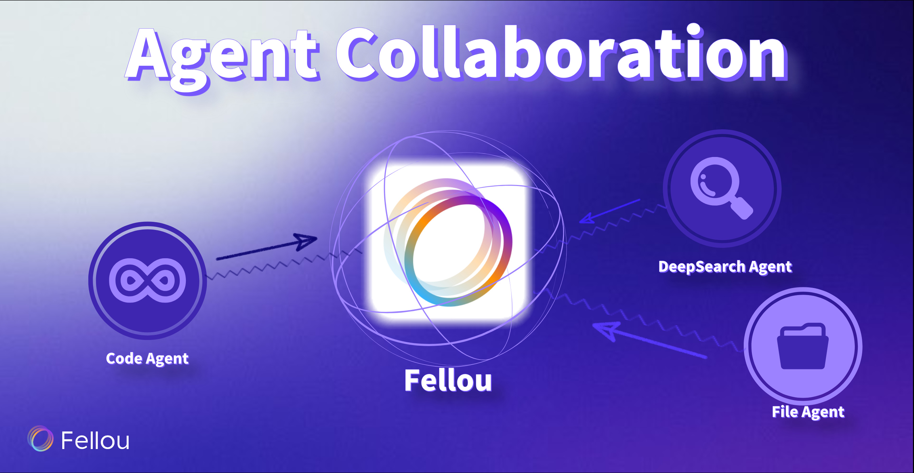

Fellou is an agentic browser that changes how we browse. It makes browsing smart and active. Users see that Fellou is a real helper. It understands what you want, plans steps, and does tasks by itself. This change from doing things by hand to agentic automation is new. Fellou’s Deep Action technology and smart thinking help users do research, reports, and creative work automatically. In real business, agentic browsers like Fellou remove boring steps and make people work up to [60% faster](https://www.puppyagent.com/blog/rag-agentic-browser-fellou-innovations). Users get a smooth, quick, and very team-friendly browsing experience.

## Key Takeaways

*   [Fellou is a smart browser](https://fellou.ai/blog/agentic-browser-fellou-next-evolution-beyond-ai-browsers/). It plans, thinks, and acts for you. It helps you finish tasks faster and easier.
    
*   It uses [many AI agents](https://fellou.ai/blog/ai-browser-vs-ai-extension-difference-fellou-productivity/) that work together. They handle hard jobs like research, reports, and online shopping by themselves.
    
*   Fellou does tasks in the background. It does not bother you. It keeps your data safe and neat.
    
*   You can control and change tasks right away. This makes your work flexible and just for you.
    
*   Agentic browsing with Fellou saves time. It lowers mistakes. It helps people and businesses do more with less work.
    

## Agentic Browser Explained

### What Is Agentic Browsing

Agentic browsing changes how people use the web. It does not just wait for commands. The [agentic browser](https://fellou.ai/) can act by itself. It knows what you want to do. It [makes a plan and finishes tasks](https://www.fullstack.com/labs/resources/blog/agentic-ai-vs-traditional-ai-what-sets-ai-agents-apart) without help all the time. This uses smart AI, so it is more than just normal browsing. The agentic browser can read things, collect facts, and make choices. It [works with all kinds of data](https://www.applause.com/blog/automation-vs-agentic-ai-key-differences/). It can handle new problems and learn from each job. Agentic browsing uses a method called [Perceive, Reason, Act, and Learn](https://www.trendmicro.com/vinfo/us/security/news/security-technology/the-road-to-agentic-ai-defining-a-new-paradigm-for-technology-and-cybersecurity), or RAG. This helps the browser understand, think, do things, and get better as it goes.

Agentic browsing is special because it uses [many agents](https://arxiv.org/html/2505.10468v1). These agents work as a team. They remember things and have different jobs. They can do hard tasks that need many steps. For example, an agentic browser can look up a topic, make a summary, and give you all the details. It can also watch for new changes and change what it does. This smart way of browsing lets the browser work on its own and be very clever.

### Why Agentic Browsing Matters

[Agentic browsing is important](https://fellou.ai/use-cases) because it saves time and gives better results. With normal browsing, people must do every step. They search, read, and put together information. This takes a lot of time and can cause mistakes. Agentic browsing fixes this by doing jobs for you. The agentic browser can search, read, and give answers with little help. It can change its plan if it finds new facts.

Big companies see why agentic browsing is useful. Companies like Microsoft use new ways to help AI agents share and work together. This makes agentic browsing safer and stronger. [By 2026](https://superagi.com/the-future-of-the-open-agentic-web-how-microsofts-model-context-protocol-is-revolutionizing-ai-interactions/), most companies will use some kind of agentic browsing to manage information. This means people get better and newer facts. They do not waste time on boring jobs. They can focus on what matters. Agentic browsing makes using the web smarter and faster.

## Fellou’s Core Architecture

### Browser, Workflow, and AI Agent

Fellou uses a unique trinity architecture. This design includes the browser, workflow, and ai agent. Each part works together to help users complete tasks with less effort. The browser acts as the main window for all actions. It lets users see and interact with web pages. The workflow manages the steps needed to finish tasks. It breaks down big goals into smaller actions. The ai agent understands what users want and makes smart choices. It uses data from the web and other sources to plan and act.

Fellou stands out because it uses retrieval-augmented generation, or rag, in every part of its system. Rag helps the ai agent find the best data for each step. It pulls information from many places and checks it for accuracy. This method lets fellou handle complex tasks, like research or report writing, without missing key details. The workflow uses rag to update plans when new data appears. The browser shows results in real time, so users always know what is happening.

> [Fellou’s trinity architecture](https://fellou.ai/blog/agentic-browser-fellou-next-evolution-beyond-ai-browsers/) gives users more control. They can see each step, change the plan, or add new tasks. This makes fellou more than just a set of tools. It becomes a partner that learns and adapts.

Fellou also uses rag to support multi-agent teamwork. Each agent can focus on a different part of a task. For example, one agent can collect data, while another writes a summary. This teamwork speeds up tasks and improves results. Retrieval-augmented generation keeps all agents up to date with the latest data. Fellou’s design makes it easy to handle many tasks at once.

### Shadow Workspace

The Shadow Workspace is a key part of fellou’s core architecture. It acts as a hidden area where tasks run in the background. Users do not see this space on their main screen. The Shadow Workspace lets fellou work without interrupting what users are doing. Tasks move forward even when users switch to other tools or web pages.

Fellou uses rag in the Shadow Workspace to keep data fresh and accurate. Retrieval-augmented generation checks for updates and changes plans if needed. This means users get the best results, even if the data changes during a task. The Shadow Workspace also helps fellou manage many tasks at once. It keeps each task separate, so data does not mix or get lost.

Fellou’s Shadow Workspace supports seamless automation. Users can start a task and let fellou handle the rest. They can check progress at any time. If they want to change something, they can step in and adjust the workflow. This makes fellou a powerful tool for anyone who needs to manage lots of data or complex tasks.

*   Key benefits of the Shadow Workspace:
    
    *   Runs tasks in the background
        
    *   Keeps data safe and organized
        
    *   Uses rag to update information
        
    *   Lets users control or change tasks at any step
        

Fellou’s architecture turns the browser into more than a viewing tool. It becomes a smart system that uses rag, data, and tools to finish tasks from start to end. Users gain speed, accuracy, and control. Fellou’s design sets a new standard for what browsers and ai agents can do.

## Planning in Fellou

### Understanding User Intent

Fellou is very good at knowing what users want. It uses retrieval-augmented generation and agentic browsing to study each command. AI agents [split user requests](https://fellou.ai/eko/docs/architecture/execution-model/) into small, clear steps. This helps make hard research or work goals easier to reach. Fellou’s Deep Action feature lets it collect, check, and show research reports without help from people. Fellou learns from what users do. It can guess what you need and give ideas before you ask. This makes work feel easier and more natural.

> Fellou’s hybrid shadow workspace does tasks in the background. Users can keep working without stopping. The AI changes plans when it gets new facts.

Fellou’s way of working is very correct and fast. Real-world data shows this is true. For example:

*   Success in understanding what users want went up by [38.9%](https://www.puppyagent.com/blog/rag-agentic-browser-fellou-innovations).
    
*   Steps needed for tasks dropped by 6.6% to 14.6%.
    
*   Verizon got 40% more sales after using AI helpers.
    
*   ServiceNow cut customer service time by 52%.
    

These facts show that Fellou’s way of knowing what users want helps people work better and faster.

### Dynamic Workflow Generation

Fellou is great at making smart workflows for research and hard jobs. It can do research on things like AI hiring trends by getting data from LinkedIn and Quora. Then it makes a neat report with skills, pay, and hiring facts. Fellou also sorts research papers from arXiv and puts names, summaries, and links in order. For stock market work, Fellou finds money facts from Yahoo Finance and makes charts to help with choices.

In online shopping, Fellou looks for products, sorts them, and adds the best ones to the cart. The [Deep Action Workflow](https://www.analyticsvidhya.com/blog/2025/05/fellou-ai/), using the Eko Framework, helps Fellou learn and make workflows better as it works. This makes research and tasks faster and smarter. Fellou can do many jobs on different sites at once. Users get more done and work feels easier.

## Reasoning in Fellou

### Context Awareness

[Fellou](https://fellou.ai/) is smart and knows what is happening around it. It gathers information from many places and uses rag to understand it. The ai agents look at each web page and learn what the user wants. They use rag to pick out the most important facts and change what they do. This helps fellou keep up with new information and what users need.

Fellou can do more than just easy jobs. It can work with hard data and switch between different tasks. When users go to a new page or change their minds, the ai agents use rag to make new plans. The system keeps everything in order and uses rag so nothing gets missed. Fellou’s context awareness means it always knows what is going on and can act quickly.

> Fellou’s smart thinking makes a special knowledge base for each user. This helps every job be smarter and more correct.

### Decision Making

Fellou is good at making choices because it is very smart and uses rag. The ai agents work together to solve tough problems. They use information from many places and check facts with rag. Fellou can break big jobs into small steps and pick the best way to finish them.

The system tries to guess what users will need next. It gives tips for actions and helps users reach their goals faster. Fellou runs ai agents in a safe space, so tasks can keep going in the background. Users can make and share special agents for different jobs, which makes teamwork easy.

Fellou’s smart thinking helps it search many sites, even private ones. It uses rag to make reports with all the right facts. The ai agents use rag to make sure nothing is wrong. Fellou’s way of making choices helps users finish jobs quickly and correctly.

*   Key features of Fellou’s reasoning:
    
    *   Uses rag for every step
        
    *   Handles many types of data
        
    *   Supports [multi-agent teamwork](https://sourceforge.net/software/compare/Fellou-vs-Prefect/)
        
    *   Runs tasks in the background
        
    *   Builds smart, shareable reports
        

## Action with AI Agent

### Deep Action Technology

Fellou is special because it can do deep actions. This means the [AI agent](https://fellou.ai/) can take what you say and turn it into steps. Fellou can use browsers and apps to finish hard jobs by itself. It understands web pages like a person, not just as pictures. It knows what is on the page and what it means. This helps it do smart tasks that fit the content. Fellou works in a shadow window. Agents can finish jobs in the background while you do other things.

Fellou can work on [over 50 websites](https://medium.com/%40KanikaBK/fellou-changes-the-game-the-worlds-first-agentic-browser-acb3dc293c32), even private ones. You do not need to write any code. You can use [drag-and-drop tools](https://www.aitoolhunt.com/tool/fellou.ai) to make [workflows](https://fellou.ai/). Fellou keeps your data safe by using your device’s own login. This keeps your privacy safe and makes sure you are secure. Fellou can think, browse, and act by itself. It can collect data, fill out forms, and make reports. Fellou puts results into [clear pictures and charts](https://www.linkedin.com/posts/inception-x_ai-tech-fellou-activity-7325934956336041986-NYbx), so you can understand them easily.

*   Key features of fellou’s deep action technology:
    
    *   Changes words into actions
        
    *   Knows what is on web pages
        
    *   Does jobs in a shadow workspace
        
    *   Works on public and private sites
        
    *   Lets you design workflows with pictures
        
    *   Keeps your data safe and private
        

### Real-Time Control

Fellou lets you control every job as it happens. The AI agent works right away, so you can see what it does. If you want to change something, you can move steps with drag-and-drop. You can edit, add, or take away steps at any time. This makes it easy to change how things work.

Fellou can make text, pictures, charts, and sound files. You can [make and share special agents](https://slashdot.org/software/comparison/Fellou-vs-Vertex-AI/) for different jobs. Fellou guesses what you might need and gives tips. It can search many sites at once, like Quora, X, and LinkedIn. Fellou helps you make reports, plan your day, and fill out forms. The AI agent works in a safe space, so jobs run safely in the background.

> Fellou’s real-time control and creative results make it different from other AI agents. You can do more work with less effort, and it is easy to share and use everything you make.

## Agentic Browser vs Traditional Browsers

Image Source: [unsplash](https://unsplash.com)

### Key Differences

[Agentic browsing](https://fellou.ai/blog/agentic-browser-fellou-next-evolution-beyond-ai-browsers/) changes how people use the web. Fellou is leading this change with new features. Old browsers let you look at web pages and search for things. They do not help you finish jobs or know what you want. Some browsers let you chat, but you still have to tell them what to do. Others help you find things fast, but they only show results.

Fellou uses agentic browsing to do more. It gives you a smart way to browse. The browser can [set goals, learn from what you do, and act alone](https://wizr.ai/blog/agentic-ai-vs-traditional-automation/). You do not have to repeat steps. Fellou can fill out forms, make reports, and manage your schedule. It works in the background and changes to fit your needs. It gives ideas without stopping what you are doing.

*   Main ways agentic browsers like Fellou are different:
    
    *   Agentic browsing uses AI to set goals and act, but old browsers just show pages.
        
    *   Fellou does tasks for you and changes to help, but old browsers need you to do everything.
        
    *   Agentic browsing gives you a smarter and more personal way to use the web.
        
    *   Fellou handles hard jobs, but old browsers cannot do tasks.
        
    *   Agentic browsing moves from just finding facts to getting things done.
        

> "[Agent-led, context-aware browsers](https://www.entrepreneur.com/en-in/news-and-trends/rise-of-the-agentic-browser-will-ai-dethrone-chrome/494480) like Fellou are changing how people start and finish things online. They do more than just search and click."

### Value for Users and Industries

Fellou gives big value to people and many jobs. [Agentic browsing](https://fellou.ai/blog/ai-browser-vs-ai-extension-difference-fellou-productivity/) helps you [finish work faster and with fewer mistakes](https://research.aimultiple.com/ai-agents/). You can focus on what matters while Fellou does the rest. In finance, agentic browsing helps with trading and checking risks. In factories, it makes supply chains better. Law and customer service teams use agentic browsing to handle lots of facts and make reports.

*   Good things about agentic browsing with Fellou:
    
    *   Does hard jobs and cuts down on manual work.
        
    *   Helps you get more done and focus on important things.
        
    *   Looks at data and changes to fit new needs right away.
        
    *   Works for many jobs, like finance and customer service.
        
    *   Gives you results, not just facts, for a better experience.
        

Studies show companies using agentic browsing work [up to 30% faster](https://www.dailyhostnews.com/from-generative-to-agentic-a-comparative-analysis-of-ai-models). People like getting answers and results, not just links or raw facts. Fellou’s smart browsing fits these new needs. It gives you an easy, flexible way to work that saves time and makes you happier.

## Real-World Use Cases

### Productivity and Automation

[Fellou changes how people do daily work](https://fellou.ai/blog/best-ai-browser-productivity-automation/). People get more done because Fellou does hard web jobs for them. It can [handle tough tasks on many websites at once](https://www.linkedin.com/posts/unwind-ai_the-first-agentic-browser-that-can-think-activity-7325345361156292609-tAlQ). With Fellou, you can look up markets, gather facts, and make reports. You do not need to keep switching tabs. The browser knows what tabs are open. It uses search to find facts from public and private sites. You can save product info from Product Hunt right into Notion. You can also set up meetings and send emails all in one place.

*   Fellou puts project content together for easy use.
    
*   People keep work and life separate with different profiles.
    
*   Split view lets you do many things at the same time.
    
*   Fellou works with Microsoft 365, LinkedIn, Notion, Facebook, GitHub, and Google Calendar and many other Web APPs.
    

> Fellou does many steps for you, so you do not have to switch between jobs. This saves time and helps you get more done. People have more time to be creative and finish more work.

Fellou helps people finish more jobs with less work. Its smart tools help you keep things in order, make reports, and do tasks faster.

### Industry Applications

[Fellou helps many kinds of businesses work better](https://fellou.ai/use-cases). In hiring, people can use Fellou automatically study job markets and make reports with real-time captured data. Social media workers can use Fellou to automatically collect team data, schedules, and fan interactions, generate English event content, and publish it to social media like X or Instagram. Fellou helps money teams look at numbers, make charts, and share results fast.

> Fellou is great at doing jobs and handling data on many sites. This makes it a top tool for getting work done and helping businesses.

## FAQ

### What makes Fellou different from other AI browsers?

Fellou is more than a chatbot. It [acts like an agent](https://fellou.ai/blog/agentic-browser-fellou-next-evolution-beyond-ai-browsers/). It knows what you want to do. It plans steps and finishes jobs on many websites. You get real results, not just facts.

### Can Fellou handle private or secure websites?

Yes, Fellou works on public and private sites. It uses your own login to keep things safe. Your data stays private while Fellou does each job.

### How does Fellou keep user data safe?

Fellou uses a Shadow Workspace for every task. This keeps your data apart and safe. Only you can change or see your work.

### What types of tasks can Fellou automate?

Fellou can do research, make reports, plan schedules, and manage social media. It handles many steps and fits different jobs.

### Does Fellou support teamwork or sharing?

> Fellou lets you make, change, and share workflows or agents. Teams can work together, check progress, and change steps right away.