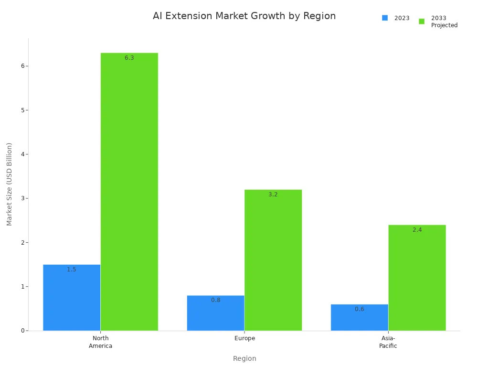
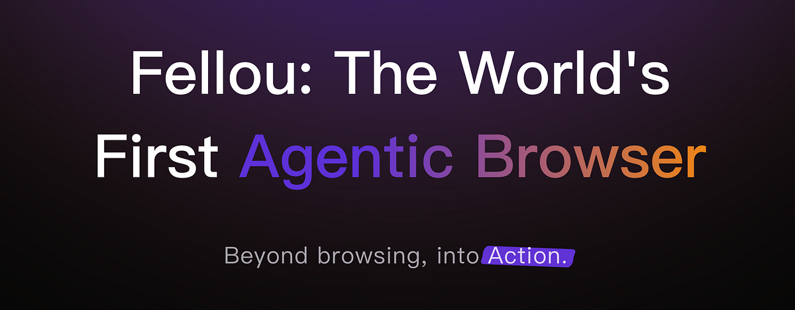
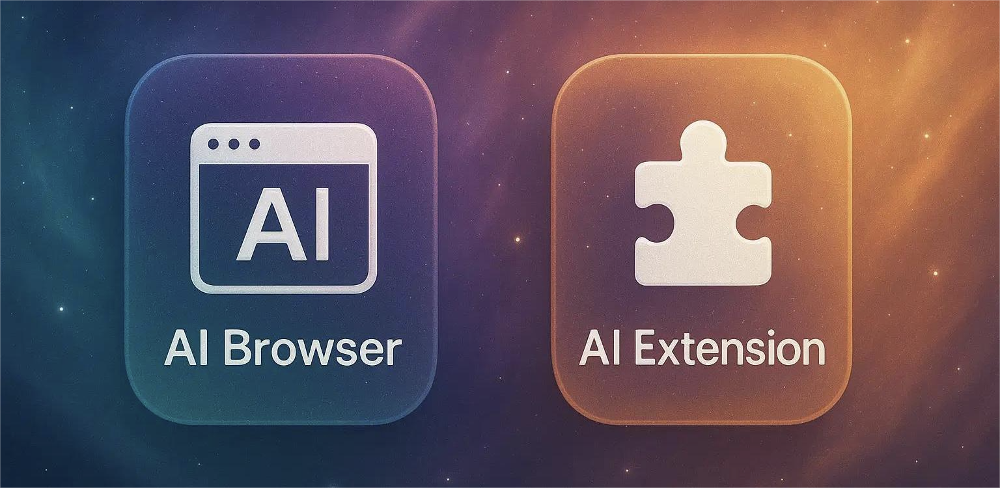

You might wonder if you need an ai browser or just an ai extension. The main difference is this: an ai browser like Fellou acts as your all-in-one digital partner, taking actions and managing tasks for you. An ai extension sits inside your regular browser and boosts specific features, such as content creation or security. Over the past five years, the demand for ai tools has exploded, thanks to more remote work and digital tasks.

As you read, think about your own workflow. Do you want a browser that handles everything, or do you prefer to add ai features to your favorite browser?

## Key Takeaways

*   🦸🏻‍♂️**From Assistant to Agent: A Fundamental Shift** AI extensions are tools that assist you. An Agentic Browser like Fellou is an agent that acts for you. It's the difference between a helpful tool and a digital employee you can delegate to.
    
*   📈 **From Simple Tasks to Complex Workflows** Extensions are for simple, single-step tasks. An Agentic Browser automates complex, end-to-end workflows like recruitment or data reporting, where Fellou achieves a proven 80% task completion rate.
    
*   🏆 **From Delivering Information to Delivering Results** Extensions deliver optimized information (like a summary). An Agentic Browser like Fellou delivers a finished result (like a completed application), moving beyond conversation to produce a tangible outcome.
    
*   ⚡️ **AI Extensions for Targeted Boosts** Ideal for quick, single-purpose tasks within your existing browser. Extensions provide immediate value for jobs like writing assistance, translation, or summarization.
    
*   🚀 **The Real Choice: A Better Tool vs. A New Way of Working** Extensions make your current browser better. An Agentic Browser like Fellou provides a new way of working. It's the choice for automating complex labor, not just for minor efficiency gains.
    

## What Is an AI Browser?

An AI Browser does more than just open websites. It acts like a [smart helper](https://medium.com/techsutra/the-rise-of-ai-powered-browsers-transforming-web-navigation-with-intelligent-assistants-3589a9f7ef6b) for your online work. This browser uses ai to make your tasks easier and faster. You can type questions in normal words and get quick answers. It can also give you short summaries and do jobs that usually take a lot of time. Think of it as a smart helper that knows what you want and helps you do it. That is what an ai browser like [Fellou](https://slashdot.org/software/comparison/Fellou-vs-Multimodal/) can do.

### Key Features of AI Browsers

The best ai browsers have many tools to help you online. Here are some of the top features:

1.  🧠 **Intelligent Task Automation: From Intent to Result**
    
    *   **Trinity Architecture:** Deeply integrates a **Browser**, **Workflow**, and **Agent** into one. It's not just a web-browsing tool, but a general agent that understands complex goals and automates cross-application tasks.
        
    *   **Dynamic Workflow Generation:** A user simply provides a high-level goal (e.g., "research top AI apps and write a report"), and Fellou autonomously plans and executes the entire process from research to delivery.
        
    *   **Shadow Workspace:** All complex tasks are executed in a background workspace, allowing users to monitor the AI's progress without interrupting their own foreground activities.
        
2.  🕹️ **Fully Controllable Experience: Beyond the "AI Black Box"**
    
    *   **Real-time Intervention:** Users can correct or redirect the AI mid-task via chat, eliminating the need to start over.
        
    *   **Visual Workflow Editing (Deep Action):** The AI's generated task plan is fully editable. Users can visually drag, drop, add, or delete steps to ensure the AI follows their exact logic.
        
    *   **Post-Generation Editing:** All outputs—whether reports, documents, or images—can be directly edited and refined after generation until they are perfect.
        
3.  🎨 **Powerful Multi-Modal Delivery Capabilities**
    
    *   **Diverse Outputs:** Goes beyond text to generate a wide range of deliverables, including images (logos, illustrations), interactive websites, presentations (PPTs), various documents (Word, Excel), and even audio (AI-generated songs, sound effects).
        
    *   **Rich-Text Reports:** Can automatically crawl relevant images from webpages and insert them into generated reports, enhancing their quality and impact.
        
    *   **Complex Creative Task Handling:** Capable of tackling advanced creative work, such as composing piano music in a specific style or designing a full set of sound effects for a product.
        
4.  🔗 **Seamless Cross-Platform & Cross-App Integration**
    
    *   **Cross-Device Sync:** Ensures all work, files, and tasks are seamlessly synchronized across desktop, mobile, and tablet devices.
        
    *   **Cross-App Collaboration:** Facilitates easy information transfer between different applications without needing complex third-party tools.
        
    *   **Information Unlocking:** Can navigate obstacles like login walls and captchas to access and retrieve a more comprehensive set of data.
        
5.  ⚙️ **Efficient, Transparent & Reliable Execution**
    
    *   **High Performance:** Features fast execution speeds, a high task success rate (80% on benchmarks), and support for parallel task processing.
        
    *   **Long-Running & Monitoring Tasks:** Excels at continuous, long-duration tasks, such as monitoring a Gmail inbox for new mail or tracking changes on a webpage.
        
    *   **Information Traceability:** Provides clear source links for all data used in its analysis, ensuring users can easily verify the authenticity of the information.
        
    *   **Developer Tools (DevTools):** Offers powerful tools for pro-users to debug and inspect the AI's execution process, providing full transparency.
        

| Feature | Traditional Browser | AI Browser |
| --- | --- | --- |
| Functionality | Shows web pages | Works as a smart helper |
| User Interaction | You click and type | You talk or type in normal words |
| Productivity Tools | Needs extra extensions | Has ai tools built in |
| Purpose | For browsing and watching videos | Helps you do tasks and create things |
| Search | Uses keywords | Talks with you and understands context |
| Personalization | Not much | Learns what you like |
| AI Integration | You add it if you want | It is part of the browser |
| Time Efficiency | You do one thing at a time | Makes choices faster and saves clicks |
| Best For | Just looking at websites | For research, writing, planning and action |

An ai browser is made to do more than just look at websites. It helps you with research, writing, and planning your day.

## What Is an AI Extension?

An [ai extension gives your browser new powers](https://www.trymaverick.com/blog-posts/top-10-ai-chrome-extensions-supercharge-your-browsing-experience). You add it to your browser, and it adds helpful features. These tools work inside your browser window. You do not need to open other apps or tabs. You can use the web like normal, but with extra help from ai.

### Main Functions of AI Extensions

You may wonder what an ai extension does for you. Here are some main things you can get:

*   [Real-time translation and language learning tools](https://addons.mozilla.org/en-US/firefox/addon/lumetrium-definer/) help you read pages in other languages.
    
*   You can see definitions, synonyms, and hear words without leaving the page.
    
*   Spell check and writing help show up as you type. This makes your emails and posts look better.
    
*   Some extensions highlight words for quick research or translation.
    
*   Many ai extensions learn what you do and give better tips over time.
    

> Tip: If you are a student, traveler, or someone who writes a lot, an ai extension can save you time and help you get more done.

These tools use smart ai right in your browser. They look at data, give advice, and can do boring jobs for you. Some use [machine learning on your device](https://www.cmarix.com/blog/ai-in-browser-for-next-generation-developers/), so your data stays private and you can use them offline.

### Types of AI Extensions

There are many kinds of ai extensions. Each one has its own job. Here is a quick look at some popular types:

| AI Extension Category | What It Does |
| --- | --- |
| AI-code-assistant | Helps you write code, fix mistakes, and find bugs. |
| AI-conversational-assistant | Lets you chat with ai for help, advice, or answers. |
| AI-writing-assistant | Makes writing easier by making text, checking grammar, and fixing style. |
| AI-media-service | Makes images, music, or videos from your ideas or words. |
| AI-data-and-workflow-optimizer | Automates data jobs and makes your daily work easier. |
| AI-meeting-assistant | Summarizes meetings and shows you important things to do. |
| AI-website-generator | Builds websites using ai, from layout to content. |

You can also find ai extensions that [organize tabs, read out loud, block threats, or make custom browser themes](https://www.microsoft.com/en-us/edge/features/ai). Each extension uses ai in a special way. This makes your browser smarter and your work easier.

## AI Browser vs. AI Extension: Comparison

When you use an [ai browser](https://fellou.ai/), smart features are built right in. You get everything in one place as soon as you open it. The ai knows what you are doing and helps you right away. You do not need to look for tools or switch tabs. Everything works together and feels smooth.

But an ai extension is different. You have to add it to your browser yourself. It works as a separate tool on top of your browser. You might need to turn it on each time you want to use it. Sometimes, you see pop-ups or small problems. Extensions can slow down your browser or not work well with other add-ons.

[Here’s a quick look at how they compare](https://www.sigmabrowser.com/blog/best-browsers-with-ai-features-comparison-and-reviews):

| Feature | AI Extension (Plugin) | AI Browser (Built-In AI) |
| --- | --- | --- |
| AI Setup | Add-on extension | Built-in from start |
| Understanding | Manual trigger | Follows user context |
| Experience | Feels separate | Feels integrated |
| Workflow | Requires switching tabs/tools | All-in-one place |
| Speed | Slower, more steps | Fast, in-flow |
| Personalization | Generic or none | Tailored to user |

> Tip: If you want things to be fast and easy, an ai browser gives you that. You do not have to worry about [pop-ups or your browser slowing down](https://www.raintreeinc.com/blog/native-ai-vs-third-party-integration/).

### Features and Capabilities

Let’s see what each tool can do for you. An ai browser comes with many smart features. You can [chat with it about any page you visit](https://www.jpost.com/consumerism/article-859352). You can ask questions, get short answers, and do tasks right in the browser. The ai helps you in real time and understands what you are looking at. You can use it to research, write, or plan your day without leaving the browser.

An extension adds new features, but it usually does one thing at a time. You might get help with writing, translating, or organizing tabs. These tools are good for simple jobs. But they do not always work together or know what you are doing on other pages.

[Here’s a table to show how their capabilities stack up](https://aiagentstore.ai/compare-ai-agents/browser-use-vs-hyperwrite-ai-agent):

| Capability Aspect | AI Extensions (e.g., HyperWrite AI Agent) | Full AI Browsers / Automation Frameworks (e.g., Browser-Use) |
| --- | --- | --- |
| Automation Autonomy | Automates common online tasks with good autonomy for standard workflows; limited customization | High automation autonomy via programmable scripting; supports complex, multi-step workflows requiring technical skills |
| Customization | Limited but practical customization focused on productivity tasks; user-friendly interface | Extensive customization through open-source programmable interfaces; supports custom integrations and complex automation |
| Ease of Use | Designed for broad audience including non-technical users; easy onboarding and minimal setup | Steeper learning curve; requires technical proficiency and scripting knowledge |
| Flexibility | Focused on predefined tasks like writing, research, scheduling; less extensible | Highly flexible; adaptable to diverse use cases including batch processing and multi-tab workflows |
| Cost | Typically subscription-based with free demos | Open-source and free, appealing to budget-conscious users |
| Target Users | General users and professionals seeking convenience | Developers and power users needing deep control and customization |

You get more power and choices with an ai browser. It can do hard jobs, [run tasks in the background](https://fellou.ai/eko/docs/architecture/execution-model/), and let you add your own scripts. If you want to work on big projects or need special features, the ai browser is best. Extensions are simple and good for everyday jobs.

> Note: [Full ai browsers use smart ways like DOM-based automation](https://www.rtrvr.ai/blog/ai-web-agents-deep-comparison). This lets them work on many tabs at once, finish jobs faster, and handle harder tasks than most extensions.

### Pros and Cons

Every tool has good and bad sides. Here is what people say about both:

**Pros of AI Browsers:**

*   You get everything in one place.
    
*   The browser knows what you are doing and helps you right away.
    
*   You can set up hard jobs and workflows.
    
*   It learns what you like and helps you more.
    
*   Many people like the easy drag-and-drop tools.
    
*   Your data is kept safe.
    

**Cons of AI Browsers:**

*   Some people think it is hard to learn at first.
    
*   You may need more tech skills for advanced features.
    
*   Some features cost more money.
    

**Pros of AI Extensions:**

*   Easy to add and start using.
    
*   Great for quick jobs like writing or translating.
    
*   Works with the browser you already use.
    
*   Many are free or let you try them.
    

**Cons of AI Extensions:**

*   Features feel separate from your main browser.
    
*   You might have problems with other add-ons or slowdowns.
    
*   Not much automation or special features.
    
*   Some people find bugs or slow support.
    

> If you want a tool that does everything and grows with you, an ai browser is best. If you just need quick help for simple jobs, an extension is enough.

## How to Decide: AI Tool Selection Guide

### Assessing Your Needs

Picking between an **ai browser** and an **ai extension** can be hard. You want a tool that helps you work better and keeps your info safe. First, think about what you do most online. Do you spend lots of time researching, writing, or planning? Or do you just need help with emails, translations, or quick summaries?

Ask yourself these things:

*   Do you want a tool that can do big jobs, like planning projects or automating many steps?
    
*   Are you looking for something simple to make your browser better, like grammar checks or **ai search**?
    
*   Is privacy and safety very important to you? Do you work with private data or in a job with strict rules?
    
*   Do you want everything in one place, or do you like picking features as you need them?
    

> Tip: If you switch tasks a lot, need strong automation, or want your browser to act like a helper, an **ai browser** could be best. If you just want to add smart tools to your favorite browser, **ai extensions** are a good pick.

When you think about safety, remember that **ai extensions** sometimes ask for lots of permissions. Some may see private info, which can be risky. Things like password theft or data leaks can happen. Enterprise browsers use special controls, whitelisting, and PII masking to lower these risks. They also use tricks like hiding your input and managing everything from one place to keep you safe. If you work with secret info, pay close attention to these things.

### Step-by-Step Decision Process

You can use easy steps to pick the best **ai tool** for your work. Here is a simple guide to help you choose:

1.  **Identify Your Goals**  
    Write down what you want to do. Maybe you want to research faster, automate reports, or write better. Make your goals clear and easy to measure.
    
2.  **Analyze Your Workflow**  
    Look at your daily jobs. Which ones take the longest? Are there steps that feel boring or easy to mess up? Jobs like **ai search**, content making, or data entry are good for automation.
    
3.  **Match Tasks to AI Tools**  
    Decide if your needs fit an **ai browser** or an **ai extension**.
    
    *   If you want deep integration, many-step automation, or to manage everything in one spot, pick an **ai browser**.
        
    *   If you want to add things like translation, summaries, or tab tools to your browser, try an **ai extension**.
        
4.  **Check Security and Compatibility**  
    Make sure the tool matches your safety needs. **AI extensions** can sometimes send data in unsafe ways or collect info from other sites. Look for browsers or extensions with strong privacy, like [whitelisting, PII masking, and ways to spot bad add-ons](https://blog.surf.security/unveiling-the-risks-of-ai-extension-in-the-modern-era).
    
5.  **Test and Compare**  
    Try different **ai browsers** and **ai extensions**. Many let you try them for free. Use them with your real jobs. See which one feels easier and helps you more.
    
6.  **Train and Adjust**  
    Spend some time learning how to use the tool. Change settings to fit your work. If you work with others, help them learn too.
    
7.  **Monitor and Optimize**  
    Watch your productivity. Are you saving time? Is your work better? Get feedback and make changes if you need to.
    

> Note: You do not have to pick just one. Many people use an **ai browser** with a few **ai extensions** for the best mix. For example, you might use an **ai browser** like Fellou for [planning and automation](https://fellou.ai/use-cases), and add an **ai extension** for grammar checks or fast translations.

[Here is a table to help you see when using both makes sense](https://www.technology.org/2025/07/08/ai-chrome-extensions-the-business-tool-leading-companies-cant-ignore/):

| Scenario | AI Browser | AI Extension | Best Approach |
| --- | --- | --- | --- |
| Deep workflow automation | ✅ | ❌ | AI Browser |
| Quick writing help | ❌ | ✅ | AI Extension |
| Fast research and summarization | ✅ | ✅ | Combine Both |
| Personalized recommendations | ✅ | ✅ | Combine Both |
| Security-sensitive environments | ✅ (with controls) | ✅ (with controls) | Combine with strict policies |

You get real benefits when you use both. For example, in sales, you can use an **ai browser** to manage leads and an **ai extension** to write emails. In school, you might use an **ai browser** for lesson plans and an extension for summaries or quizzes. This mix gives you more choices and power.

> Tip: [Try out all the features](https://www.letsdive.io/blog/all-you-need-to-know-about-ai-powered-chrome-extensions-in-2023). Make your setup your own. Keep your extensions up to date. Using both **ai browsers** and **ai extensions** can make your browser super helpful.

Choosing between an ai browser and an ai extension depends on what you want from your online experience. An ai browser gives you a full workspace with smart tools built in. You can let the ai handle big tasks or automate your workflow. An ai extension adds ai features to your favorite browser for quick help.

*   [Think about your main needs and how the ai fits your daily work](https://www.godofprompt.ai/blog/essential-ai-extensions-for-chrome-users).
    
*   Check if the ai tool works well with your current browser.
    
*   Look at pricing and make sure it is clear.
    
*   Review privacy and security before you use any ai.
    
*   Try out ai extensions first to see if they help.
    
*   Use ai to boost your productivity and stay ahead.
    
*   Remember, ai will keep getting smarter and more personal.
    
*   Business leaders see ai as key for future success.
    

Try both options. You might find that using an ai browser like Fellou with a few ai extensions gives you the best results.

## FAQ

### What is the main benefit of using an AI browser like Fellou?

You get a smart helper that can handle big tasks for you. Fellou can plan, research, and **finish jobs** while you focus on other things. You save time and boost your productivity.

### Can I use AI extensions with an AI browser?

You don't need to add up more ai extensions, AI browser like Fellou already combined with most AI extensions function.

### Are AI browsers safe for my personal data?

Most AI browsers, like Fellou, use strong privacy settings. They protect your data and let you control what gets shared. Always check the [privacy policy](https://fellou.ai/policy/) before you start.

### Do I need to be a tech expert to use an AI browser?

No, you do not. AI browsers like Fellou use simple menus and clear instructions. You can start with basic features and learn more as you go. Anyone can use them!