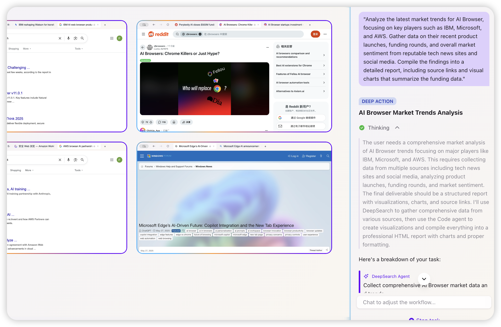
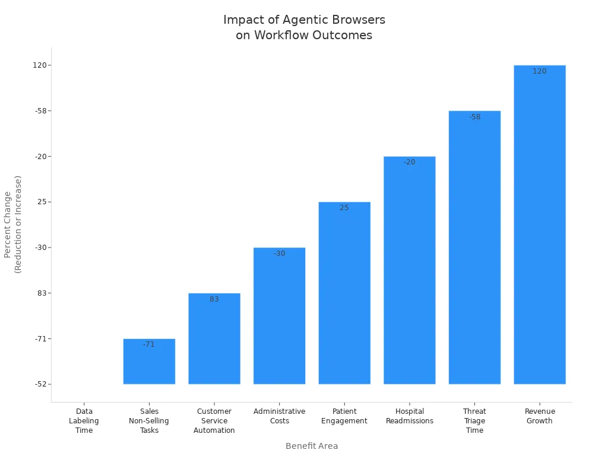

Imagine you have to fill out many online forms every day. You might also need to collect data from different websites. This is when an agentic browser can help you. It lets you use AI to do boring tasks on the web. The AI knows what you want and does the work for you. Normal browsers need you to do everything by hand. An agentic browser works like your digital helper. Recent reports say [many companies now try agentic browsers for web task automation](https://medium.com/%40ayushkmrjha/why-im-excited-about-the-future-of-agentic-crypto-browsers-bcbd22a43655). This helps them [make choices faster](https://www.entrepreneur.com/en-in/news-and-trends/rise-of-the-agentic-browser-will-ai-dethrone-chrome/494480) and get more work done. Their work becomes easier and more organized. You get more time for creative work because the browser handles each task from start to finish.

## Key Takeaways

*   [Agentic browsers](https://fellou.ai/blog/agentic-browser-fellou-next-evolution-beyond-ai-browsers/) use many AI agents to do web tasks for you. They can fill out forms and collect data. They act like a smart helper online.
    
*   [Automation](https://fellou.ai/blog/ai-browser-vs-ai-extension-difference-fellou-productivity/) helps you save time and do less boring work. This lets you spend more time on fun and important things.
    
*   You can start automation with no-code tools. Just list your tasks and use simple commands or drag-and-drop steps.
    
*   Agentic browsers can do hard tasks with many steps. They can also change when websites change. This makes automation work well and stay useful.
    
*   Try small tasks first and watch what the agent does. Always keep your data safe to make sure automation works smoothly.
    

## Agentic Browser Overview

### What Is an Agentic Browser

You might ask how an [agentic browser](https://fellou.ai/blog/agentic-browser-fellou-next-evolution-beyond-ai-browsers/) is different from the one you use now. An agentic browser uses ai agents to figure out what you want. It can do things for you, not just wait for you to click or type. This browser [can fill out forms and collect data](https://medium.com/%40hernanimax/unlocking-the-future-of-work-business-advantages-of-perplexitys-agentic-ai-browser-77b07b1f0d9b). It can even make choices for you. It works like a digital helper in the background. [You give it a job, and it plans and finishes each step](https://www.xcubelabs.com/blog/agentic-ai-vs-traditional-ai-key-differences/). You do not have to help at every part.

[Let’s look at the main types of browsers](https://www.linkedin.com/pulse/from-user-driven-web-agentic-ai-paradigm-displacement-maginley-gxmae):

| Feature / Browser Type | Agentic Browser | Conversational Browser | Search-Optimized Browser |
| --- | --- | --- | --- |
| User Interaction | Direct actions (click, fill, organize) | Chat-based help | Manual browsing and search |
| Automation Capabilities | Full task automation | Limited to chat and answers | No automation |
| AI Integration Depth | Deep, context-aware | Basic, no direct actions | Search-focused |
| Real-time Web Access | Yes | Sometimes | Yes |
| User Experience Impact | Acts as a personal assistant | Helps with questions | Delivers search results |

Normal browsers need you to do all the work. Conversational browsers can answer your questions but do not do tasks for you. Search-optimized browsers help you find things faster. Only an agentic browser uses [ai agents to do real actions and automate your web jobs](https://www.puppyagent.com/blog/rag-agentic-browser-fellou-innovations).

### Key Benefits

Using an agentic browser gives you more automation. You do not need to repeat the same steps every day. The browser can do many steps, like getting data from many sites or handling your emails. Ai agents can guess what you need next and suggest things before you ask.

[Here are some main benefits](https://devcom.com/tech-blog/agentic-ai-use-cases/):

*   [You save time because the browser does boring work](https://vocal.media/journal/the-dawn-of-agentic-browser-automation).
    
*   Automation helps you get more done and lets you be creative.
    
*   Ai agents can work with many tools and platforms, making things easier.
    
*   The browser can do jobs in the background, so you can keep working.
    
*   Many companies see better results and faster help when they use agentic browsers for customer service.
    

> Tip: [Agentic browsers are used in many areas, like customer service, healthcare, finance, and online shopping](https://superagi.com/top-10-industries-transforming-with-autonomous-ai-agents-trends-and-case-studies-for-2025/). They help with tasks like filling out forms, collecting data, and making hard choices.

With an agentic browser, you do not have to do every click. You get a smart helper that takes care of the boring stuff, so you can focus on what matters most.

## Way to Automate Web-Based Tasks

### How to Automate Tasks with Agentic Browser

Automating tasks with an agentic browser is designed to be an intuitive process, transforming a complex goal into a series of manageable, automated actions. The core strength of these **AI-powered automation** tools lies in their ability to interpret natural language instructions and independently devise a plan to achieve the objective.

**For example, consider a real-world use case:** A business consultant needs to conduct market research. They could simply enter a prompt like:

_"Analyze the latest market trends for_ **_agentic AI_**_, focusing on key players such as IBM, Microsoft, and AWS. Gather data on their recent product launches, funding rounds, and overall market sentiment from reputable tech news sites and social media. Compile the findings into a detailed report, including source links and visual charts that summarize the funding data."_

Agentic Browser like Fellou would then execute this complex **workflow automation**, delivering a comprehensive report in a remarkably short time, a task that would have traditionally taken hours of manual work.

### Traditional Way to Setup Automation Tasks

#### Getting Started

You can use special tools to automate web tasks. Many platforms help you do this without writing code. These tools let you make a list of tasks and set commands. You can run automation with just a few clicks. Some popular tools are [Axiom AI, Bardeen AI, and Browserflow](https://www.firecrawl.dev/blog/browser-automation-tools-comparison-2025). Each one has a no-code interface, so you do not need to know coding.

[Here is a table that shows some top platforms and what they do best](https://olive.app/blog/top-agentic-ai-platforms-in-2025-the-ultimate-guide-for-businesses/):

| Platform | Key Strengths and Use Cases |
| --- | --- |
| Cognosys | Browser-native agents for real web interactions like data extraction and form submission. |
| Axiom AI | No-code Chrome extension for automating web tasks and scraping, with integrations and scheduling features. |
| Browserflow | No-code/low-code Chrome extension for web scraping and task automation, with local and cloud execution. |
| Firecrawl | Specializes in scraping and preparing web data for AI applications. |
| Microsoft Autogen | Complex multi-agent collaboration, Azure-native, enterprise-focused. |
| IBM Watsonx Orchestrate | Automates workflows across enterprise software stacks, enhancing business process automation. |
| UiPath | Extends RPA with agentic AI for autonomous decision-making and unstructured task handling. |
| Bardeen AI | AI-powered Chrome extension for automating GTM workflows with natural language and extensive integrations. |
| ServiceNow | AI agents for ITSM, HR, and service operations automation. |
| LivePerson | Conversational AI agents for customer service, support, and sales interactions. |

You can use these platforms to automate things like getting data, filling forms, and making workflows. Many people start with easy online tasks. As they get better, they try more complex lists.

> Tip: Write down the tasks you want to automate first. This helps you pick the right tool and plan your steps.

#### Setup Steps

To start browser automation, you need to get your computer ready. Most tools work on Windows, macOS, and Linux. You can use a Chrome extension or a Python backend. Here is a simple list to help you begin:

1.  [Close all Chrome windows before you start](https://github.com/AgenticA5/A5-Browser-Use).
    
2.  Start Chrome with remote debugging turned on.
    
3.  Make a `.env` file with your provider details.
    
4.  Make sure you have Python 3.11 or higher.
    
5.  Install Python packages with `pip install -r requirements.txt`.
    
6.  Start the backend server using `uvicorn` and the right app module.
    
7.  Go to `http://localhost:8888/lastResponses/` to use the API.
    

You might need a GPU like [RTX 4090, at least 16 GB RAM, and 100 GB disk space](https://nodeshift.com/blog/from-screenshots-to-structured-data-install-microsofts-agentic-ai-omniparser-v2-0) for big jobs. Nvidia CUDA should be installed for best speed. If you use a no-code tool, you can skip most code setup and just build your task list with visual commands.

> Note: Always check what hardware your tool needs. Some jobs need more power, especially with big AI models.

#### First Automation

Now you can try your first automation. Pick a simple job, like filling a form or getting data from a website. Use natural language or drag-and-drop commands to make your task list. Many platforms let you use playwright commands to control the browser. You can also use code blocks if you want more control, but most people use the no-code interface for basic tasks.

[Fellou’s three-in-one setup](https://fellou.ai/) makes automation simple. The browser moves around the web, the workflow keeps your tasks in order, and the agent uses AI to understand your commands. You give a goal, and the agent breaks it into smaller jobs. For example, you can ask the agent to collect prices from different sites. The agent will use playwright commands to visit each site, get the data, and save it for you.

Here is a sample list for automating web tasks:

*   Open the browser and go to the website you want.
    
*   Use natural language to say what you want, like "get all product names and prices."
    
*   The agent makes a plan and creates commands for each step.
    
*   The workflow runs each command in order, using playwright to work with the page.
    
*   The agent checks the results and goes to the next job.
    
*   When done, the agent saves the data and shows you what it found.
    

> Tip: Try your automation with a small amount of data first. This helps you find mistakes and fix your commands before you run the whole list.

To do better, [look at your current process before you automate](https://www.oakslab.com/story/a-practical-guide-to-building-agentic-ai-products). Decide what you want to do and set clear goals for each job. Make your workflow with rules and backup steps. Test your commands and code in different cases. Keep making your automation better by updating prompts and retraining agents when needed.

Browser automation helps you do web tasks faster and with fewer mistakes. You can use no-code tools or write your own code. With the right setup, you can automate almost any online job and spend more time on important work.

## Automate Web Browsing

### Common Use Cases

You can use automation to save time and make fewer mistakes. Many people use [agentic browsers](https://fellou.ai/blog/agentic-browser-fellou-next-evolution-beyond-ai-browsers/) for jobs they do every day. Here are some ways you might use automation:

*   [Fill out online forms](https://deepsense.ai/blog/browser-ai-automation-can-llms-really-handle-the-mundane-from-lunch-orders-to-complex-workflows/), like sending reports or ordering food.
    
*   Make a list of tasks to help you get more done.
    
*   Use [web scraping](https://www.browserbase.com/) to get data from different websites.
    
*   Let AI agents test websites by clicking and reading for you.
    
*   Build special tools for your business, like handling vacation requests or supply orders.
    
*   Use browser tools so AI agents can do things on web pages without you.
    
*   Run lots of browser sessions at once for big jobs in healthcare, taxes, or law.
    

> Note: Agentic browsers use AI to work with changing websites. You do not have to change your task list every time a site updates.

### Multi-Step Workflows

Agentic browsers help you with [hard jobs that need many steps](https://monojkantisaha.medium.com/agentic-ai-vs-traditional-automation-the-strategic-shift-in-software-engineering-419533077245). You give a goal, and the browser makes a list of tasks. Each step uses commands to move around, get data, and finish the job. [Shadow Workspace](https://aicounsel.substack.com/p/product-focus-fellou-the-worlds-first/) lets you run tasks in the background, so you can keep working. Deep Action lets you use simple words or drag-and-drop to make commands.

Here is a table that shows how [agentic workflows](https://aisera.com/blog/agentic-workflows/) are different from old automation:

| Feature | Traditional Automation (RPA) | Agentic Workflows |
| --- | --- | --- |
| Adaptability | Only follows set rules and scripts | Can change and learn from what happens |
| Scope | Good for easy, repeat jobs | Handles hard jobs with many steps |
| Error Handling | Only uses set rules for mistakes | Can fix itself and learn from errors |
| Integrations | Works alone, not with other systems | Works well with business tools |
| Human Intervention | Needs people to help a lot | Needs people just to check sometimes |

You can automate a list of jobs like getting data, web scraping, and using many commands. The agent plans each command, checks what happens, and changes the list if needed. Shadow Workspace and Deep Action help your commands work well, even with lots of jobs at once.

> Tip: Start with a small list of jobs, then add more as you learn. This helps you get better at automation.

## Overcoming Challenges

### Troubleshooting

When you automate web tasks, you may face some common problems. You might see [login issues, robot checks like reCAPTCHA, or errors with environment setup](https://medium.com/%40joycebirkins/browser-use-testing-browser-control-agent-recaptcha-and-login-verification-challenges-742bd7a9ac07). Sometimes, the browser needs extra steps, such as installing playwright or dealing with browser versions. You may also find that commands break when websites change their layout.

Here are some common challenges you might face:

*   Login verification can block your commands.
    
*   Robot checks make it hard for agents to finish a task.
    
*   Errors can happen if playwright is not set up right.
    
*   Commands may fail if the website changes its buttons or forms.
    
*   [Writing and keeping source code for UI tests takes a lot of time](https://www.parasoft.com/blog/automated-web-ui-testing-best-practices-challenges-tools/).
    

To solve these problems, you can follow these steps:

1.  [Use behavioral caching to save working commands](https://github.com/esinecan/agentic-ai-browser) for each website. This helps your agent adapt when sites change.
    
2.  Keep logs with timestamps. This makes it easy to track what happened during each task.
    
3.  Focus on the DOM when you write commands. This helps your agent find the right buttons and links, even if the site changes.
    

> Tip: Always test your commands with a small task first. This helps you catch errors before you run a big job.

### Best Practices

You can make your automation more reliable and secure by following some best practices. Always use strong security rules. Run regular audits to check for problems. Encrypt your data and keep your source code safe. Use trusted frameworks and keep your software updated.

Here are some [best practices for agentic browser automation](https://aisera.com/blog/agentic-ai-security/):

*   Set clear access controls for each agent and task.
    
*   Monitor agent actions and check logs for strange behavior.
    
*   Validate all inputs and outputs for each task to stop bad commands.
    
*   Use human oversight. You can step in and change commands or stop a task at any time.
    
*   Edit your workflow as you go. You can change commands or add new steps without starting over.
    
*   Use audit logs and dashboards to see what each agent does during a task.
    
*   Follow rules like GDPR and HIPAA if you handle private data.
    

| Aspect | How It Helps You |
| --- | --- |
| User Control | You approve commands before the agent runs them. |
| Real-time Intervention | You can stop or change a task while it runs. |
| Workflow Editing | You can update commands or add new steps during any task. |

> Note: Good automation means you stay in control. You can always see what your agent does, change commands, and keep your data safe.

You can make your daily work **easier** by using an [agentic browser](https://fellou.ai/) to automate web tasks. First, decide what job you want to do. Next, pick the right AI for your needs. Then, set up how the browser will work with the website. The agent can do things like collect data and follow steps for you. Let it handle jobs like getting information or helping customers.

1.  [Choose what you want to do](https://www.sparkouttech.com/how-to-build-ai-web-agent/)
    
2.  Pick the best AI model
    
3.  Set up how the browser will work
    
4.  Add web scraping or other steps
    
5.  Connect and automate each job
    
6.  Start your agent
    

| Benefit Area | Measurable Outcome | Impact Description |
| --- | --- | --- |
| Data Labeling Time | 52% reduction | Saves time on every task |
| Sales Non-Selling Tasks | 71% reduction | Focus more on sales, less on manual task |
| Customer Service Automation | 83% queries resolved | Improves task efficiency |

Try cool features like using pictures to click, working with [more than one agent](https://fellou.ai/eko/docs/agents/), and no-code tools. You can let the browser do any job, change when needed, and do more work. Take the next step—let agentic browsers do your next job and help you get more done.

## FAQ

### How do you start your first automation task with an agentic browser?

You begin by choosing a simple task. You can use natural language to tell the browser what you want. The agent will break your task into steps and create commands. You do not need to write any code.

### Can you edit commands during a running task?

Yes, you can change commands while your task runs. You can add, remove, or update commands at any time. This helps you fix mistakes or improve your task without stopping the process.

### What if your task fails because a website changes?

If your task fails, you can update your commands. The agentic browser lets you adjust commands quickly. You do not need to change all your code. You can test your task again after making changes.

### Do you need to know code to automate a web task?

You do not need to know code for most tasks. You can use drag-and-drop or natural language to set up commands. If you want more control, you can add code blocks, but most users finish tasks without writing code.

### How do agentic browsers keep your task safe and under control?

Agentic browsers let you approve commands before running a task. You can watch each step and stop the task if needed. You can also review logs to see what commands the agent used for your task.