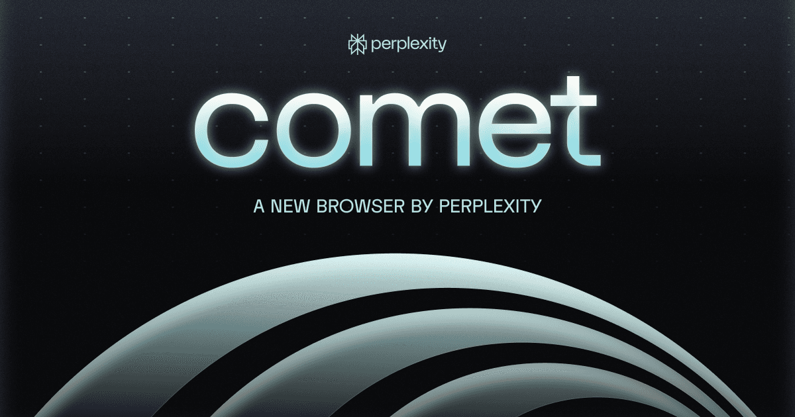
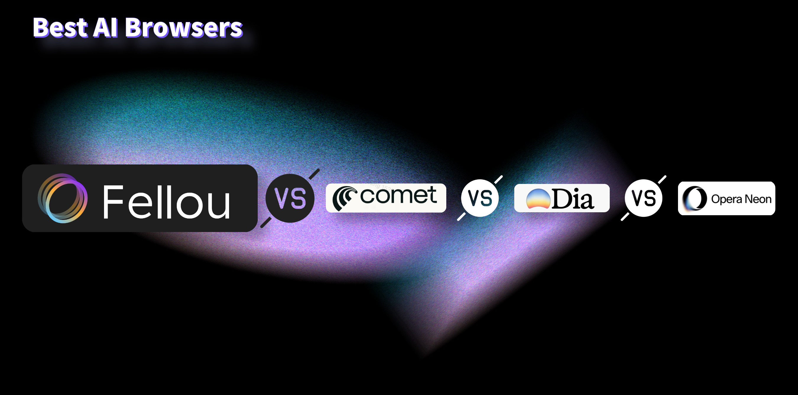

Are you trying to find the best [AI browser](https://fellou.ai/) for productivity this year? There are some great choices in 2025. Fellou, Dia, Comet, and Neon are top agentic browsers. These agentic products do more than help you browse the web. They can actually do tasks for you. AI now does [routine jobs and makes smart choices](https://superagi.com/navigating-the-future-of-work-how-agentic-ai-will-automate-15-of-day-to-day-decisions-by-2028/). This lets you focus on creative work. Your browser can handle boring tasks. Companies using these ai products say they work much better now. They like features such as [workflow automation and real-time project changes](https://superagi.com/navigating-the-future-of-work-how-agentic-ai-will-automate-15-of-day-to-day-decisions-by-2028/resource-allocation-and-project-planning). Fellou is special because it helps turn your goals into real results, not just answers.

## Key Takeaways

*   Agentic AI browsers like Fellou, Dia, Comet, and Neon do more than just browse. They finish tasks for you. This saves time and helps you get more done.
    
*   Fellou enabling AI to autonomously manage web pages, collaborate on tasks, and automatically complete **complex workflows**.
    
*   Dia has a **clean** chat interface. It gives you smart tools for writing and research. You can use custom commands without needing to code.
    
*   Comet mixes browsing and AI. It helps you research, write, and organize work faster. It also has strong features for team collaboration.
    
*   Neon is made for teamwork and automation. It helps you manage tasks and create content. You can stay organized with its visual tools.
    

## Fellou

### Features

Fellou stands out as the [world’s first agentic browser](https://medium.com/%40KanikaBK/fellou-changes-the-game-the-worlds-first-agentic-browser-acb3dc293c32), launched in 2025. You get more than just a tool for browsing. This product acts like a digital partner that can handle your tasks from start to finish. Fellou uses a three-in-one setup: browser, workflow, and agent. This means you can give it a goal, and it will break it down, plan the steps, and get the job done. You don’t need to code or set up complex rules. Just tell Fellou what you want, and it takes action.

Here are some features that make Fellou different from any other ai browser:

*   It understands your commands and turns them into real actions, not just answers.
    
*   You can run [deep research across many sites](https://www.analyticsvidhya.com/blog/2025/05/fellou-ai/) at once.
    
*   Fellou works with apps like Notion and LinkedIn, so it can write, post, or organize for you.
    
*   The [Shadow Workspace](https://www.puppyagent.com/blog/rag-agentic-browser-fellou-innovations) lets agents work in the background while you keep using your computer.
    

### Agentic Browser Capabilities

Fellou brings true agentic power to your daily work. You can give it a one-sentence command, and it will visit websites, fill out forms, and finish tasks without you clicking around. The [Deep Action feature](https://www.linkedin.com/posts/arjun-devireddy_fellou-agenticbrowser-aiautomation-activity-7328079465417269248-BAEN) lets agents think, browse, and act on your behalf. Fellou even handles private sites and keeps your data safe. You get hands-free research, report writing, and social media management. This [agentic browser](https://fellou.ai/) acts like a team of ai coding agents working for you.

> Tip: Fellou’s proactive intelligence learns your habits and suggests actions before you even ask.

### Productivity Tools

Fellou packs in tools to boost your productivity. You can automate form filling, generate reports, and manage emails with simple commands. The product supports multitasking with timeline navigation, split view, and project groups. You can design and share custom agents for special jobs. Fellou syncs across all your devices, so your work stays up to date everywhere. Many users say this product saves them hours each week.

| Tool/Feature | What You Get |
| --- | --- |
| Deep Action | Turns commands into step-by-step workflows |
| Deep Search | Finds info across 43+ platforms |
| Virtual Workspace | Runs tasks in the background |
| Custom Agents | Lets you build and share ai coding assistants |

### Automation

You can automate almost any online task with Fellou. Just say what you need in plain language. The product will search, collect data, and create reports for you. It can move info between apps, like sending trending products from a website to Notion. Fellou’s [agents work quietly in a shadow window](https://www.linkedin.com/posts/inception-x_ai-tech-fellou-activity-7325934956336041986-NYbx), so you stay focused. The [Eko Framework](https://lngfrm.net/fellou-revolutionizing-the-future-of-digital-browsing/) helps the product learn and get faster over time. You don’t need third-party tools to connect your workflow. Fellou gives you a smooth, secure, and private automation experience.

## Dia

### AI Browser Experience

Dia feels new as soon as you open it. This product thinks ai is not just a tool. It is the whole browser. The interface looks clean and simple. You use a chat design to do things. You can ask questions or get article summaries. You can even get ideas right from the search bar. Dia’s ai helps you shop by showing review summaries. It can also add items to your cart. The [tab intelligence feature](https://www.digitaltrends.com/computing/i-loved-this-ai-first-web-browser-but-experts-warned-me-of-free-ai/) keeps your tabs neat. It helps you handle many tabs easily. There is a screen-grab tool for images. It works like Google Lens but is faster. Many people like how Dia makes browsing easy and smart.

> Tip: Use 'write the next line' or 'summarize a tab' to work faster.

### Task Automation

Dia is great at [automating tasks](https://fellou.ai/use-cases). You can check your calendar or summarize social media feeds. You can send emails with just one command. The 'Skills' feature lets you make custom commands. You do not need to know how to code. You can set up shortcuts for jobs you do often. Other ai browsers need add-ons, but Dia does not. Dia has ai built into the main product. The ai knows what you are doing and helps you finish faster. You do not have to switch between apps. Everything happens in one place.

### Personalization

Dia lets you control your own experience. You can make your own ai commands. You can change how the product works for you. The skill system helps you set up workflows for research or writing. You can even use it for meeting notes. You can make shortcuts for actions you use a lot. The ai learns your habits and gives smart tips. You can share your browsing history if you want. This helps the ai get better. You always control your own data.

### Productivity

Dia helps you finish more work in less time. You can summarize articles or write emails without leaving the page. The voice-powered ai and meeting notes feature help you save ideas. Journalists and writers use Dia for research and writing. The table below shows what users like about Dia:

| Feature | User Feedback |
| --- | --- |
| AI-Powered Answers | Fast, helpful, and saves time |
| Productivity Tools | Great for writing and research |
| Command-Based Actions | Makes workflows simple and efficient |
| Seamless Automation | Handles daily online tasks with ease |
| User Interface | Clean and easy to use |

Dia’s ai browser makes your workday easier and helps you get more done.

## Comet

### Agentic Browser

Comet by Perplexity is a new kind of [agentic browser](https://fellou.ai/). It wants to make your browsing smarter and more useful. Comet helps you keep your web sessions smooth and simple. You do not need to switch tabs or copy information. You can ask questions right on the page and get answers fast. This ai browser mixes browsing and thinking together. You spend less time searching and more time doing your work.

> Note: Comet is [invite-only](https://efficient.app/apps/comet) right now, but many people are excited to try it and see how it could change online work.

### AI Features

Comet has special ai features that make it stand out. You can use an [agentic research assistant](https://latenode.com/blog/comet-browser-ai-fix) to sum up web pages as you read them. The browser lets you search inside a page and understand things faster. There is a built-in content creation aid. This tool checks your grammar and tone while you write. You do not need to open another app. Comet also organizes your tabs and projects for you. This makes it easier to focus on what you need to do.

| Unique AI Feature | How It Helps You Work |
| --- | --- |
| Agentic Research Assistant | Sums up and explains web content quickly |
| Content Creation Aid | Makes your writing better in the browser |
| Tab & Project Organizer | Groups tabs by project to cut down clutter |
| Personalized Security | Warns you about online dangers |

### Workflow Integration

You can [automate lots of tasks](https://fellou.ai/use-cases) with Comet. The product lets you [take screenshots](https://www.testingcatalog.com/comet-ai-browser-agent-now-captures-screenshots-during-tasks/) while you work. This helps you remember what you have done. If you use Microsoft Outlook, Comet can connect to it. This helps you manage emails and meetings. The browser will soon work on Android phones. You can keep your workflow going on your phone too. These tools make it easy to share info with your team. Everyone can stay on the same page.

### Productivity

Comet helps you get more done with less work. You can [sum up emails](https://onlinequeso.com/cs/blogs/trending-today/perplexity-launches-comet-the-ai-powered-web-browser-challenging-google-search), manage tabs, and find answers without leaving your page. Many users say they finish jobs faster because they do not need to switch apps. Teams using Comet feel happier and work better together. This is true for [machine learning projects](https://www.comet.com/site/customers/ntt-data-group/) too. Comet shows how an agentic browser can help you be more productive and make your day easier.

## Neon

### AI Integration

Neon puts ai in the center of your browsing. You can do more than just ask for help. There is an assistant you can chat with for quick answers. It helps you search the web or make new content. [The Browser Operator lets Neon do things for you](https://opentools.ai/news/opera-neon-the-future-of-browsing-with-ai-agents). It can fill out forms and buy things online. Neon can even book your travel for you. You do not have to do anything. You can ask Neon to make a mini-game or design a website. Neon does tasks on your computer, so your data stays safe. The ai [keeps working on your projects even if you go offline](https://www.theverge.com/news/675406/opera-neon-ai-agentic-browser-chat-do-make-launch-release-date). This is possible because of cloud teamwork.

*   Chat: Get smart answers and summaries that fit what you need.
    
*   Do: Neon can shop or book things for you online.
    
*   Make: Use ai to help you create code, games, or websites.
    

> Tip: You can use your voice to tell Neon what to do. You do not have to type.

### Automation

[Neon is great for automating](https://fellou.ai/) your online work. The ai agent can do boring jobs like [tagging data or sending email replies](https://www.getguru.com/reference/neon-one-ai-agent). It can set reminders for you too. You can set up answers for common questions. Neon can look at data and help you make better choices. Many teams use Neon to talk to donors and raise more money. They also use it to make each person’s experience special. You save time and do less manual work. This lets you focus on important things. Neon’s automation tools keep your work smooth and easy.

| Automation Feature | What It Does |
| --- | --- |
| Smart Email Replies | Answers routine emails automatically |
| Data Tagging | Organizes info for easy searching |
| Scheduling | Sets reminders and notifications |
| Data Analysis | Helps you make better decisions |

### Productivity

[Neon helps you get more done](https://fellou.ai/), especially with a team. It uses [bright colors and visual tools](https://neonhub.com/blogs/news/neon-productivity-using-neon-inspired-techniques-for-time-management) to help you focus. You can block time for tasks and set goals. Neon keeps everything neat and organized. It helps you track your progress and stay on task. [Neon’s coworking features](https://www.neon.work/blog/the-ultimate-guide-to-finding-the-best-workspace) make remote work fun and supportive. You get comfy furniture, fast internet, and a helpful community. Many people say Neon helps them stay calm and get work done, even on busy days.

### User Scenarios

Neon works well with today’s ways of working. Developers use it to build web apps and ai projects. Neon helps with disaster recovery and can grow or shrink as you need. You can [connect Neon to tools like Vercel or Replit](https://www.bytebase.com/blog/planetscale-vs-neon/). This lets you take quick database snapshots and test new things fast. If you use ai frameworks, Neon makes it easy to handle databases and automate jobs. You get fast scaling, strong security, and pay only for what you use. Neon’s serverless setup and natural language support make it a top pick for teams who want to move fast and stay flexible.

*   [Build web apps with ai agent help](https://cevheri.medium.com/neon-the-next-generation-opensource-serverless-postgresql-ab86e367627f)
    
*   Automate scaling and disaster recovery
    
*   [Use developer tools for fast testing](https://neon.com/guides/agentstack-neon)
    
*   Manage databases with natural language
    
*   Work with teams of agents on big projects
    

## Agentic Browser Overview

<iframe width="900" height="480" src="https://www.youtube.com/embed/-exoWp3y1Jk" title="New AI Browser RESEARCHES &amp; CODES Autonomously!!" frameborder="0" allow="accelerometer; autoplay; clipboard-write; encrypted-media; gyroscope; picture-in-picture; web-share" referrerpolicy="strict-origin-when-cross-origin" allowfullscreen></iframe>

### What Is an Agentic Browser

You might wonder what makes an [agentic browser](https://fellou.ai/) different from the browser you use every day. Here’s what sets it apart:

*   An agentic browser uses ai to [plan, execute, and finish tasks](https://ninepeaks.io/what-is-agentic-search) for you. You don’t have to click through tabs or copy and paste information.
    
*   This product understands what you want, breaks big jobs into smaller steps, and gets things done with little help from you.
    
*   [Traditional browsers just show you links](https://www.linkedin.com/pulse/evolution-browsing-through-agentic-ai-sahil-bareja-gjtre). You do all the work. Conversational ai browsers can chat and answer questions, but you still guide every step.
    
*   Agentic browsers [act on their own](https://www.ibm.com/think/insights/agentic-ai). They can book flights, gather research, or fill out forms while you focus on other things.
    
*   These products learn your habits and connect with your favorite apps, making your browsing experience smooth and personal.
    

> In the ai era, agentic browsers change how you use the web. You get a helper that thinks and acts for you.

### AI and Automation

You now live in a world where ai agents do more than just answer questions. They work together to handle complex jobs. Here’s how the latest trends shape your experience:

*   [Agents like planners, browsers, and critics](https://vocal.media/journal/the-dawn-of-agentic-browser-automation) team up to understand your instructions, carry out actions, and check their own work.
    
*   These agents use natural language, so you can just say what you need.
    
*   The product adapts to new websites and changing tasks. It keeps getting smarter.
    
*   Open-source tools and new protocols help these agents work together, even if they come from different companies.
    

You don’t have to set up complicated rules. The product figures out the best way to finish your task.

### Productivity Impact

Agentic browsers boost your productivity in ways you can feel every day. You save time because [ai agents](https://fellou.ai/use-cases) handle the boring stuff. Here’s what you get:

*   End-to-end automation of tasks that used to take hours.
    
*   Fewer mistakes, since agents check their own work.
    
*   More time for creative projects, because the product takes care of routine jobs.
    
*   Experts say that [by 2028, many business apps will use agentic ai](https://www.atera.com/blog/agentic-ai-predictions/) to make work faster and easier.
    

> Imagine having a team of ai agents working for you. They help you get more done, make better choices, and keep your day running smoothly.

## Comparison Table

### Features

You might wonder what makes each browser different. This table shows their main features. It helps you pick the one that fits you best.

| Browser | Key Features | Integrations (Examples) | Platforms Supported |
| --- | --- | --- | --- |
| Fellou | Agentic browser, Deep Action, proactive intelligence, background task execution, custom agents | Notion, LinkedIn, Google Calendar, Claude, Reddit, X and most of Web APPs | Windows, Mac |
| Dia | AI-driven chat interface, content understanding, multi-source analysis, custom skills | Facebook, GitHub, Google Calendar, Microsoft 365, OpenAI | Mac |
| Comet | Agentic automation, session unification, instant explanations, content creation aid | Similar to Fellou | Mac |
| Neon | AI-powered chat, smart automation, advanced content creation, intent understanding | Developer tools, cloud services, database integrations | Windows, Mac |

> Tip: Fellou has the most [agentic features and work with many apps](https://slashdot.org/software/comparison/Comet-Browser-vs-Fellou/).

### Automation

Let’s check how each browser does automation. You can see which one matches your way of working.

| Browser | Automation Focus | Unique Automation Tools | Support & Training |
| --- | --- | --- | --- |
| Fellou | Deep web Action for multi-step tasks, proactive suggestions | Visual workflow editor, shareable agents | 24/7 live support, webinars |
| Dia | AI-powered task flows, custom command shortcuts | Skills system, tab intelligence | Business hours, online docs |
| Comet | Agentic process automation, autonomous task execution | Research assistant, tab organizer | 24/7 live support, webinars |
| Neon | Smart web actions, routine task automation, cloud teamwork | Browser operator, scheduling, reminders | 24/7 live support, API |

> Note: Fellou’s Deep Action lets you do hard jobs with just one command.

### Productivity

You want to finish more work in less time. This table shows how each browser helps you be more productive.

| Browser | Productivity Tools & AI Features | Best For | Pricing |
| --- | --- | --- | --- |
| Fellou | Deep search, visual reports, multi-agent collaboration | Advanced automation, workflow builders | Free, trial |
| Dia | Article summarizer, voice notes, command-based actions | Writers, researchers, everyday users | Free |
| Comet | Content creation aid, project organizer, instant explanations | Teams, machine learning, fast research | Free, trial |
| Neon | Visual workspace, coworking tools, developer integrations | Developers, remote teams, creators | Free, API |

> Want a browser that feels like a digital helper? Fellou gives you agentic power and strong automation for your daily work.

## Choosing an AI Browser

### Criteria

Picking the right [AI browser](https://fellou.ai/) can feel tricky. You want a tool that fits your needs and helps you work smarter. Start by looking at what matters most for your daily tasks. Here’s a table to help you compare:

| Criteria Category | Key Considerations & Examples |
| --- | --- |
| Integration Capability | Works with your favorite apps and systems. Look for easy connections, like Zapier or n8n. |
| Customization & Ease of Use | Choose a browser with simple, drag-and-drop tools. No coding should be needed. |
| Scalability & Security | Make sure the browser grows with you and keeps your data safe. |
| AI Capabilities | Advanced AI features, like smart agents and natural language processing, help with complex jobs. |
| Support for Agentic Behavior | The browser should act on its own and work across devices. |

You can also follow these steps to make your choice: [1\. List the tasks that take up most of your time](https://devcom.com/tech-blog/ai-agentic-workflows/). 2. Check if your data and systems are ready for automation. 3. Pick a product that lets you edit how the AI works and learns. 4. Set rules for how your data gets used and who approves changes. 5. Plan how you’ll measure success. 6. Assign the browser to the right team or job. 7. Try a small project first, then grow from there.

> Tip: Start with what slows you down the most. The right AI browser can turn those chores into quick wins.

### Workflow Fit

Think about how you work every day. Do you jump between apps? Do you need to share info with your team? The best AI browser fits right into your workflow. It should connect with your favorite tools, handle your files, and let you switch between devices without losing progress. If you work with lots of data or need to automate reports, look for a browser that supports those features. Try to pick one that feels easy to use and helps you stay focused.

### Privacy

[Privacy](https://www.dataguard.com/blog/growing-data-privacy-concerns-ai/) matters when you use any AI tool. You want to know how your data gets collected and used. The best browsers show you clear privacy policies and let you control your settings. They protect your info with strong security and never track you without asking. Some browsers even offer VPNs or special privacy modes. Look for a product that follows rules like GDPR and gives you tools to manage your data. Good browsers also report how they use your info and let you decide what to share.

## Use Cases

Image Source: [pexels](https://pexels.com)

### Productivity

You want to finish more work in less time. Agentic and AI browsers help you do this. These tools let you set goals for your day. The browser can plan your work steps for you. You can ask it to find research or write a report. It can even make meeting notes for you. The browser helps you see how much you have done. Many people use these browsers to make learning or work fit them better. You can get reminders and short summaries. The browser can also give you ideas for what to do next. This makes your day easier and helps you focus on what matters.

*   Plan and track projects with automated workflows
    
*   Summarize articles and emails in seconds
    
*   Prepare for meetings with agenda suggestions
    
*   Personalize your daily tasks and learning
    

> Tip: Let your browser do boring jobs so you can spend more time on creative ideas.

### Automation

You can use automation to save lots of time. Agentic browsers fill out forms and compare prices for you. They can even help with customer support tickets. You just tell the browser what you want, and it does the job. Some browsers work with your favorite apps. They update records or send invoices for you. You can also set up reminders for deadlines or help new workers get started. These tools help you avoid mistakes and keep things running well.

*   [Automate contract reviews and risk checks](https://www.moveworks.com/us/en/resources/blog/agentic-ai-examples-use-cases)
    
*   Compare prices and manage purchases
    
*   [Resolve customer support issues without lifting a finger](https://www.warmly.ai/p/blog/ai-agentic-workflows)
    
*   Update records and send invoices automatically
    

### Real-World Scenarios

[Here are some ways you might use an agentic browser each day](https://akka.io/blog/agentic-ai-use-cases):

| Scenario | What the Browser Does |
| --- | --- |
| Legal and Compliance | Checks contracts, finds risks, tracks rules |
| Procurement | Compares quotes, buys supplies, negotiates |
| Workflow Automation | Onboards employees, updates records |
| Customer Support | Solves tickets, learns from each case |
| Supply Chain | Watches shipments, reroutes deliveries |
| Marketing | Makes and sends campaigns |

You can see how this kind of product fits many jobs. It helps you work faster and make better choices. You feel less stress and your team stays on track.

You have seen how [Fellou](https://fellou.ai/), Dia, Comet, and Neon lead the way in AI and agentic browsers for 2025. Fellou stands out with its agentic power, turning your goals into real results. Dia and Comet make research and writing fast and easy. Neon brings teamwork and automation to your projects. Experts say agentic browsers can [boost productivity by up to 30%](https://superagi.com/top-10-open-source-agentic-ai-frameworks-to-watch-in-2025-features-use-cases-and-adoption-trends/) and help businesses save on costs. Try the one that fits your style and stay tuned for more smart tools!

## FAQ

### What is an agentic browser?

You get a browser that does more than show web pages. It understands your goals and takes action for you. You can ask it to finish tasks, like booking tickets or writing reports, while you focus on other things.

### Can I use these AI browsers on my phone?

Yes! Most AI browsers like Fellou, Dia, Comet, and Neon work on phones and tablets. You can start a task on your computer and finish it on your mobile device. Your work stays in sync everywhere.

### Are my data and privacy safe with AI browsers?

You control your data. These browsers use strong security and privacy settings. You can choose what to share and what to keep private. Always check the [privacy policy](https://fellou.ai/policy/) before you start using a new browser.

### How do I get started with an agentic browser?

Just download the browser you want. Sign up for an account. Try simple tasks first, like summarizing a web page or sending an email. You will learn new features as you use it more.

### Do I need to know how to code to use these browsers?

No coding needed! You can use plain language to tell the browser what you want. The AI understands your words and handles the rest. You just focus on your work.