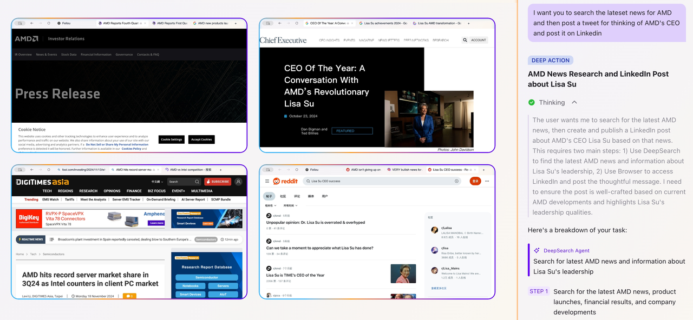
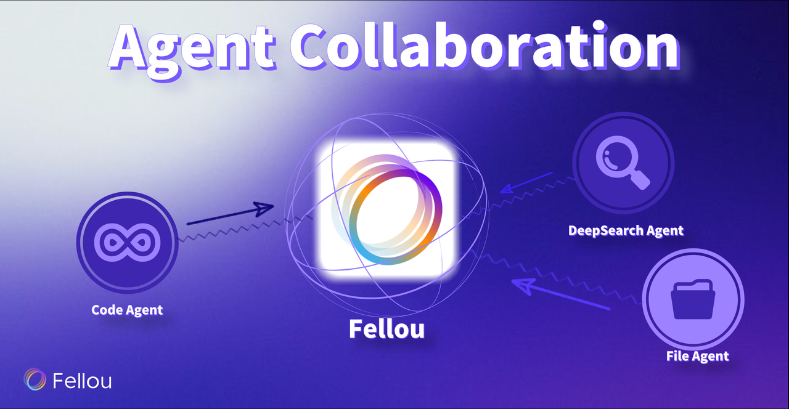
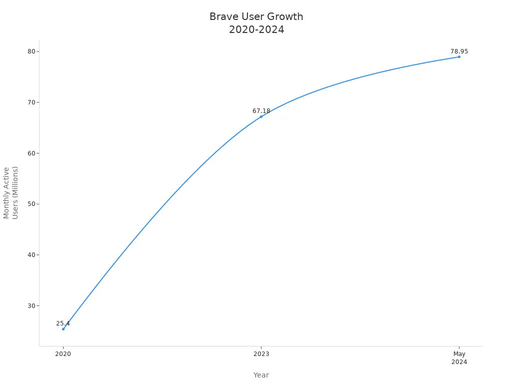
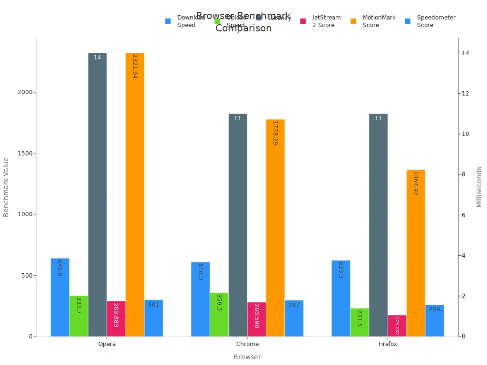

Looking for the best window browser alternatives to [Google Chrome](https://www.google.com/intl/es/chrome/) for 2025? Here are seven top picks:

1.  Fellou
    
2.  Microsoft Edge
    
3.  [Mozilla Firefox](https://www.firefox.com/)
    
4.  Brave
    
5.  Opera
    
6.  [Apple Safari](https://www.apple.com/safari/)
    
7.  [LibreWolf](https://librewolf.net/)
    

You might want a new browser for better privacy, faster speed, more customization, or cool features like AI tools. Take a look at the market share table below to see how these browsers stack up:

| Browser | Desktop Market Share 2024-2025 (%) |
| --- | --- |
| Chrome | 65.25–66.49 |
| Edge | 13.06–13.07 |
| Safari | 7.37 |
| Firefox | 5.86 |
| Opera | 2.65 |
| Brave | 1.65 |

You’ll find these browsers were chosen for strong privacy protection, smart AI integration, and handy productivity tools.

## Key Takeaways

*   Microsoft Edge offers fast performance and strong integration with Windows 11, featuring AI tools and smooth syncing across devices.
    
*   Mozilla Firefox prioritizes privacy with powerful tracker blocking and customization options, making it a top choice for secure browsing.
    
*   Brave blocks ads and trackers automatically, speeds up browsing, and rewards users with tokens for viewing privacy-respecting ads.
    
*   Opera stands out with built-in VPN, ad blocker, and gamer-friendly features, delivering fast browsing and useful tools without extra setup.
    
*   Fellou provides unmatched customization and productivity tools, letting you tailor your browser experience to fit your style and workflow.
    

## 1.Fellou

### Overview

Fellou gives you a browser that feels truly personal. You get a tool that lets you change almost everything about how it looks and works. Fellou stands out because it puts you in control. If you want a browser that matches your style and helps you stay organized, Vivaldi is a smart pick.

### Strengths

*   Researching products and making detailed reports at once
    
*   Filling out forms across different websites
    
*   Gathing information, generate posts and post on social medias at once
    
*   It mixes Retrieval-Augmented Generation with agentic browsing. You can ask for reports, text, images, websites, PPT, CSV, Excel, Word, MP3 or actions and get results easily.
    
*   The [Deep Action feature](https://www.puppyagent.com/blog/rag-agentic-browser-fellou-innovations) lets you give a command. Fellou will collect data, study it, and make reports for you.
    
*   Proactive Intelligence means Fellou learns your habits. It suggests actions before you even ask.
    
*   The Hybrid Shadow Space lets Fellou work in the background. Your main tasks are not stopped.
    
*   The Agent Store gives you special AI agents for different jobs. This makes your work smoother.
    

Fellou’s Deep Action Workflow uses the [Eko Framework](https://fellou.ai/eko/docs/getting-started/eko/). It helps you finish tasks faster and with better accuracy. You get clear and helpful results that make your work easier.

### Features

Fellou packs in productivity tools that help you get more done. [Take a look at this table](https://vivaldi.com/blog/most-powerful-productivity-tool-students/) to see what you get:

| Productivity Tool | Description | User Benefit |
| --- | --- | --- |
| Workspaces | Group tabs into categories | Stay organized, switch tasks easily |
| Tab Stacks | Stack related tabs | Declutter your tab bar |
| Speed Dials | Visual bookmarks | Quick access to favorite sites |
| Notes | Take notes in the browser | Save ideas, add screenshots, organize notes |
| Reading List | Save articles for later | Avoid too many open tabs |
| Web Panels | Sidebar for sites | Multitask without leaving your tab |
| Calendar | Built-in calendar | Organize meetings and events |
| Mail Client | Manage emails | No need for a separate email app |
| To-Do List | Task management | Track tasks and deadlines |
| Sync | Sync across devices | Keep your work up to date everywhere |
| Ad/Video Blocking | Blocks ads and videos | Faster browsing, fewer distractions |
| Password Manager | Secure login management | Easy and safe sign-ins |
| Translation Tool | Translate websites | Work with international content |

You can [take notes right in the sidebar](https://www.xda-developers.com/i-started-using-vivaldi-for-privacy-and-productivity-and-it-does-both-surprisingly-well/), save articles for later, and even manage your calendar and email without leaving the browser.

### Trade-offs

Fellou is different from other browsers because it uses [agentic computing](https://fellou.ai/blog/agentic-browser-fellou-next-evolution-beyond-ai-browsers/). Instead of one AI assistant, Fellou has a [team of AI agents](https://digitaldigest.com/fellou-ai-browser-review/). These agents work together and do many jobs at once. You can keep browsing while the AI works in a hidden workspace called a ”shadow window.” This helps you stay focused and not get distracted. And Fellou is the only AI Browser that can search private sites which require strict user identity confirmation.

## 2.Microsoft Edge

### Overview

Microsoft Edge stands out as a top choice if you use Windows. You get a browser that feels right at home on your PC. Edge [works especially well with Windows 11](https://www.microsoft.com/en-us/edge/learning-center/reasons-to-update-your-browser), so you notice smooth performance and quick loading times. Many people like Edge because it brings together web browsing and Microsoft’s powerful tools in one place.

### Strengths

You will find Edge packed with features that boost your productivity. Here are some highlights:

*   [**AI Copilot Integration**](https://research.aimultiple.com/ai-web-browser/): Edge offers Copilot, an AI assistant built right into the browser. It helps you write emails, summarize web pages, and even generate images using DALL-E.
    
*   **Seamless Windows 11 Experience**: Edge uses [Snap layouts](https://www.microsoft.com/en-us/windows/windows-11), making it easy to organize your tabs and windows. You can drag and drop tabs into different parts of your screen for better multitasking.
    
*   **Enterprise-Grade Security**: If you care about security, Edge gives you strong protection, especially when you use it with Office 365.
    
*   **Smooth PC and Mobile Sync**: You can manage notifications, messages, and calls from your PC, which saves you time.
    

### Features

Edge brings you a lot of smart tools:

*   **GPT-4 Chat and Bing Search**: You can chat with the AI, ask questions, and get organized answers.
    
*   **Voice Input**: Speak instead of type, and Edge will understand you.
    
*   **Tab Management**: Keep your browsing neat with easy tab grouping and switching.
    
*   **Coding Assistance**: If you code, Edge can help you with suggestions and explanations.
    
*   **Structured AI Output**: The AI gives you clear, well-organized results, not just casual replies.
    

### Trade-offs

Edge shines if you use Microsoft services, but it has some limits. Some advanced AI features only work if you have a Microsoft 365 account. Edge relies on Microsoft’s cloud, so you do not get local AI processing. If you want a browser focused only on privacy or open-source tools, Edge might not fit your needs. Still, for most Windows users, Edge offers a powerful, modern browsing experience.

## 3.Mozilla Firefox

### Overview

You probably know Mozilla Firefox as the browser that puts privacy first. Firefox is open-source, so you can trust that the code is transparent and the community checks it often. Millions of users choose Firefox because it gives you [control over your data](https://www.mozilla.org/en-US/privacy/firefox/) and browsing experience. If you want a browser that doesn’t track you everywhere, Firefox stands out.

### Strengths

You get strong privacy protection with Firefox. The browser blocks trackers, cryptominers, and fingerprinting technologies. You can customize your privacy settings easily, so you decide what information gets shared. Firefox also has a huge add-on library, letting you personalize your browser with themes and extensions. Many users switch to Firefox because it feels fast, secure, and less cluttered than Chrome.

> **Tip:** Firefox is known as the top Chrome replacement. You can block annoying notification pop-ups, get alerts if your email is in a data breach, and tweak almost every part of your browser.

Here’s why people love Firefox:

*   [Blocks notification pop-ups](https://www.foxnews.com/tech/best-browser-alternatives-once-popular-now-retired-internet-explorer), so you browse without interruptions.
    
*   Alerts you if your email appears in a data breach.
    
*   Lets you personalize your browser with themes and extensions.
    

### Features

Firefox packs in [privacy tools that set it apart](https://support.mozilla.org/en-US/products/firefox/privacy-and-security) from other browsers. Take a look at this table to see what you get:

| Privacy/Security Feature | Explanation |
| --- | --- |
| Enhanced Tracking Protection | Blocks over 2000 ad trackers automatically to protect your privacy. |
| Total Cookie Protection | Keeps cookies locked to the site that created them, stopping cross-site tracking. |
| DNS over HTTPS (DoH) | Encrypts DNS queries, so no one can snoop on your browsing activity. |
| Fingerprint Blocking | Stops websites from using fingerprinting to track you. |
| Private Browsing Mode | Deletes cookies and history when you close a private session. |
| Password Manager + Firefox Relay | Masks your email and keeps your credentials safe. |

You can manage privacy settings with simple controls. Firefox gives you transparency about data collection and lets you browse with confidence.

### Trade-offs

Firefox works great for privacy and customization, but you might notice some websites optimize better for Chrome. Some web apps run smoother on Chrome or Edge. Firefox uses a bit more memory with lots of tabs open. If you rely on Google services, you may miss some deep integration. Still, Firefox gives you a secure, flexible browser that respects your privacy and puts you in control.

## 4.Brave

### Overview

Brave gives you a fresh way to browse the web. You get a browser that blocks ads and trackers right out of the box. Brave puts privacy first, so you can surf without feeling watched. You also get a built-in search engine that does not track your searches. If you want a browser that feels fast and safe, Brave stands out.

### Strengths

You will notice Brave blocks annoying ads and trackers on every site you visit. This makes pages load faster and keeps your data private. Brave works with independent groups like [PrivacyTests.org and CoverYourTracks (EFF)](https://brave.com/blog/adblocker-testing-websites-harm-users/) to check how well it blocks ads and trackers. These groups run tests and share results, so you know Brave takes privacy seriously. You do not have to set up anything—Brave protects you from the start.

> **Tip:** Brave’s privacy tools work automatically. You do not need to install extra extensions.

Brave also gives you a rewards system. You can earn tokens called BAT (Basic Attention Token) just by seeing privacy-respecting ads. You choose if you want to see these ads. You can use BAT to support your favorite creators or trade it for other currencies.

### Features

Here’s what you get with Brave:

*   **Built-in Ad Blocker**: Stops ads and trackers by default.
    
*   **Brave Rewards**: [Earn BAT tokens for viewing safe ads](https://brave.com/blog/rewards-partners-july/).
    
*   **Brave Search**: Uses a privacy-focused search engine.
    
*   **Brave Wallet**: Lets you manage crypto right in your browser.
    
*   **Fast Browsing**: Pages load quickly because ads and trackers do not slow you down.
    

| Aspect | Details |
| --- | --- |
| Rewards System | Earn BAT for viewing privacy-respecting ads. |
| Revenue Share | Get 70% of ad revenue in BAT; Brave takes 30%. |
| BAT Usage | Support creators or exchange for other currencies. |
| User Growth (2020-2024) | Monthly active users grew from 25.4M (2020) to 78.95M (May 2024). |
| Privacy Focus | Blocks trackers and ads by default. |

### Trade-offs

Brave gives you strong privacy and speed, but some websites may not work perfectly with its ad blocker. You might see fewer ads, but sometimes sites ask you to turn off your blocker. Brave’s rewards system only works if you opt in. If you want lots of browser extensions, Brave’s library is smaller than Chrome’s. Still, if you want privacy, speed, and a way to earn rewards, Brave is a smart choice.

## 5.Opera

### Overview

Opera gives you a fresh take on web browsing. You get a browser that feels fast and modern. Opera stands out with its built-in VPN, ad blocker, and sidebar for quick access to your favorite apps. If you love gaming, Opera GX offers special features just for you. You can customize the look and feel, making Opera fit your style.

### Strengths

You will notice Opera loads pages quickly and handles lots of tabs with ease. Many users pick Opera for its built-in tools. You do not need to install extra extensions for ad blocking or VPN. Opera GX brings unique features for gamers, like CPU and RAM limiters, so your games run smoothly while you browse.

> **Note:** Opera GX lets you control how much computer power the browser uses. This helps you avoid lag during gaming sessions.

Here’s how Opera compares to other browsers on speed and performance:

| Browser | Download Speed (Mbps) | Upload Speed (Mbps) | Latency (ms) | JetStream 2 Score | MotionMark Score | Speedometer Score |
| --- | --- | --- | --- | --- | --- | --- |
| Opera | 640.9 | 333.7 | 14 | 289.883 | 2321.94 | 301 |
| Chrome | 610.3 | 359.5 | 11 | 280.598 | 1778.29 | 297 |
| Firefox | 623.3 | 231.5 | 11 | 175.132 | 1364.92 | 259 |

### Features

Opera packs in features you will use every day:

*   Built-in VPN for browsing with more privacy
    
*   Free ad blocker to stop annoying ads
    
*   Sidebar for quick access to WhatsApp, Messenger, and more
    
*   Snapshot tool for easy screenshots
    
*   Opera GX for gamers, with sound effects and custom themes
    

You can also sync your bookmarks and tabs across devices.

### Trade-offs

[Opera’s VPN only protects traffic inside the browser](https://www.opera.com/secure-private-browser). It does not cover other apps on your computer. The VPN lacks advanced features like a kill switch or DNS leak protection. Opera’s privacy policy is not as strong as some rivals. If you want serious privacy, you may want a dedicated VPN. Some users notice Opera feels a bit slower than Chrome or Brave on certain sites, with pages taking [a second or two longer to load](https://medium.com/%40mihirgrand/i-benchmarked-and-tested-8-browsers-so-i-could-find-the-one-i-could-settle-with-in-2024-b3485ee2aa09). Still, Opera gives you a lot of value with its built-in tools and gamer-friendly options.

## 6.Apple Safari

### Overview

You might know Apple Safari as the default browser for Macs and iPhones, but now you can use it on Windows too. Safari brings a clean look and smooth experience. If you use Apple devices, you’ll find it easy to sync bookmarks, passwords, and tabs across all your screens. Safari uses the WebKit engine, which helps it run fast and stay efficient.

### Strengths

Safari stands out for speed and security. You get quick page loads and a simple interface. Apple designed Safari to work well with its hardware, but recent updates make it a strong choice for Windows users. If you care about privacy, Safari includes tools to block trackers and limit ads. You also get strong integration with Apple’s ecosystem, so switching between your iPhone, iPad, and PC feels seamless.

> **Note:** Safari is a top pick if you want a browser that works well with Apple devices and keeps things simple.

Here’s why Safari might be right for you:

*   Fast browsing speeds on Windows
    
*   Strong data security features
    
*   Easy syncing with Apple devices
    
*   Clean, distraction-free design
    

### Features

Safari packs in features that help you browse smarter:

| Feature | What It Does |
| --- | --- |
| Intelligent Tracking Prevention | Blocks cross-site trackers and limits ads |
| Privacy Report | Shows you which trackers Safari blocked |
| Password Manager | Saves and autofills your passwords |
| Reading List | Lets you save articles for later |
| Tab Groups | Organizes tabs for different tasks |
| iCloud Sync | Syncs bookmarks, tabs, and passwords |
| Energy Efficiency | Uses less battery on laptops |

Safari’s performance on Windows is impressive. Apple ran tests in August 2024 using JetStream 2.2, MotionMark 1.3.1, and Speedometer 3.0. Safari 18.0 scored higher than Chrome, Edge, and Firefox on Qualcomm Snapdragon X Elite PCs running Windows 11 Home. Safari loaded popular websites about [40% faster than Chrome](https://www.apple.com/safari/). These results show you get a speedy experience, especially if you visit the same sites often.

*   Apple’s tests used controlled Wi-Fi and specific hardware.
    
*   Safari topped all major benchmarks for speed.
    
*   You get faster loading times for your favorite sites.
    

### Trade-offs

Safari gives you speed and a clean look, but its [privacy tools are not as strong as some rivals](https://www.av-comparatives.org/tests/mac-security-test-review-2024/). Independent tests show Safari blocks trackers and uses fingerprinting defense, but it still allows some ads and trackers by default. Safari does not support Global Privacy Control, so you cannot opt out of all data sharing. Browsers like Brave offer more privacy features out-of-the-box. If you want the best privacy, you may want to look elsewhere. Safari works best if you use Apple devices and want a simple, fast browser for everyday use.

## 7.LibreWolf

### Overview

LibreWolf gives you a browser that puts privacy first. If you want a tool that keeps your data safe, LibreWolf stands out. This browser is based on Firefox, but it comes with extra privacy features right out of the box. You do not need to tweak settings or add lots of extensions. LibreWolf is ready to protect you from the start.

### Strengths

You get strong privacy with LibreWolf. The browser blocks thousands of trackers and ads before they even load. LibreWolf does not collect your data or send information back to Mozilla. You can browse the web without worrying about who is watching. Many people choose LibreWolf because it removes all the built-in tracking you find in standard Firefox. If you care about staying anonymous online, this browser gives you peace of mind.

> **Tip:** LibreWolf is a great pick if you want a browser that works like Firefox but takes privacy to the next level.

### Features

LibreWolf comes packed with privacy tools that work automatically. Here are some of the things you get:

*   Enhanced Tracking Protection set to strict, [blocking over 3,000 trackers and ads](https://www.howtogeek.com/sick-of-being-tracked-these-browsers-put-your-privacy-first/).
    
*   uBlock Origin built in, so you do not see annoying ads or hidden trackers.
    
*   Cookies and site data clear every time you close the browser.
    
*   Total Cookie Protection keeps third-party cookies from following you around.
    
*   Anti-fingerprinting blocks websites from using tricks like canvas, font, or WebGL to identify you.
    
*   WebRTC is off by default, so your real IP address stays hidden, even with a VPN.
    
*   The browser never saves form inputs or search history.
    
*   Cached files and temporary storage clear when you exit.
    
*   HTTPS-Only Mode makes sure you always use secure connections.
    
*   [DuckDuckGo](https://duckduckgo.com/) is the default search engine, so your searches stay private.
    
*   LibreWolf removes all telemetry and tracking found in regular Firefox.
    

### Trade-offs

LibreWolf gives you top-notch privacy, but you might miss some features from standard Firefox. You will not find built-in sync with Firefox accounts or some cloud services. Some websites may not work perfectly because of the strict privacy settings. You may need to adjust settings for certain sites. LibreWolf focuses on privacy, so it does not offer as many extras or integrations as other browsers. If you want a simple, private browsing experience, LibreWolf is a strong choice.

## Window Browser Comparison

### Performance

You want a window browser that feels fast and smooth. Most browsers today load pages quickly, but some stand out. Opera and Safari often lead in speed tests. Opera handles lots of tabs without slowing down. Safari uses smart hardware tricks to load sites faster, especially on Apple devices. Edge works well with Windows and gives you quick access to Microsoft tools. Brave speeds up browsing by blocking ads and trackers. Firefox and LibreWolf run well, but you might notice a small lag with many tabs open. Vivaldi offers good speed, but its extra features can slow things down if you use them all.

| Browser | Speed (General) | Handles Many Tabs | Special Speed Features |
| --- | --- | --- | --- |
| Opera | Very fast | Yes | Built-in ad blocker, VPN |
| Safari | Fastest on Apple | Yes | Hardware-optimized |
| Edge | Fast on Windows | Yes | AI Copilot, Snap layouts |
| Brave | Fast | Yes | Blocks ads/trackers |
| Firefox | Fast | Good | Enhanced Tracking Protection |
| Vivaldi | Good | Good | Custom tab management |
| LibreWolf | Good | Good | Strict privacy settings |

### Privacy

Privacy matters when you pick a window browser. [Firefox, Safari, and Brave lead the way](https://proprivacy.com/privacy-service/comparison/most-secure-browsers). They block trackers and cookies by default. Brave goes further with fingerprinting protection and even lets you use Tor for extra privacy. LibreWolf gives you strict privacy settings and blocks thousands of trackers. Edge and Chrome offer strong security, but you need to change settings to block trackers. Vivaldi gives you control, but its privacy features are not as strong as Brave or Firefox.

> Tip: If you want the best privacy out-of-the-box, try Brave, Firefox, or LibreWolf.

| Browser | Default Privacy Protections | Security Highlights | Audit Notes |
| --- | --- | --- | --- |
| Firefox | Blocks trackers/cookies | Open-source, frequent updates | Top privacy scores |
| Safari | Blocks cross-site trackers | Hardware security, sandboxing | Top privacy scores |
| Brave | Aggressive tracker blocking | Fingerprinting randomization, Tor | Leading privacy-first browser |
| Edge | User-configurable | SmartScreen, Enhanced Security Mode | Less aggressive default privacy |
| Chrome | Manual settings needed | Safe Browsing, frequent patches | Strong security, less privacy |
| Vivaldi | Good controls | Chromium-based security | Not as strong as Brave/Firefox |
| LibreWolf | Strict privacy by default | No telemetry, built-in ad blocker | Privacy-focused, Firefox-based |

### Customization

You want your window browser to fit your style. Vivaldi gives you the most options. You can change almost everything, from tab layout to colors. Firefox lets you use themes and add-ons to make it your own. Opera offers a sidebar and custom themes. Edge and Chrome let you change backgrounds and add extensions. Brave and LibreWolf focus on privacy, so they offer fewer customization choices.

*   Vivaldi: Move toolbars, change themes, stack tabs, add notes.
    
*   Firefox: Use themes, add-ons, tweak privacy settings.
    
*   Opera: Sidebar, custom themes, gaming features.
    
*   Edge: Change backgrounds, use extensions.
    
*   Chrome: Many themes, extension options.
    
*   Brave: Simple look, privacy tools.
    
*   LibreWolf: Privacy-focused, limited customization.
    

### Extension Support

Extensions help you do more with your window browser. Chrome has the biggest library, with [over 188,000 extensions](https://www.cloverdynamics.com/blogs/browsers-that-support-extensions). Firefox supports about 30,000 extensions and lets you customize a lot. Edge uses many Chrome extensions and adds its own, with strong security checks. Opera and Vivaldi support most Chrome extensions. Safari supports extensions, but the library is smaller. LibreWolf supports Firefox extensions, but strict privacy settings may block some.

| Browser | Extension Library Size | Special Notes |
| --- | --- | --- |
| Chrome | Largest (~188,000) | Most options, easy to find tools |
| Firefox | ~30,000 | High customizability |
| Edge | Large, secure | Strict verification, Chrome support |
| Opera | Supports Chrome ext. | Easy to use, smaller library |
| Vivaldi | Supports Chrome ext. | Custom features, good support |
| Safari | Smaller library | Focus on security |
| LibreWolf | Firefox extensions | Privacy may block some extensions |

## Choosing a Window Browser

When you pick a window browser, you want one that matches your needs. Some people care most about privacy, while others want speed, productivity, or a browser they can make their own. Here’s how you can decide which browser fits you best.

### Privacy

If privacy matters to you, look for a window browser that blocks trackers and protects your data. Here are some things to keep in mind:

*   [Private browsing or incognito mode only hides your history on your device](https://gibraltarsolutions.com/blog/web-browsers-and-data-privacy-balancing-enterprise-and-personal-use/). Websites and your internet provider can still see what you do.
    
*   Some browsers use fingerprinting to track you, even if you block cookies.
    
*   Using the same browser for work and personal stuff can mix your data. Try using separate profiles if your browser offers them.
    
*   Always update your browser to stay safe from new threats.
    
*   Be careful with extensions. Only install ones you trust, since some can collect your data.
    
*   Privacy settings can be tricky. Take time to learn what each setting does.
    

> Tip: Brave, Firefox, and LibreWolf offer strong privacy features right out of the box.

### Speed

You want a window browser that loads pages fast and runs smoothly. Recent tests show [Chrome and Microsoft Edge lead in speed](https://www.cloudwards.net/fastest-browser/), with Opera, Brave, and Vivaldi close behind. Firefox is a bit slower, especially with lots of tabs open.

| Browser | JetStream 2 | Speedometer | Basemark Web 3.0 | MotionMark 1.2 |
| --- | --- | --- | --- | --- |
| Chrome | 168 | 169 | 924 | 761 |
| Microsoft Edge | 163 | 158 | 929 | 745 |
| Opera | 155 | 127 | 771 | 581 |
| Vivaldi | 152 | 123 | 737 | 566 |
| Firefox | 101 | 118 | 689 | 541 |

If you want the fastest experience, try Chrome or Edge. For good speed and privacy, Brave is a solid pick.

### Productivity

A good window browser can help you get more done. Look for features like tab grouping, built-in note tools, and easy syncing. Here’s a quick look at what some browsers offer:

| Browser | Productivity Features |
| --- | --- |
| Microsoft Edge | Collections, annotation, immersive reader, Office 365 integration, fast loading |
| Mozilla Firefox | Reader View, Pocket, advanced tab isolation, customizable interface |
| Vivaldi | Workspaces, tab stacks, built-in notes, calendar, mail client |
| Opera | Sidebar for messaging apps, snapshot tool, built-in VPN |

> Note: If you use lots of web apps or need to organize many tabs, Vivaldi and Edge stand out for productivity.

### Customization

You might want your browser to look and work your way. [Customization lets you change themes, move toolbars, and add extensions](https://wpsecurityninja.com/why-using-the-right-web-browser-is-important/). This can make your workflow faster and more fun.

*   Extensions help you block ads, manage passwords, and organize tabs.
    
*   Personal themes and layouts make your browser feel unique.
    
*   Syncing settings across devices keeps your experience smooth everywhere.
    

Research shows that when you personalize your browser, you work better and feel happier using it. Vivaldi and Firefox give you the most options for making your browser your own.

> Try different browsers to see which one feels right for you. The best window browser is the one that fits your style and needs.

You have lots of great browser choices, each with its own strengths. Here’s [a quick look at what users like and dislike](https://seraphicsecurity.com/learn/island-browser/top-7-island-browser-competitors-in-2025-pros-and-cons/):

| Browser | Pros | Cons |
| --- | --- | --- |
| Vivaldi | Customizable, built-in tools | High memory use, complex settings |
| Edge | Fast, Windows integration | Some privacy concerns |
| Firefox | Excellent privacy, low resource use | Slower on some sites |
| Brave | Strong privacy, fast | Fewer extensions |
| Opera | Efficient, unique tab features | Not as private as others |
| Safari | Fast, secure | Fewer extensions |
| LibreWolf | Top privacy, no tracking | Limited features |

> Try a few browsers to see what fits your style. You might love new features like [AI tools, dark mode](https://www.thewebfactory.us/blogs/tag/web-development-trends-2025/), or better privacy. Let us know your favorite in the comments or ask any questions!

## FAQ

### What is the safest browser for privacy?

You get the best privacy with Brave, LibreWolf, or Firefox. These browsers block trackers and ads by default. They do not collect your data. If you want strict privacy, try LibreWolf. For easy setup, Brave is a great pick.

### Can I use Chrome extensions on other browsers?

Yes! Edge, Opera, and Vivaldi support most Chrome extensions. You just visit the Chrome Web Store and add them. Firefox and LibreWolf use their own add-ons. Safari has a smaller extension library.

### Which browser is best for slow computers?

Try Opera or Firefox. Both use less memory and run well on older PCs. Opera’s built-in ad blocker helps pages load faster. You can also use Brave for speed if you want strong privacy.

### Do these browsers work on mobile devices?

Yes, most do! Edge, Firefox, Brave, Opera, and Vivaldi have mobile apps. You can sync bookmarks and tabs between your phone and computer. Safari works best with Apple devices.

### How do I switch browsers without losing my bookmarks?

You can import bookmarks easily. Most browsers have an “Import Bookmarks” tool in their settings. Just follow the steps, and you keep your favorite sites. No need to start over!
