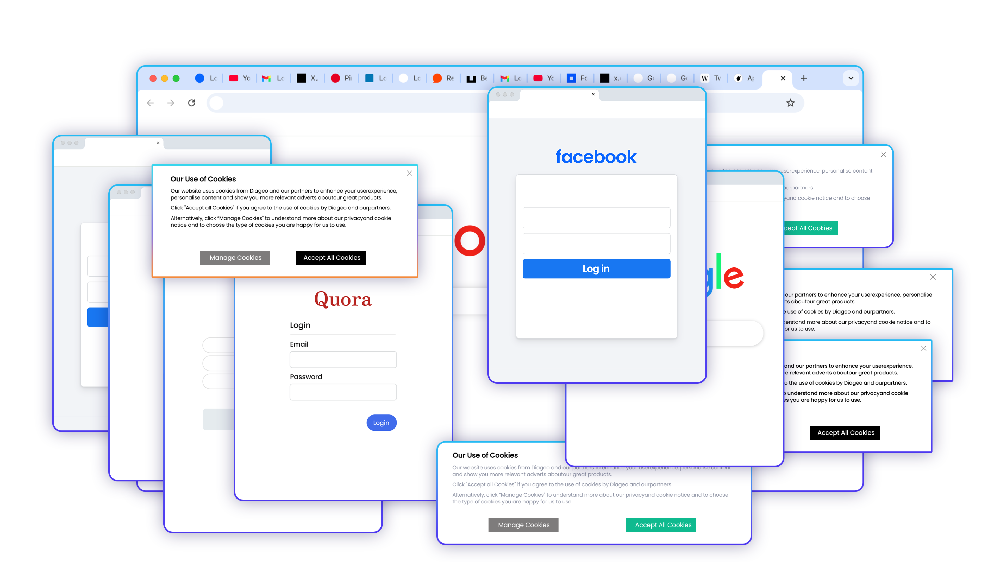
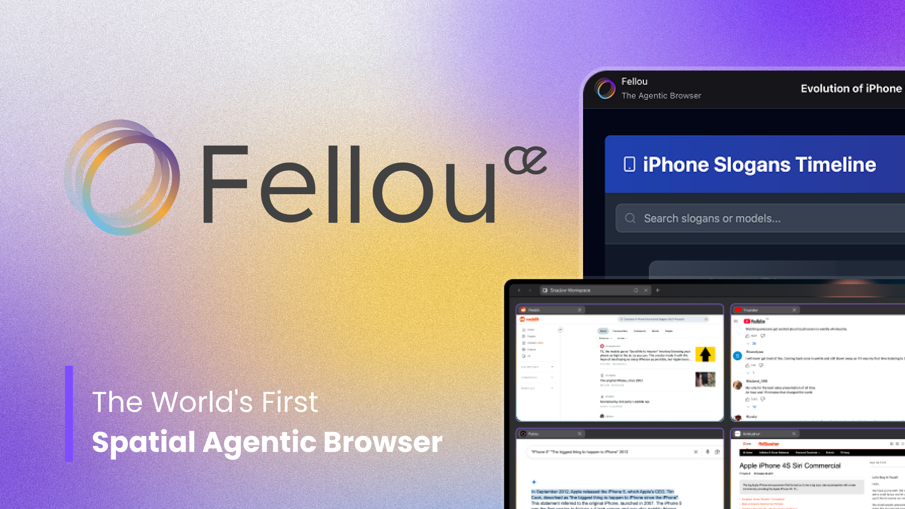
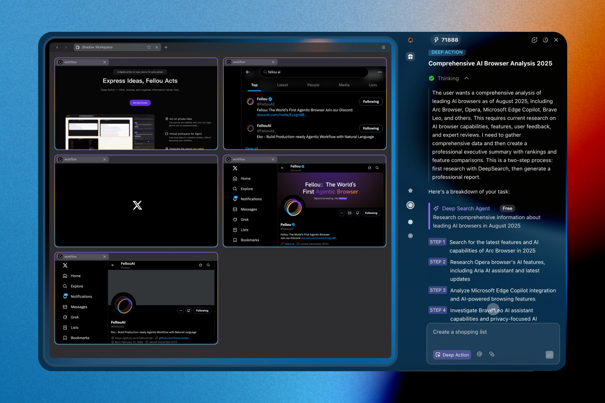
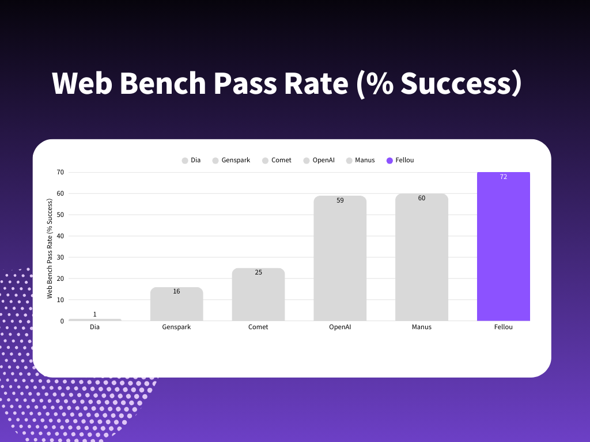
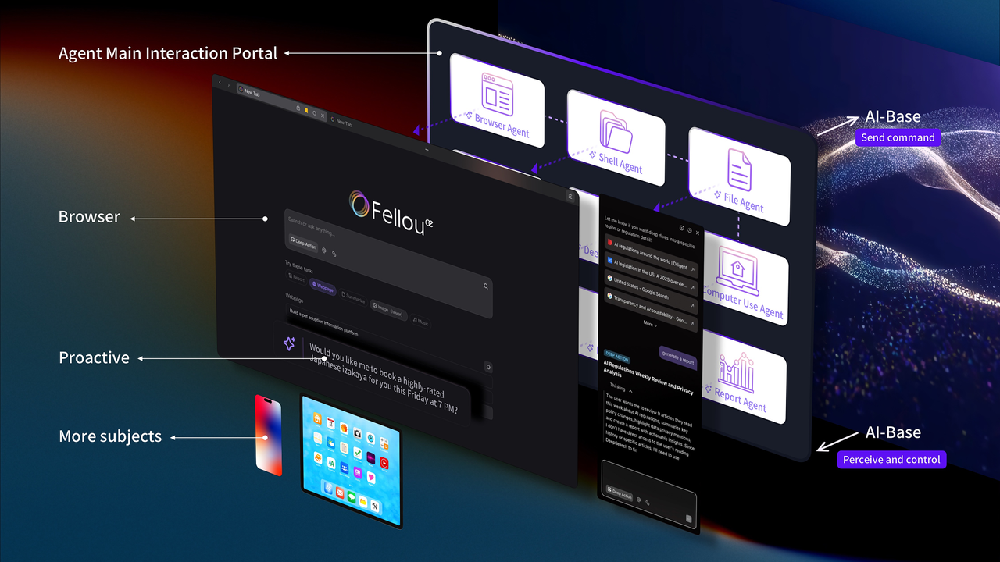
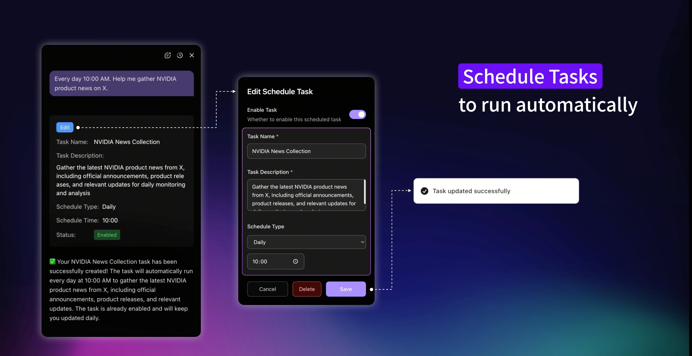

## **The End of an Chaotic Era, The Dawn of AI Browser**

Think about your day. A single goal, like producing a market analysis report, shatters into a dozen browser tabs, multiple logins, and a mind-numbing sequence of manual copy-pasting. We live in a paradox of productivity, drowning in the very tools meant to set us free. Your primary tool, the browser, has become the cage. It's a passive window on a dynamic world, a relic of a simpler age, fundamentally broken for today’s complexity.

That era ends now. Today, we are officially launching

**Fellou CE (Concept Edition)**—not just an update, but an entirely new category of software: the world's first **Spatial** [**Agentic Browser**](https://fellou.ai/blog/ai-browser-agentic-workflows-productivity-automation/). Fellou CE is an intelligent, autonomous partner built to understand your intent and execute complex tasks on your behalf. It is designed to do one thing: transform you from the one _doing_ the work, to the one _directing_ the outcome.

## **Fellou's Vision: Reclaiming Human Creativity**

In a tech landscape obsessed with the question, "How much time can AI save you?", we believe that is precisely the wrong approach. Measuring an [**AI browser**](https://fellou.ai/blog/how-fellou-redefines-ai-browser-with-agentic-automation/)**'s** value in minutes saved merely helps us run faster on the same treadmill. The true, transformative power of **agentic AI** lies in its ability to serve as a ‘**cognitive lever**’—a tool that fundamentally expands how we think, create, and solve complex problems. Our core philosophy is not to simply automate tasks, but to augment human intellect.

This journey is inspired by a singular, ambitious goal articulated by our founder, Dominic Xie: to create a "Jarvis for everyone". Our ultimate vision is to give every person a deeply integrated, [personal AI agent](https://fellou.ai/blog/fellou-first-launch/) that truly understands their intent, operates seamlessly across all their devices, and works tirelessly to help them achieve their most important goals.

## **A Deep Dive into the Fellou CE Experience**

The powerful Fellou CE experience is driven by two core pillars: a revolutionary **Spatial Interface** and an advanced **Agentic Engine**. These components work in synergy to transform your browser from a passive window into an active, thinking partner.

### **Your Spatial Workspace in AI Browser**

We have fundamentally redefined the user interface by introducing a **Z-axis**, creating a digital environment with true depth In this new dimension, your AI agents get their own dedicated workspace, making your collaboration with AI clearer and more efficient than ever before.

*   **Dynamic Multitasking**: The system automatically creates dedicated spatial zones for the execution of each task. Users can continue to browse the web without interruption while these tasks run in the background
    
*   **Shadow Workspace**: This intelligent workspace tracks and manages all user activities in the background. It allows for real-time monitoring and intervention, ensuring you have full control over your digital partner at any point.
    
*   **Fellou Home**: This is your three-dimensional command center. It serves as a centralized spatial hub that intuitively organizes your bookmarks, browsing history, local files, and task lists, designed to dramatically reduce cognitive load and eliminate tab juggling.
    

### **Turning Intent into Autonomous Action**

At its core, Fellou CE is powered by a sophisticated engine that understands complex intent and executes autonomously.

*   [**Deep Action**](https://fellou.ai/blog/fellou-v2-launch/): This is Fellou’s superpower. You can issue complex instructions in natural language, such as "Find 10 jobs suited to my LinkedIn profile and apply with my resume," and Fellou's AI agent will autonomously carry out these multi-step tasks across different websites.
    
*   **Deep Search & Visual Report (Free for All)**: Fellou’s Deep Search automates research across multiple sources, even from logged-in sites like X and Reddit, generating personalized reports. Tailoring results to what their algorithms typically show you. All information is fully traceable with source links, providing verifiable and relevant insights.
    

We believe this level of intelligence should be accessible to everyone. That’s why **our powerful Deep Search and Visual Report are completely free for all users.**

*   **Parallel Multi-Agent Operations**: Multiple AI agents can simultaneously research markets, draft reports, and analyze data, creating images, SVG, making music or coding, each in its own dedicated workspace. They work together in parallel without conflict, accomplishing in minutes what would take human hours.
    

But these powerful execution capabilities aren't just theoretical. On the rigorous **Halluminate's Web Bench benchmark**, Fellou CE’s performance has been validated in real-world scenarios.

*   **The Challenge**: The benchmark covers over 500 real-world websites and 5,750 browser automation tasks. It reveals that while most agents perform well on simple "read" tasks, their success rates drop significantly on complex "write" tasks like logging in, filling out forms, and downloading files.
    
*   **Fellou’s Superior Performance**: On these highly difficult "write" tasks, **Fellou achieves a remarkable 72% success rate**.
    
*   **The Competitive Edge**: This result significantly outperforms competitors such as manus (60%) and OpenAI (59%).
    

### [**The Seamless Continuum**](https://arxiv.org/pdf/2508.06849#:~:text=This%20paper%20positions%20lived%20experience,and%20context%2Daware%20AI%20systems.)**: Breaking Down Digital Silos**

Fellou CE is designed to break down the barriers between apps, data, and memory to create a unified, fluid experience.

*   **Enhanced Agentic Memory**: This advanced system allows you to instantly retrieve and summarize previously browsed information, turning your browser history into an intelligent, searchable knowledge base.
    
*   **Seamless Integration (Local & Web)**:
    
    *   **Cross-App Integration**: Forget complex automation tools. Fellou enables quick, seamless information transfer between apps with simple drag-and-drop or copy-paste functionality.
        
    *   **Seamless Local File Power**: Command your local computer files directly from your browser. Fellou can automatically search, move, and organize any document on your computer.
        
    *   **@Web: Instant Context**: With the @Web feature, you can just @ any web page in the chat bar to pull in exactly what you need, eliminating the need to copy-paste or sift through tabs.
        

### **Control and Convenience by Design**

Powerful automation must be built on a foundation of absolute trust and control.

*   **Controllable Workflow**: The entire automation process is visualized, allowing you to edit, approve, or modify any step in real-time. This ensures Fellou's actions align with your strategic goals. We believe this shifts from a reactive prompt-response tool to a proactive partner that performs
    
*   **Task Decomposition and Planning** is key to deep human-agent collaboration.
    
*   **Scheduled Task Execution**: With flexible smart scheduling, you can set important, multi-step tasks to get done on time—automatically. Set it once, and let Fellou handle the rest, allowing your AI browser to work for you even while you rest.
    

### **Trust & Transparency is Our Top Priority**

A true partnership with an **AI browser** must be built on a foundation of absolute trust. From day one, we have engineered Fellou CE with principles that prioritize your security and put you in complete control

*   **Local-First, Privacy-First**: We champion a local-first, on-device execution model. This ensures your most sensitive information and operations never need to leave your machine. By processing data locally, we eliminate privacy concerns, latency issues, and dependencies on connectivity, setting a new standard for security in the **agentic AI** space.
    
*   **Transparent Sparks Usage**: Powerful automation should never come with surprise costs. To ensure transparency, every Deep Action includes a clear preview of the "Sparks" it will consume. Before you commit to an action, you’ll see a precise estimate of the required credits, empowering you to make confident, cost-aware decisions with total clarity. (ps. Sparks = Credits)
    

## **Fellou's Roadmap: The Journey to Your Personal "Jarvis"**

The launch of Fellou CE is a major step forward, but it is just the beginning of our journey. We have a clear, multi-stage vision for creating the ultimate AI partner, culminating in our long-term mission to deliver a "Jarvis for everyone".

*   **Stage 1: Your AI Super-Partner (Today)**: We're launching Fellou to be your most reliable AI co-pilot, acting as a personal project manager for complex tasks. It's backed by a squad of specialized "sub-agents" that team up to make your work frictionless. In this stage, you are always the boss—every major decision comes back to you for final approval.
    
*   **Stage 2: Magical Tools for Everyone (Next)**: In the next phase, Fellou will become your personal "toolkit," without requiring you to write a single line of code. You will be able to use natural language to tell Fellou what you need, and it will connect your useful apps to build a unique "magic tool" just for you. Our mission is to let anyone build their own automated assistant—like LEGOs—making Fellou's power accessible to everyone.
    
*   **Stage 3: Your "Jarvis" (Future)**: Our ultimate dream is to give everyone their own personal "Jarvis." This will be a truly trustworthy AI that deeply understands you and works for you. It will redefine the very concept of an interface.
    
    *     Imagine a [**Generative UI**](https://www.nngroup.com/articles/generative-ui/) that fluidly adapts to your goals in real-time—a workspace that builds itself around your immediate needs, presenting the perfect tools for the task at hand while hiding all irrelevant distractions. This is the end of static menus and rigid layouts; it is the beginning of a truly dynamic and personalized digital environment.
        
    *     In this future, Fellou won't just be a tool that executes tasks. It will be a true partner in **computational co-creation**, building a seamless and intelligent world with you, not just for you. Together, we will achieve our most important goals and build a better future.
        

## **Join the Next Renaissance: Your Journey Starts Now**

We believe the best form of human-computer symbiosis is a partnership where AI helps us reclaim our focus and gives us the courage to pursue our biggest ideas. Fellou CE is more than a new **AI agentic browser**; it's an invitation to a new era of creativity and productivity. It's a partner that doesn't shout but is always present; one that doesn't bind you but empowers you to be more yourself.

Your journey into the future of autonomous web interaction begins today.

The wait is almost over. **Fellou CE officially launches worldwide today, September 2nd, at 10:00 AM PST | 1:00 PM EST.**

To celebrate our launch, here is everything you need to know:

*   **7-Day Invite-Code-Free Access**: From September 2nd to September 8th, you can download and experience the platform's full potential without needing an invitation code.
    
*   **Core Power, Permanently Free**: Our most powerful features, **Deep Search and Visual Report generation, are completely free** for all users, forever.
    
*   **Mac/Windows Version**: All Mac users will able to access it once we officially launch. For our Windows users, the wait is nearly over! The official Windows version of Fellou CE drops on September 9th.
    

Be the first to get access by heading to our official website. We can't wait for you to join us.