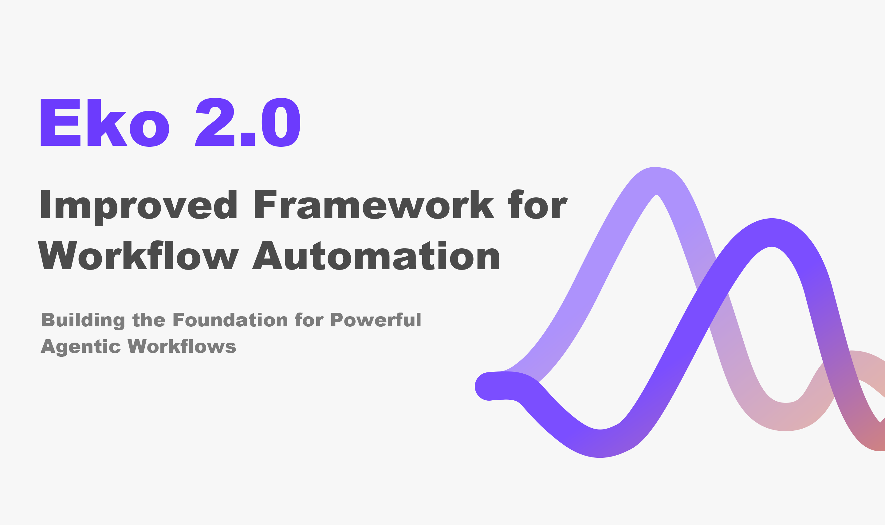
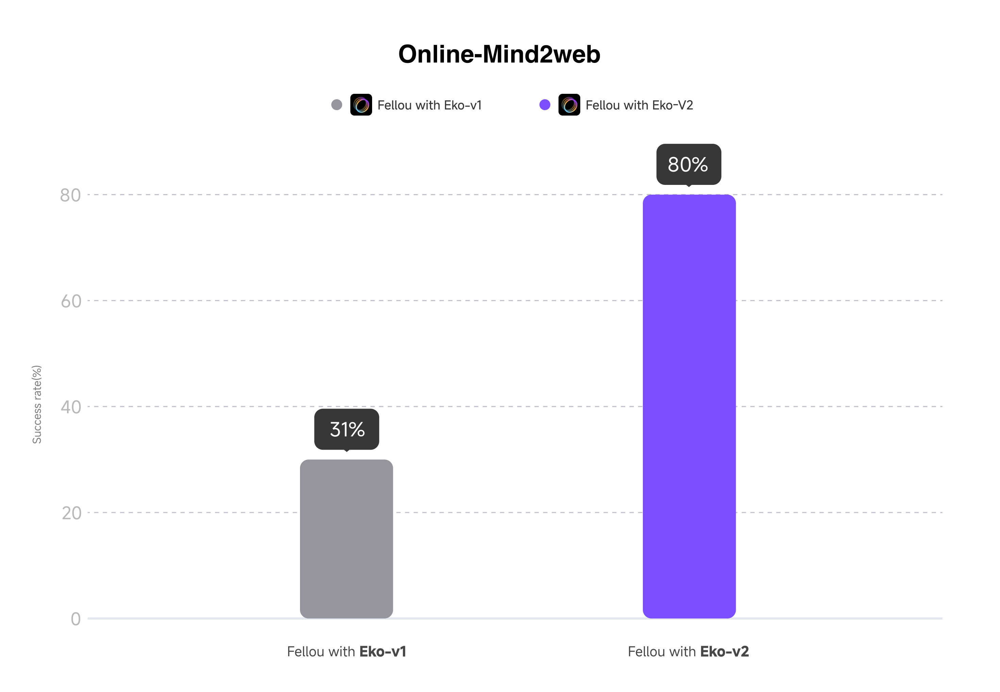
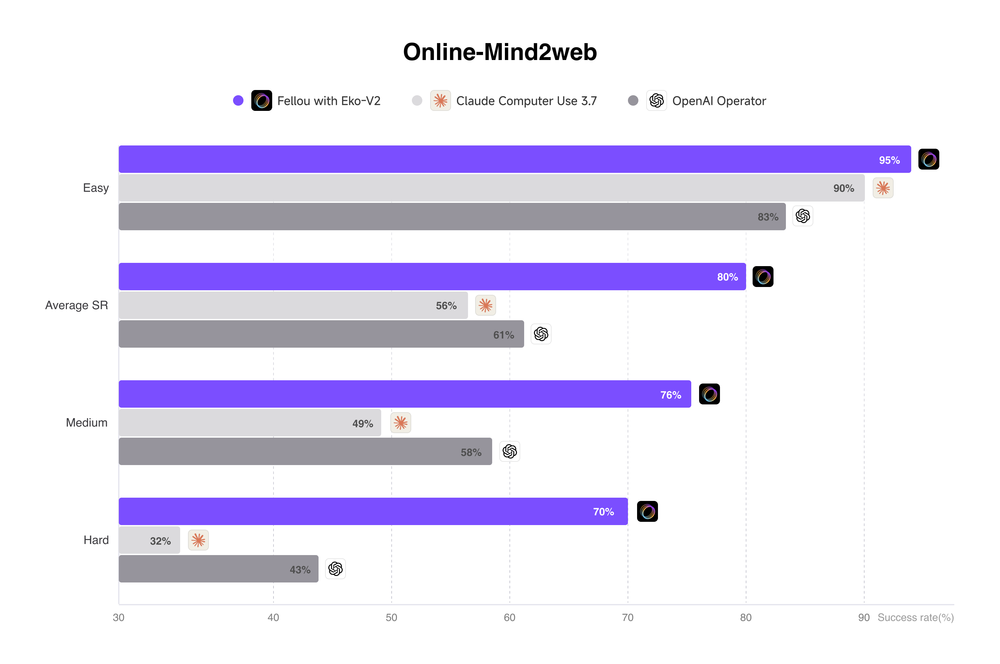
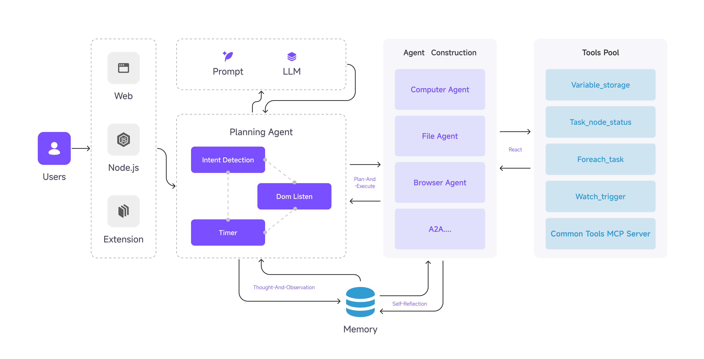

The future of work isn't just about having intelligent tools—it's about having tools intelligent enough to adapt and recover on their own, while possessing the performance and scale to handle complex production-grade task scenarios. Today marks an important moment in that evolution. Eko 2.0 represents more than an incremental update; it's a dual breakthrough in both capability boundaries and execution efficiency for Agentic Workflow Frameworks.

## Eko 2.0: Building the Foundation for Powerful Agentic Workflows

When we launched Eko 1.0, our vision was simple: make complex agentic workflow automation accessible to everyone through natural language, giving developers an out-of-the-box solution for building and running intelligent workflows. The community response was incredibly encouraging, but it also revealed something crucial—the demand for truly production-ready, high-performance agentic frameworks was far outpacing what existing solutions could deliver.

Eko 2.0 is the result of months of intensive research, community feedback, and real-world deployment insights. This isn't just about piling on new features—it's about exploring what becomes possible when cutting-edge AI capabilities meet production-grade architecture. While Eko 1.0 successfully enabled developers to build agents that could tackle repetitive tasks, Eko 2.0 takes things to the next level as a robust Framework for creating truly production-grade agentic workflows.

The performance improvements speak for themselves: Eko 2.0 doesn't just add native support for multi-agent collaboration—it also delivers breakthrough results on the rigorous Online-Mind2web benchmark, with task success rates jumping dramatically from 31% to 80%. This significant performance leap demonstrates real progress in framework reliability and practical utility.

## Performance Revolution Breakthrough: Eko 2.0 Dominates the Online-Mind2web Benchmark Rankings

The significant performance improvements we mentioned earlier are just the beginning—the specific data is even more compelling. Eko 2.0 has achieved SOTA performance on the widely recognized Online-Mind2web benchmark in the industry.

What's even more noteworthy is Eko 2.0's consistently excellent performance across different complexity levels:

- **Easy Tasks**: 95% success rate (vs 80-90% for other products)
- **Average Success Rate**: 80% success rate (vs 56-61% for other products)
- **Medium Complexity**: 76% success rate (vs 49-58% for other products)
- **Hard Tasks**: 70% success rate (vs 32-43% for other products)

Behind these numbers lies the critical difference between unreliable automation tools and production-ready Agentic Workflow Frameworks that enterprises can truly depend on.

## What's New in Eko 2.0: The Standout Improvements and Feature Additions

| Feature                          | Eko 2.0                  | Eko 1.0                 |
| -------------------------------- | ------------------------ | ----------------------- |
| **Performance**                  | 1.2x faster execution    | Baseline speed          |
| **Multi-Agent Support**          | ✅ Native orchestration  | ❌ Single agent only    |
| **DOM Event Handling**           | ✅ Real-time monitoring  | ❌ Static interactions  |
| **Tool Integration**             | ✅ MCP Protocol support  | ❌ Limited tool options |
| **Agent-to-Agent Communication** | ✅ Coming soon           | ❌ Not supported        |
| **LLM Configuration**            | ✅ Dynamic switching     | ❌ Fixed configuration  |
| **Planning System**              | Stream Planning & Replan | Simple Plan             |
| **Callback Architecture**        | Stream & Human Callbacks | Basic Hooks             |

### Multi-Agent Collaboration Architecture

Eko 2.0 natively supports Multi-Agent collaboration, delivering significant improvements in both speed and capability. In developing Eko 2.0, we've witnessed the rapid development of inter-agent communication protocols. Soon, we'll also natively support A2A functionality, enabling direct information exchange between agents and further enhancing the intelligence level and execution efficiency of entire Agentic Workflows.

This multi-agent collaboration architecture doesn't just boost performance—more importantly, it provides more flexible and reliable solutions for complex business scenarios.

### Dynamic Planning Engine

Eko 1.0 used single-shot planning. Once an execution plan was set, it couldn't be flexibly adjusted, which often proved inadequate when facing complex and dynamic real-world scenarios. Eko 2.0's Dynamic Planning Engine completely transforms this limitation.

**Stream Planning & RePlanning** enables Eko 2.0 to generate and adjust execution plans in real-time. When workflows encounter unexpected situations during execution, such as webpage structure changes, API response anomalies, or data format mismatches, the system doesn't simply throw errors and stop. Instead, it dynamically replans subsequent steps based on the current execution state. This adaptive capability ensures workflow continuity and reliability, gracefully handling and recovering even from unforeseen circumstances.

**Dynamic LLM Configuration** further enhances the system's intelligence level. Eko 2.0 can dynamically adjust language model parameters at runtime based on specific task requirements, even switching between different model configurations during various execution phases. This intelligent resource allocation not only optimizes performance but also significantly improves cost-effectiveness.

### Reactive Execution Control

In Eko 1.0, we provided developers with workflow observability and intervention capabilities through our Hook system—workflow hooks, subtask hooks, and tool hooks enabled monitoring and adjustments at critical points. While this design performed well in static environments, modern web applications increasingly rely on dynamic content and asynchronous loading, presenting challenges that traditional hook mechanisms often struggle to handle effectively.

Eko 2.0's Reactive Execution Control system builds upon the core principles of the Hook system while being specifically redesigned for the challenges of dynamic web environments. We've evolved from passive "hook listening" to proactive "event response," enabling agents to truly "understand" and adapt to constantly changing web environments.

**DOM Event Watching & Loop Tasks** functionality gives Eko 2.0 real-time awareness of webpage changes. Unlike Eko 1.0's reliance on preset hook points, the new system can proactively monitor DOM changes, user interactions, and JavaScript-generated dynamic elements. This means agents no longer need to rely on fixed wait times or repetitive polling—instead, they can intelligently respond to actual page changes, dramatically improving the efficiency and reliability of web automation.

**Advanced Callback System** represents a comprehensive upgrade of the original Hook system. While maintaining core functionalities like workflow hooks and subtask hooks, it introduces advanced features such as stream callbacks, human callbacks, and callback chains. Stream callbacks enable real-time monitoring of workflow execution status, human callbacks introduce manual intervention mechanisms at critical decision points, and callback chain functionality connects these capabilities together, building event processing workflows that are more complex and flexible than traditional Hook systems.

This evolution from "static hooks" to "Reactive Execution Control" not only enhances the system's adaptability to dynamic environments but, more importantly, provides developers with unprecedented control granularity and flexibility.

### Extensible Tools Framework

Extensibility is an indispensable feature for building production-grade Agentic Workflow frameworks. Eko 2.0 now supports MCP integration, enabling developers to freely and efficiently integrate third-party tools and services.

Furthermore, the custom tool extensions functionality unleashes the framework's potential even further. Developers are no longer limited to preset tool collections but can build specialized tool modules according to specific business requirements. Eko 2.0 provides clean and powerful tool development interfaces. Developers can easily encapsulate their tools into Eko-compatible modules and integrate them seamlessly with the entire workflow system.

This open and flexible tool architecture design ensures that Eko 2.0's capability boundaries will continue to expand, providing increasingly rich solutions for automation needs across various industries, making the Eko Framework continuously scalable.

## Architecture Reimagined: Built for Scale, Speed, and Capability

Eko 2.0's architecture represents significant architectural improvements built around three core principles: scale, speed, and capability.

**Scale Expansion**: Eko 2.0 evolves from single-agent architecture to support multi-agent collaborative systems, enabling complex tasks to be better handled through specialized division of labor. Through MCP protocol integration, the framework gains virtually unlimited tool integration capabilities, allowing developers to easily expand functional boundaries. The upcoming A2A (Agent-to-Agent) communication feature will further enhance coordination between multiple agents, building truly intelligent collaborative networks.

**Speed Optimization**: Eko 2.0 achieves a 1.2x performance improvement through optimized execution processes and reduced redundant operations, significantly enhancing overall execution efficiency. Intelligent resource scheduling mechanisms enable the system to dynamically select optimal LLM model configurations based on specific task requirements, further optimizing performance while maintaining quality.

**Capability Enhancement**: Eko 2.0 achieves a qualitative leap in intelligent decision-making, evolving from simple instruction execution to a system with intelligent judgment and environmental adaptation capabilities. Dynamic replanning functionality enables the framework to gracefully handle exceptions and unexpected changes, while the 80% benchmark success rate demonstrates its powerful ability to handle complex real-world scenarios. The advanced callback system supports fine-grained human intervention and supervision, with stream planning combined with real-time DOM event monitoring ensuring workflows can accurately respond to dynamically changing web environments.

Building on these foundations, Eko 2.0's architecture represents a significant upgrade, starting with the user and connecting through Web, Node.js, and browser extension environments to the core planning agent system. This system integrates intent detection, DOM listening, and timer functionality while maintaining bidirectional communication with advanced LLM models. The framework establishes a complete memory system implementing "thought-and-observation" and "self-reflection" capabilities, while deploying specialized computer, file, and browser agents that share powerful tool pool resources including variable storage, task status management, and event triggers.

## Eko 2.0 vs The Competition: A Clear Advantage

When compared to other automation frameworks, Eko 2.0's advantages become clearly evident:

| Feature                        | Eko 2.0          | Langchain        | Browser-use  | Dify.ai  | Coze     |
| ------------------------------ | ---------------- | ---------------- | ------------ | -------- | -------- |
| **Platform Support**           | All platforms    | Server-side only | Browser only | Web only | Web only |
| **Natural Language Workflows** | ✅               | ❌               | ✅           | ❌       | ❌       |
| **Human Intervention**         | ✅               | ✅               | ❌           | ❌       | ❌       |
| **Development Efficiency**     | High             | Low              | Medium       | Medium   | Low      |
| **Open Source**                | ✅               | ✅               | ✅           | ✅       | ❌       |
| **Private Resource Access**    | ✅ (Coming soon) | ❌               | ❌           | ❌       | ❌       |

While other frameworks confine themselves to specific environments or demand complex configurations, Eko 2.0 achieves the perfect combination of universal platform support and natural language workflow generation—a pairing that's simply unavailable elsewhere in the current market. The integration of cross-platform compatibility and natural language workflow generation makes Eko 2.0 a framework that truly delivers on the promise of accessible, powerful automation. For teams that need both robust functionality and development convenience, Eko 2.0 is the ideal solution.

## The Road Ahead: What This Means for Developers

### The Future Is Here: Creating Production-Ready Agents Starts with Eko 2.0

Eko 2.0 builds upon the solid foundation of Eko 1.0, delivering important improvements in agentic workflow development. While maintaining the original ease of use, Eko 2.0 significantly enhances multi-agent collaboration capabilities and production environment adaptability. With Eko's upgraded architecture, developers can now more efficiently build complex agentic workflows, focusing on what business value their agents should deliver without worrying extensively about the complexity of underlying technical implementation.

The practical significance of these improvements means your agentic workflows now possess greater stability and scalability, suitable for deployment in business scenarios that demand higher reliability. From simple task automation to complex business process handling, Eko 2.0 provides more comprehensive solutions.

The 80% success rate on the Online-Mind2web benchmark isn't just a number—it's validation that AI agents can now handle complex real-world tasks with enhanced reliability. This level of performance opens possibilities for automating more critical business workflows, including scenarios previously considered too complex or unpredictable for automation tools.

### Building Tomorrow: Our Vision for Eko's Future

Eko aims to revolutionize automation by combining natural language programming with powerful tooling across browsers and operating systems. Our development focuses on expandability, reliability, and developer experience.

Eko 2.0 marks an important step toward our vision of a production-ready agentic workflow framework, but this is just the beginning. Our technical roadmap outlines a series of key innovations that will further enhance enterprise-grade automation capabilities:

**Workflow Enhancements**: We're building generic DAG (Directed Acyclic Graph) structure support and enhancing workflow generation capabilities through multi-agent execution. Future releases will feature advanced control flow with conditionals and loops, enhanced state management and execution tracking, plus improved error handling and recovery mechanisms.

**Action System Evolution**: Upcoming code agents will provide direct code execution capabilities, complemented by enhanced debugging and monitoring tools, and an expanded action templating system that gives developers more powerful automation capabilities.

**Tool Infrastructure**: Beyond our current MCP architecture support, we'll provide GUI automation tools for both computer and browser operations in Node.js environments, establish a standardized tool development framework, and enhance tool discovery and composition features.

**Enhanced LLM Integration**: We'll support additional LLM providers and APIs, offer customizable prompt template systems, optimize context management, and significantly improve cost efficiency.

**Architecture Improvements**: Future versions will support daemon/cron job execution, enhanced multi-agent orchestration and collaboration, stronger security and permission models, plus resource optimization and scaling capabilities.
