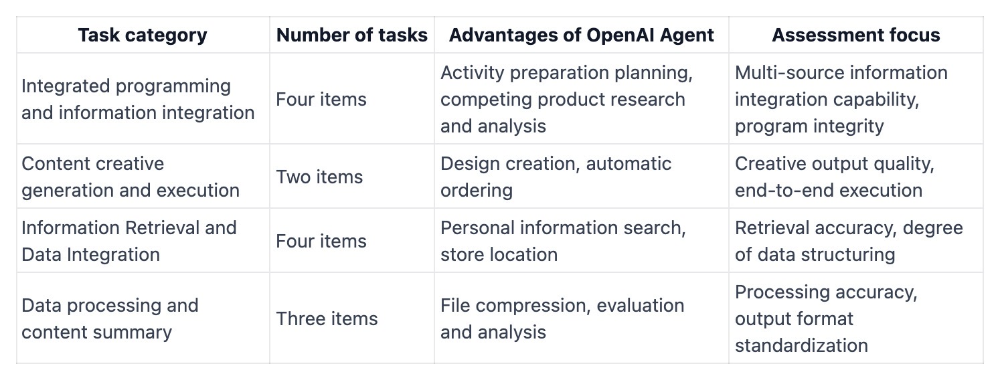

import VideoComparison from '../../components/mdx/VideoComparison.astro';

## Test Background

We evaluated both platforms across four core task types:

Each task was executed simultaneously on both platforms to ensure a fair comparison. We assessed performance across multiple dimensions: **execution capability, efficiency, report presentation, and intent recognition**.

## 1. Execution Capability

Fellou excels in **end-to-end automation**. It handles tasks from requirement analysis to information retrieval, content creation, and solution generation — all while interacting with users dynamically to refine results.

For example, in tasks like **video compression** or accessing local files, users simply provide basic instructions, and Fellou completes the full process independently. It can process local files directly, including extraction, format conversion, batch sorting, classification, and archiving.

<iframe width="879" height="578" src="https://www.youtube.com/embed/FANLLsZTsFc" title="file agent" frameborder="0" allow="accelerometer; autoplay; clipboard-write; encrypted-media; gyroscope; picture-in-picture; web-share" referrerpolicy="strict-origin-when-cross-origin" allowfullscreen></iframe>

In contrast, OpenAI Agent operates entirely in the cloud and cannot access local files, making it less suited for tasks that require local data processing.

## 2. Execution Efficiency

For general tasks, Fellou and OpenAI Agent perform similarly. However, in **complex, multi-step tasks**, Fellou leverages its **“Shadow Space”** technology to run multiple processes in parallel, significantly speeding up information capture and integration.

For instance, when searching for competitive product analysis reports across major platforms:

- Fellou: 672 seconds
- OpenAI Agent: 1033 seconds

Fellou was roughly **35% faster**, demonstrating clear advantages in large-scale and multi-dimensional information integration.

<VideoComparison 
  leftVideo={{
    src: "https://www.youtube.com/embed/-6D88tr_l5M",
    title: "fellou Execution",
    description: "Fellou's Shadow Space Parallel Retrieval Task Execution"
  }}
  rightVideo={{
    src: "https://www.youtube.com/embed/J65NBNG0q2k",
    title: "openai Execution", 
    description: "OpenAI Agent Single-Threaded Task Retrieval Execution"
  }}
/>

## 3. Report Presentation

Fellou delivers **highly visual and interactive reports**. Users receive outputs through rich graphics, icons, and even interactive websites — making information intuitive and actionable. Complex planning tasks, like full-process trip planning or tourism solutions, can be presented in a detailed, step-by-step format.

OpenAI Agent, by contrast, primarily delivers text and tables, with limited visualization or interactive elements.

<VideoComparison 
  leftVideo={{
    src: "https://www.youtube.com/embed/gFdxlzr9Rv8",
    title: "fellou report",
    description: "Fellou's Interactive Report"
  }}
  rightVideo={{
    src: "https://www.youtube.com/embed/ye2T_ueia1E",
    title: "openai report", 
    description: "OpenAI's Report"
  }}
/>

## 4. Intent Recognition

Fellou dynamically interacts with users to clarify and refine instructions in real time. When tasks contain incomplete or ambiguous information, Fellou actively guides users to provide the necessary details, ensuring the final results meet actual needs.

For example, if a user gives a fuzzy instruction like:

> Order Whole Foods bakery and cheese for a family party

<VideoComparison 
  leftVideo={{
    src: "https://www.youtube.com/embed/P18E_QhWdLk",
    title: "fellou",
    description: "Fellou"
  }}
  rightVideo={{
    src: "https://www.youtube.com/embed/2u1ohkgi5PY",
    title: "openai", 
    description: "OpenAI"
  }}
/>

Fellou can execute the task step-by-step, guiding the user through order and payment. OpenAI Agent, however, can only provide solution suggestions without completing the task.

## Conclusion

Both platforms have their strengths, but **Fellou shows clear advantages** in:

- End-to-end execution
- Efficiency in multi-tasking scenarios
- Interactive, visual reporting
- Dynamic intent recognition

Fellou is particularly suited for **action-oriented tasks** that require efficient local file processing, multi-platform integration, and automated workflows.
