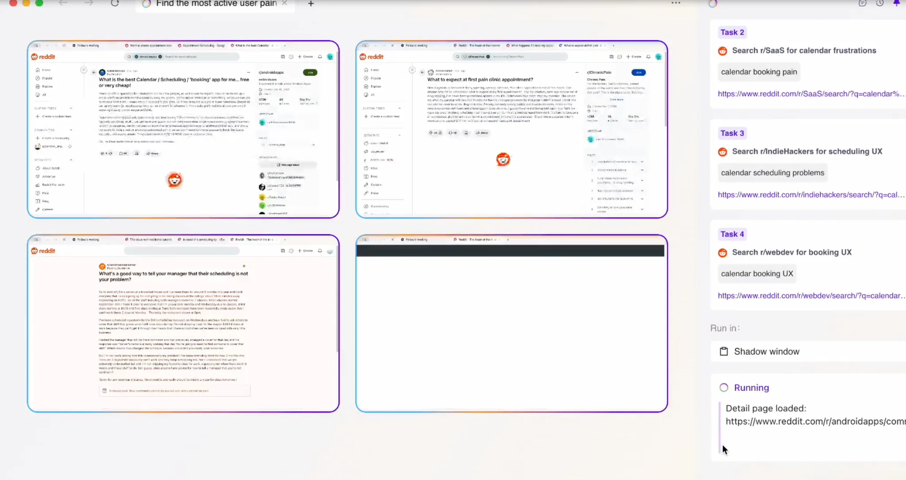

You might feel like your browser just sits there waiting for you to click, scroll, and search. Now, agentic features in AI browsers like Fellou flip that script. These tools jump into action, making decisions and handling tasks for you. Studies show that agentic browsers can [slash routine work time by over 60%](https://superagi.com/the-future-of-work-how-agentic-ai-agents-will-streamline-business-operations-and-enhance-productivity/) and even cut errors in half. Imagine focusing on creative work while your AI browser handles the boring stuff.

> Think about what your day would look like if you let an agentic browser take care of the little things.

## Key Takeaways

*   **🎯Goal-Oriented Execution:** Agentic browser acts on high-level goals to deliver a final result (e.g., a finished report), not just information, by autonomously handling all necessary steps from research to completion.
    
*   **🧠Proactive Intelligence:** Agentic browser functions like a "mind reader" by understanding your browsing context and intent, allowing it to anticipate your needs and suggest actions before you even ask.
    
*   **👻Seamless Background Workspace:** Agentic browser performs complex tasks in a separate "Shadow Workspace," allowing you to continue your work uninterrupted while the agent operates for you in the background.What Is an Agentic Browser?
    

### Agentic Browser vs. Traditional Browser

Not all browsers work the same way now. An agentic browser changes how you use the web. It does not just wait for you to click or type. It acts more like a real helper. It understands what you want and can do things by itself. This means you can finish more work with less effort.

[Here’s a simple table to show the differences](https://aiagentstore.ai/compare-ai-agents/browser-use-vs-onequery):

| Feature | Agentic Browser | Traditional Browser |
| --- | --- | --- |
| Autonomy | Handles complex, multi-step tasks for you | Needs you to do everything |
| Flexibility | Adapts to your needs and different workflows | Sticks to basic, fixed functions |
| Ease of Use | Uses natural language and smart suggestions | Relies on manual clicks and scripts |
| Task Execution | Automates research, reports, and more | Limited to simple browsing |

With an agentic browser, you do not just search for things. You ask for results, and it gives you full answers. Sometimes, it even helps before you know you need it.

### Core Agentic Features

Let’s look at what makes [an AI browser like Fellou](https://fellou.ai/) special:

*   [**Deep Action**](https://www.puppyagent.com/blog/rag-agentic-browser-fellou-innovations): You tell the browser what you want. It breaks your request into small steps and finishes the job. This could be finding facts, writing something, or making a report.
    
*   **Proactive Intelligence**: The browser learns from what you do. It guesses what you might need next and offers help before you ask.
    
*   **Shadow Workspace**: Fellou works in the background. You keep doing your work while it handles other jobs. This way, you do not get stopped.
    
*   **AgentStore(coming soon)**: You can use or share [special agents for different tasks](https://fellou.ai/use-cases). This makes it easy to work with others and change things to fit your needs.
    

These features make an agentic browser like a digital teammate. It helps you do tasks, manage projects, and find answers faster. You spend less time on boring work and more time on important things.

## How AI Browsers Transform Work

### Autonomous Task Execution

Imagine you have a digital assistant that never gets tired. With an [ai browser like Fellou](https://fellou.ai/), you can hand off long, boring jobs and watch them get done in the background. You do not need to click through every step or remember every detail. The ai browser takes your instructions, breaks them into smaller pieces, and finishes the whole workflow for you.

You move from doing every step yourself to simply telling the ai what you want. Now, you act more like a supervisor. You check the results, make changes if needed, and let the ai handle the rest. This shift saves you time and helps you focus on bigger goals.

Here are some ways an ai browser [automates complex workflows](https://sourceforge.net/software/product/Browseragent/alternatives):

*   Runs multi-step tasks hands-free, like gathering data from different websites and making a report.
    
*   Lets you create and share special agents for jobs like project management or content moderation.
    
*   Works in a sandboxed space, so you can keep using your computer while the ai browser does its thing.
    
*   Supports deep, parallel searches across both public and private sites.
    
*   Generates visual reports you can share with your team.
    

| Task Example | Manual Time | AI Browser Time |
| --- | --- | --- |
| Cross-platform research & report generation | 240.5 sec | 85.0 sec |
| Shopping automation (e.g., adding GPUs to cart) | 10 min | 3 min |
| Organizing academic research papers | 1 hr | 15 min |

You can see how much faster and easier your day becomes. In one real case, a company [cut its RFQ processing time from four weeks to just four days](https://nexocode.com/blog/posts/co-pilots-vs-ai-agents-and-the-5-levels-of-autonomy-in-process-automation/) by letting [ai agents handle the workflow](https://fellou.ai/blog/post/eko-first-launch/). These agents remember what you want, learn from your feedback, and keep getting better. You spend less time fixing mistakes because the ai reduces errors and keeps everything on track.

> Tip: Try delegating a routine project to your ai browser. You might be surprised at how much time you save!

### Proactive Intelligence

You do not always know what you need next. That is where [proactive intelligence](https://opentools.ai/news/ai-powered-browsers-revolutionizing-the-way-we-surf-the-web) comes in. The ai browser watches what you do and learns your habits. It can guess your next step and offer help before you even ask.

For example, if you are comparing products, the ai browser might suggest a side-by-side chart. If you are planning a meeting, it could pull up your calendar and suggest times. Some ai browsers even chat with you, making it feel like you have a real digital assistant by your side.

This content-aware automation means you do not have to stop and think about every detail. The ai browser handles routine tasks, finds information, and gives you smart tips. You get a smoother, faster workflow and more time for creative work.

Other companies use content-aware automation to help with things like content moderation, image recognition, and even medical screening. The ai takes care of simple cases, so people can focus on the hard stuff. Teams that use ai delegation report [higher accuracy](https://dl.acm.org/doi/10.1145/3696423), better results, and more job satisfaction.

> Note: The more you use your ai browser, the smarter it gets. It learns from your choices and helps you work better every day.

## Key Features of Agentic Browsers

### Deep Action

Deep action helps you finish tasks much faster. You do not need to click through many tabs. Just tell your [ai browser](https://fellou.ai/) what you want done. It can do research, fill out forms, and make reports for you. This feature breaks big jobs into small steps and finishes them quickly.  
Here is how deep action helps at work:

| Benefit Metric | Measurable Improvement | Supporting Tools |
| --- | --- | --- |
| Productivity Increase | Up to 30% | Microsoft Copilot Studio, Adept AI |
| Customer Satisfaction | Up to 25% | Inflection AI, Google Gemini |
| Response Time Reduction | 30% | Microsoft Copilot Studio |
| Workflow Automation | Repetitive tasks automated | Microsoft Copilot Studio, Adept AI |

You get more work done in less time. Your team feels better, and there are fewer mistakes. That is why deep action is so helpful.

### Shadow Workspace

Shadow Workspace lets you multitask without slowing down. While you work on your main screen, your ai browser does other jobs in the background. You can keep writing, designing, or chatting. The ai browser handles research or data entry for you. You do not have to stop what you are doing. Multitasking is easy, and your work stays smooth.

### Agent Collaboration

Agent collaboration makes teamwork easier and better. With [AgentStore](https://fellou.ai/use-cases), you can use different ai agents with special skills. Some agents work with data, others help with writing or scheduling. They talk to each other, share files, and split up big projects.  
Here is what you get:

*   [Agents break up hard jobs into smaller parts](https://aws.amazon.com/blogs/machine-learning/unlocking-complex-problem-solving-with-multi-agent-collaboration-on-amazon-bedrock/).
    
*   Special agents handle tough tasks, making work better.
    
*   Supervisor agents make sure everything goes right.
    
*   Agents talk fast for quick results.
    
*   You get [real-time file sharing and project updates](https://www.talkspirit.com/blog/20-collaborative-tools-to-improve-employee-productivity).
    

You spend less time on boring work and more time on fun ideas.

### Customization and Control

You are always in charge with customization and control. Your ai browser lets you change how agents work and set privacy rules. You can check every step and see what is happening. You get risk checks and clear records in real time. This means the browser fits your needs and style.  
You can trust your ai browser to keep your privacy safe and give you strong new tools.

> Tip: Try changing your agent settings to fit your work. You will see how much easier your day can be!

## Real-World Impact of AI Browsers

### Productivity Gains

You may ask if an ai browser really helps you work better. The facts show it does. Many companies get much more done when they use these tools. For example, support agents answer about [14% more questions](https://hatchworks.com/blog/gen-ai/generative-ai-statistics/) each hour. Business workers write almost 60% more documents. Programmers finish over twice as many coding jobs every week.

Here are some real-world examples:

*   Arizona State University made student enrollment [50% faster](https://colorwhistle.com/ai-workflow-case-studies/) and had fewer mistakes.
    
*   Accenture’s IT team fixed problems 30% quicker with AI-powered help.
    
*   Booking.com got 30% more customer interest after using AI for travel planning.
    

You can see how smart companies do more with less work. These results mean you spend less time on boring jobs and more time on important things.

### Workflow Automation

Now, you do not need to do every step by yourself. An [ai browser](https://fellou.ai/) can finish long workflows fast. In [recruitment, it sorts resumes](https://www.singlegrain.com/artificial-intelligence/how-to-leverageagentic-workflows/), ranks people, and sets up interviews. In e-commerce, it makes shopping personal, changes offers, and chats with customers. Content creators use it to automate marketing, make posts, and check results.

| Field | How AI Browsers Automate Workflows |
| --- | --- |
| Recruitment | Sorts resumes, ranks candidates, schedules interviews, and learns from feedback |
| E-commerce | Personalizes shopping, adjusts offers, chats with customers, and boosts sales |
| Content Creation | Automates marketing, generates content, optimizes SEO, and tracks performance |

You get smarter systems that change to fit your needs. Your company can grow without adding more manual work.

### Collaboration Enhancement

Working together is easier with [agentic browsers](https://fellou.ai/blog/agentic-browser-fellou-next-evolution-beyond-ai-browsers/). You can share tasks, files, and updates right away. Tools like [Slack and Microsoft Teams](https://superagi.com/unlocking-team-synergy-how-the-top-10-ai-communication-platforms-can-boost-productivity-in-remote-teams/) use AI to do routine jobs, suggest next steps, and keep everyone working together. Video meetings get better with instant notes and summaries from Zoom AI Companion and Otter.ai.

| Platform | AI Features | Collaboration Benefits |
| --- | --- | --- |
| Slack | AI chatbots, task automation, meeting help | Faster teamwork, better communication |
| Microsoft Teams | Conversation summaries, action suggestions | Keeps projects organized and focused |
| Zoom AI Companion | Real-time notes, meeting summaries | Saves time, helps everyone remember key points |

You and your team can focus on new ideas while the ai browser does the busywork. This is how smart companies stay ahead.

## Benefits and Challenges

### Efficiency and Scalability

You want to get more done in less time. [Agentic browsers like Fellou](https://chat.fellou.ai/report/01676d84-db4f-4a4a-9c88-1b7640e98d0e) help you do just that. These tools turn [complex, multi-step web tasks](https://slashdot.org/software/comparison/Fellou-vs-Pointee/) into simple commands. You can fill out forms, generate reports, or manage schedules with just a few words. Fellou works in the background, so you keep using your computer while it handles the busywork.  
Here’s how these features boost your productivity:

*   Automates long workflows, like research or data entry, with Deep Action.
    
*   Runs tasks in a secure sandbox, so you never lose focus.
    
*   Anticipates your needs and suggests helpful actions.
    
*   Searches across many sites at once and creates visual reports you can share.
    
*   Lets you design and use special agents for different jobs, making your work more flexible.
    

You get a smarter, faster way to work. Your team can scale up without adding more people or hours.

### Privacy and Security

You care about your data. Agentic browsers take privacy and security seriously. They use [strong identity management](https://www.okta.com/identity-101/what-is-agentic-ai/) and access controls. Every action gets checked and logged. Your credentials stay safe with secret management and just-in-time access.  
Some ways these browsers protect you:

*   Only collect the data needed for each task.
    
*   Give you [clear choices about what data to share](https://www.securityinfowatch.com/ai/article/55300108/privacy-unplugged-tackling-the-challenges-of-agentic-ai-in-business).
    
*   Use continuous monitoring to spot anything unusual.
    
*   Follow rules like [**GDPR and CCPA**](https://fellou.ai/policy) to keep your information safe.
    
*   Let you review and control what the ai does with your data.
    

You stay in control, and your privacy stays protected.

### Job Roles and Ethics

When you bring ai into your work, you might worry about [job changes or fairness](https://superagi.com/future-of-work-how-agentic-ai-will-transform-employee-productivity-and-customer-engagement/). These are real concerns. The best agentic browsers help you work smarter, not just faster. They support you, rather than replace you.  
Here are some key points to think about:

| Ethical Issue | What It Means for You |
| --- | --- |
| Accountability | You need clear rules about who is responsible for ai decisions. |
| Bias and Fairness | ai can make mistakes if it learns from bad data, so regular checks are important. |
| Transparency | You should always know how and why ai makes choices. |
| Consent and Oversight | You stay in the loop and can step in when needed. |
| Job Displacement | ai should help you do more, not take your job away. |
| Governance | Companies need strong rules and regular reviews to keep ai safe and fair. |

You play a big part in making sure ai works for everyone. With the right tools and training, you can use agentic browsers to unlock new opportunities and keep your work meaningful.

## The Future of Work with Agentic AI

### Evolving Workflows

Your daily work will change a lot as [agentic AI browsers](https://fellou.ai/blog/post/eko-first-launch/) become more popular. These tools do more than just help with easy jobs. They can make choices, fix problems, and even work with other AI agents. Soon, you may work with digital teammates who do boring tasks while you think of new ideas.

Here’s a simple look at how experts think work will change:

| Aspect of Workflow Evolution | What’s Coming Next | Examples and Details |
| --- | --- | --- |
| Autonomous Decision-Making | AI will fix 80% of common customer service issues by 2029, saving about 30% in costs. | IBM and Microsoft already use agentic AI for supply chain and finance. |
| Multi-Agent Collaboration | Special AI agents will join together to solve hard problems and work faster. | Customer service, supply chain, and finance agents working together. |
| Human-AI Cooperative Workflows | You will work with AI helpers, letting them do data jobs while you focus on big ideas. | Healthcare, finance, and education already use AI helpers for better choices. |
| Governance and Ethics | New rules and lessons will help keep AI use safe and fair. | Companies will make clear rules and teach workers for mixed teams. |
| Market Growth and Adoption | AI spending will hit $300 billion by 2026, with agentic AI in one-third of business software. | Fast growth means more jobs and new ways to work. |

> Tip: Try to think about how you can work with AI, not just use it. The future will belong to teams that mix human ideas with AI speed.

### Skills for the Agentic Era

You will need new skills to do well in this new world. Tech skills are important, but so are teamwork and leading others. Here are some top skills to learn:

| Skill Area | Why It Matters |
| --- | --- |
| Machine Learning | Helps you build and guide smart AI agents. |
| Natural Language Processing | Lets you talk to AI and use chatbots or content tools. |
| Autonomous Systems | Gets you ready to manage AI that works alone. |
| Strategic AI Skills | Shows you how to plan and work with many AI agents at once. |
| Data & Process Optimization | Makes you better at improving how AI and people work together. |
| Automation & Security | Keeps your systems safe and running well as you add more AI. |
| Management & Entrepreneurship | Helps you lead teams and start new projects in an AI-powered workplace. |

You will also need soft skills like being flexible, thinking hard, and talking clearly. Many companies now help you learn these skills with training. If you want to stay ahead, get used to working with AI, keep learning, and be ready for new jobs as tech grows.

> Note: The best way to get ready is to stay curious, practice new skills, and work with both people and AI. The future of work is a team job—humans and machines together.

[Agentic AI browsers like Fellou](https://fellou.ai/) make your browser feel like a teammate. You get answers faster and your work gets easier. These tools do hard jobs, change as you work, and help teams join forces. To keep up, first look at how you do your work now. Build tech that can change when you need it. Teach your team how to use these new tools.

> Stay curious and ready for new things—agentic AI will keep getting better, and you can be the one to lead the way into the future of smart automation.

## FAQ

### What is an agentic browser?

An agentic browser is a smart browser that can do tasks for you. You tell it what you want, and it gets the job done. You do not need to click through every step.

### Can I trust an AI browser with my data?

Yes, you stay in control. [Fellou](https://fellou.ai/) keeps your data private by working locally on your device. It does not track you or store your info in the cloud.

### How do I use agentic features in my daily work?

Just type what you need in plain language. Fellou can research, fill out forms, or create reports. You can keep working while it handles tasks in the background.

### Will an agentic browser replace my job?

No, it helps you work smarter. You get more time for creative and important work. The browser takes care of boring or repetitive tasks.

### What devices can I use Fellou on?

You can use Fellou on Windows computers. The team plans to support more platforms soon. Check the website for updates and new releases.