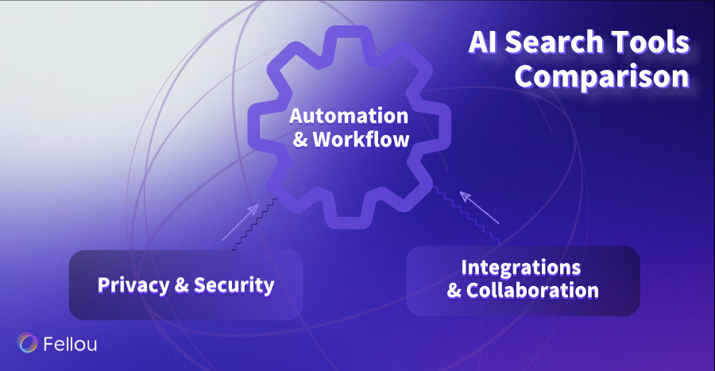
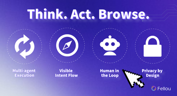

What is an AI Browser? Most see it as a conversational tool that search and answers questions. Fellou challenges this, pioneering the true AI Browser. It moves beyond simply chatting by embedding AI agents that autonomously handle complex workflows across web pages and local files into a browser. By learning from user data within the browser, it can better understand their needs and handle repetitive dirty work.

## Key Takeaways

*   **Redefining the AI Browser:** Fellou believes that AI Browser should be embedded AI agents into a browser, because by learning from user data within the browser, AI Browser can understand you better and better.
    
*   **Superior On-Device Architecture:** By embedding its AI agent locally, Fellou deeply understands your context for superior personalization and control.
    
*   **From Intent to Action:** With Deep Action, Fellou turns simple commands into completed multi-step tasks across the web, boasting industry-leading success rates for even complex workflow automation.
    
*   **A Partner That Learns:** Fellou builds an Agentic Memory from browser history, conversation context and user profile. This allows the browser to evolve into a smarter, more personalized partner over time.
    
*   **A Fortress of Security:** Fellou ensures your safety with advanced encryption and browser fingerprinting. This multi-layered defense system secures your data, privacy, and digital identity during automated tasks.
    

## AI Browser Definition

### Traditional Browsers

You probably use a traditional browser every day. Chrome and Firefox are good examples. These browsers help you visit websites and search for things. You can also save bookmarks. You control what happens. You type web addresses and click on links. You fill out forms by yourself. Some browsers have small AI features, like spell check or page summaries. But you still do most of the work. The browser is just a tool, not a helper.

### Conversational AI Browsers

Now, think about a browser that talks with you. Conversational AI browsers, like Dia, let you ask questions in plain language. You can say, “Find the best science project ideas,” and the browser gives you answers. These browsers use advanced AI to understand what you need. They help you search faster. They make your work easier, especially if you need to research or organize information. Privacy matters, so these browsers often keep your data safe and local.

### Agentic AI Browser

[Agentic AI browsers](https://fellou.ai/) go even further. You do not just talk to them. You give them a goal, and they act for you. For example, you can ask the browser to book a flight or fill out forms. It can also compare products for you. The browser uses agentic browsing to finish tasks by itself, even on different websites. It learns from your browsing preference, browse history and Web page contexts to fit your style. This kind of AI browser can not just handle hard workflows but more like an assistant that understands what you want. It can even tell you what to do before you've even thought of it.

Why did Fellou choose browser to be the container

[**Quick Comparison Table**](https://clipboardextension.com/articles/next-gen-ai-browsers-comparison)

| Aspect | Traditional Browsers | Conversational AI Browsers | Agentic AI Browsers |
| --- | --- | --- | --- |
| AI Role | A passive tool with minimal AI features like spell check. | A responsive assistant that answers questions and finds information. | A proactive agent that understands goals and executes complex tasks. |
| Interaction | Fully manual; the user types, clicks, and navigates everything. | User asks questions and gives commands in natural language. | User delegates complex goals with simple, high-level commands. |
| Autonomy | No autonomy; the user is in complete and direct control. | Limited to searching and retrieving information based on direct queries. | High; autonomously completes multi-step workflows across websites and local files |
| User Experience | The user is the operator, performing all the work manually. | A faster, easier way to research and get answers. | A proactive partner that automates work and gets things done. |

You can see how the [AI Browser](https://fellou.ai/blog/ai-browser-vs-ai-extension-difference-fellou-productivity/) has changed over time:

*   [Traditional browsers need you to do everything](https://www.linkedin.com/pulse/recent-changes-web-browsers-ai-interaction-khanchandani-rqtuc).
    
*   Conversational AI browsers help you search and answer questions.
    
*   [Agentic AI browsers work for you](https://superagi.com/agentic-ai-vs-traditional-ai-a-comparative-analysis-of-capabilities-and-applications/), finishing tasks and learning from your habits.
    

Agentic browsing changes how you use the internet. You do not have to click and search all the time. Now, the browser can handle tasks for you. This new way makes your digital life easier and helps you get more done.

## Why Fellou Choose Agentic Browser

In the emerging landscape of AI-powered tools, a fundamental architectural decision separates the truly revolutionary from the merely incremental. When it comes to the **AI Browser**, the question is: should the browser be a tool inside a sandboxed cloud AI, or should the **AI Agent** live natively within the browser on your device?

Fellou has made a definitive choice: we embed the AI Agent directly into a locally-deployed browser. This is not a minor technical detail—it. It is the core philosophy that unlocks unparalleled productivity, deep personalization, and unwavering user trust. Here’s a detailed breakdown of why this on-device approach is superior and how it solidifies Fellou's position as a true **Agentic Browser**.

### Why Cloud-Based Agents Can't Truly Understand You

A cloud-based agent operating a browser in a remote sandbox is fundamentally disconnected from you. It's an assistant with amnesia, blind to the very context that makes an AI partner valuable.

*   **The Cloud-Based Agent's Blind Spots:**
    
    *   **Browser Context:** It cannot see your other open tabs, read the content on your current pages, or access your browsing history.
        
    *   **User Interaction Data:** It is oblivious to how you scroll, what you click on, and your unique patterns of engagement.
        

Without this rich, continuous stream of data, a cloud agent can never develop a genuine understanding of your preferences, intent, or workflow. It remains a simple order-taker, unable to evolve into the proactive, intelligent assistant you need.

**Fellou's On-Device Advantage:** As a locally-deployed **Agentic Browser**, Fellou can legitimately and directly access this high-quality user **interaction data**, helping progressively smarter and more attuned to your needs. By analyzing your complete behavioral loop within the browser, Fellou's **intelligent agent** optimizes its decision-making logic to serve you better, transforming the browser from a passive tool into a true smart partner. **The longer you use Fellou, it will serve you better**.

### From Black Box Execution to Transparent Collaboration

The remote, sandboxed nature of cloud agents creates a black-box problem, leading to uncertainty and a high potential for error.

*   **The Flaw of Blind Execution:** If a user's command is even slightly ambiguous ("Find me a good flight"), a cloud agent executes the task blindly, often leading to irrelevant results and wasted time.
    
*   **The Lack of Controllability:** Once a task is initiated, the user has no power to interrupt, course-correct, or take over. This lack of control and transparency is a significant barrier to trust and efficiency, a limitation many current context protocols struggle to overcome.
    

**Fellou's Collaborative Framework:** Fellou operates on the principle of a shared interactive space.

*   **You Are Always in Control:** You can monitor AI's **workflow automation** in real-time, intervening at any moment to adjust goals or take over manually.
    
*   **True Goal Alignment:** This "glass box" approach avoids the uncertainty of black-box operations. The AI and the user work in tandem, ensuring the final outcome always aligns with the user's true intent.
    

### A Fortress of Security: Trust Through Advanced Encryption and Protection

Placing a powerful AI agent on a user's device through a browser requires an uncompromising commitment to security and privacy. Fellou has engineered a multi-layered defense system to protect both your accounts and your personal data.

#### **A. Securing Your Digital Identity and Actions**

To ensure seamless and safe **browser automation**, Fellou integrates sophisticated anti-detection technologies inspired by advanced privacy browsers.

*   **Browser Fingerprint Spoofing:** Creates a unique and consistent, yet false, digital fingerprint (User-Agent, OS, plugins, etc.) to ensure automated tasks appear as legitimate human activity.
    
*   **HTTP Header Modification:** Intelligently alters HTTP headers to mimic natural user traffic, making automation difficult for websites to detect and block.
    
*   **Canvas Fingerprint Protection:** Adds digital "noise" to the HTML5 canvas output, preventing websites from creating a persistent, trackable fingerprint of your device.
    
*   **Human-like Automation:** Simulates realistic mouse movements, typing speeds, and interaction cadences to further disguise automation.
    
*   **Isolated Cookie Management:** Each browsing profile's cookies are strictly segregated, preventing cross-session tracking and enhancing account security.
    

#### **B. Securing Your Sensitive Information**

Fellou employs robust encryption for data both in transit and at rest.

*   **Advanced Transport Encryption:** By default, Fellou uses the **TLS protocol** for all data transmission. It specifically leverages powerful algorithms like **ECDHE** to securely negotiate temporary session keys. This ensures that even if your connection is intercepted, the eavesdropper cannot decipher the transmitted data.
    
*   **Multi-Layered Data Encryption:** For highly sensitive data, such as account information, Fellou utilizes a proprietary encryption method analogous to **onion routing**. Your data is wrapped in multiple layers of encryption as it passes through virtual nodes. Like peeling an onion, each layer adds to the security, making the core data effectively unbreakable and eliminating the risk of data leaks at the source.
    

### Conclusion: Browser is The Best Choice For AI Agents on PC

The browser is the natural habitat for a truly effective **AI Agent**. It possesses the inherent permissions to read pages, simulate clicks, and execute tasks without requiring complex workarounds. More importantly, it provides a shared space where humans and AI can collaborate seamlessly.

By choosing a local, on-device architecture, Fellou's **AI Browser** breaks through the data, performance, and control limitations of cloud-based systems. It is a deliberate, strategic choice that transforms the browser from a simple gateway to information into a proactive, intelligent partner—one, one that truly understands you, collaborates with you, and finishes complex tasks for you. This is the future of human-AI interaction, and it's the very definition of what an **AI Browser** should be.

## Core Features of Fellou AI Browser

Fellou introduces a new way for you to work with technology. You do not just use a browser. You gain a digital teammate that can act on your behalf, handle complex tasks, and help you focus on what matters most. Let’s explore how [Fellou’s agentic AI](https://fellou.ai/blog/agentic-browser-fellou-next-evolution-beyond-ai-browsers/) changes your digital experience.

### Trinity Architecture

Fellou’s core design uses a [Trinity Architecture](https://fellou.ai/blog/how-agentic-features-in-ai-browser-fellou-are-changing-work/). This means you get three powerful parts working together:

1.  **Browser**: You access the web as usual, but now the browser understands your goals.
    
2.  **Workflow**: Fellou breaks big jobs into steps of an agentic workflow
    
3.  **A Team of Agent**: AI agents collaborate with each other to reason, plan, and take action to finish your tasks.
    

This setup lets you move beyond simple browsing. You can give Fellou a goal, like “research the best laptops and make a report.” The AI will search, compare, and organize the results for you. You do not need to switch between tabs or copy information. The agent can handle everything, even across different websites.

The Trinity Architecture follows [key principles of agentic AI](https://www.assistents.ai/blog/agentic-ai-components):

1.  Perception: The agent gathers data from web pages and your commands.
    
2.  Reasoning: It uses advanced models to understand what you want.
    
3.  Action: The agent connects with tools and APIs to complete tasks.
    
4.  Learning: Fellou improves as it learns from your feedback and preference.
    
5.  Planning: It sets goals and figures out the best steps to reach them.
    
6.  Autonomous Action: The agent works autonomously, so you do not have to guide every step.
    
7.  Adaptability: Fellou changes its approach if your needs or the environment change.
    

With this structure, you get a browser that does more than show web pages. It becomes a smart partner that helps you achieve your goals.

### Shadow Workspace

Fellou’s [Shadow Workspace](https://ai-tools.dagengren.net/tool/fellou) gives you a unique way to multitask. When you start a job, the AI agent works quietly in the background. You can keep browsing, writing, or watching videos. The agent does not interrupt your screen or slow you down.

Here is what makes the Shadow Workspace special:

*   The agent can log into sites, fetch data, and fill out forms while you do other things.
    
*   Fellou keeps your private data safe and does not track your browsing.
    
*   Fellou AI Browser enables hyper-productivity by running multiple tasks concurrently
    
*   The workspace supports switching between tasks and lets you revisit what the agent did with a timeline feature.
    

This system acts like a digital teammate. It handles [multi-step workflows](https://www.aziro.com/blog/agentic-ai-vs-generative-ai-understanding-the-shift-from-content-creation-to-autonomous-action/), such as scheduling, emailing, or creating reports. You do not need to watch over the process. Fellou’s Shadow Workspace lets you enjoy true multitasking while you are enjoying yourself on other web pages.

### Proactive Intelligence

Fellou’s agentic AI does not wait for you to give every command. It uses proactive intelligence to understand your context and suggest helpful actions. For example, if you start researching a topic, Fellou might offer to summarize key points or organize your findings into a report.

Proactive, [context-aware intelligence](https://dl.acm.org/doi/10.1145/3613904.3641979) helps you stay productive. The AI adapts to your habits and preferences. It can block distractions, remind you of important tasks, and even adjust its actions based on your current work. Studies show that context-aware tools like this can reduce distractions and boost productivity, especially when they personalize their help to fit your needs.

Fellou’s approach goes beyond just answering questions. The AI becomes a [true partner](https://pmc.ncbi.nlm.nih.gov/articles/PMC11459757/). It learns from your feedback, improves over time, and helps you manage both work and personal tasks. You get a browser that supports your creativity and helps you focus on what matters.

> **Note:** Fellou’s philosophy is “Beyond Browsing, Into Action.” Inspired by the Renaissance, Fellou aims to give you the freedom to create, discover, and realize your potential. You do not just browse the web. You take action and achieve more with less effort.

### Deep Action

Fellou’s [Deep Action feature](https://sourceforge.net/software/compare/Augment-AI-Logistics-vs-Fellou/) lets you give simple commands, like “Find the best robot vacuum under $600 and order it.” The browser takes care of every step, from searching to buying. You don’t have to click through each page or copy and paste information. Fellou also lets you create your own agents for special tasks with Eko Agentic framework, and you can share them with your colleagues.

*   You can set up Fellou to handle things like:
    
    *   Researching products and making detailed reports at once
        
    *   Filling out forms across different websites
        
    *   Gathering information, generating posts and posting on social media at once
        
    *   Organizing files and even building websites
        
    *   Create beautiful images and lovely song
        

> Imagine a group of robots in a warehouse. Each one picks up items, packs boxes, and moves things around. They talk to each other, so nothing gets missed. Fellou works the same way, but with your online tasks. This teamwork means you get more done in less time.

What's more, Fellou uses the [Eko 2.0 framework](https://fellou.ai/blog/post/eko20-launch/), which has achieved SOTA performance on the widely recognized Online-Mind2web benchmark in the industry.

*   **Easy Tasks**: 95% success rate (vs 80-90% for other products)
    
*   **Average Success Rate**: 80% success rate (vs 56-61% for other products)
    
*   **Medium Complexity**: 76% success rate (vs 49-58% for other products)
    
*   **Hard Tasks**: [70% success rate](https://fellou.ai/blog/eko20-launch/) (vs 32-43% for other products)
    

### Workflow Automation

You can use [workflow automation](https://sourceforge.net/software/product/Fellou/) to make your daily routines automatic. Fellou breaks big jobs into small steps and finishes them for you. You do not have to watch every move. The browser does tasks in a special workspace, so your main screen stays clear. You can even set up tasks to run later or let the browser suggest actions based on your habits. This hands-free way saves you time and helps you focus on what matters.

### Agentic Memory

[Fellou](https://fellou.ai/blog/post/fellou-introduction/) remembers what you like, what you did before, and what you are working on now. This [agentic memory](https://sourceforge.net/software/compare/Augment-AI-Logistics-vs-Fellou/) helps the browser learn how you work. You get smarter ideas and faster results because the browser uses your history to help you. You can also change and organize your notes and browsing trails, so it is easy to find things later.

### Multi-modal Output

You can ask Fellou to make reports, images, presentations, or even audio files. The browser puts together text, pictures, and data in one output. Studies show that multi-modal systems like this help people make better choices in areas like healthcare and finance. You get clear results that you can share and use for your needs.

### Security & Privacy

Fellou keeps your data safe. It does not track your searches or what you do online. You can use privacy mode for extra control. The browser works both on your device and in the cloud, so your information stays safe. You can sync your work across devices without worry.

> **Table:** [**Fellou’s Technical Features**](https://fellou-ai-browser.tenereteam.com/)

| Feature | Description |
| --- | --- |
| Agentic Browsing | Does things like opening tabs, replying to emails, and making content without you doing it yourself. |
| Deep Action Technology | Automates hard workflows from natural language commands. |
| Deep Search | Searches public and private platforms, even sites that need passwords. |
| Hybrid Shadow Workspace | Runs tasks in the background, so you can multitask easily. |
| Proactive Intelligence | Learns your behavior and suggests actions before you ask. |
| Cross-Platform Integration | Syncs your work across all your devices. |
| Privacy Focus | Does not track your browsing or search activity. |

All these features use the Eko 2.0 framework, which lets you get real-time help and smooth support on any device.

## Use Cases

Fellou helps you do more each day. You can use it for [many jobs](https://fellou.ai/use-cases). It works for students, creators, and busy workers. Here are some ways Fellou boosts your work and creativity.

### Productivity

Fellou [saves you time by doing your daily jobs](https://www.linkedin.com/posts/ashishpatel2604_ai-innovation-productivity-activity-7277916757628010496-hVG2). It sorts your emails, files, and plans your schedule. [You just say what you want](https://www.linkedin.com/posts/raghugandham999_fellouai-agenticbrowser-airevolution-activity-7334039509434605568-PZlP), and Fellou does it. Many people finish research and reports much faster now. Fellou also helps with social media, so you can [handle more sites at once](https://www.linkedin.com/posts/munsifraza_fellou-just-launched-the-first-fully-agentic-activity-7325025048698736640-_uyX), it can finish search, generate posts and post the content on different social medias all at once.

> Before Fellou, I spent too long trying to connect pieces of scattered research. Now one line is all it takes - [**SANI BULA**](https://x.com/SaniBulaAI/status/1940296023244775664)

### Content Creation

Fellou helps if you write, design, or make content. It finds trending topics, writes SEO articles, and posts them for you. You can ask Fellou to sum up articles, make images, or build presentations. The browser learns your style and what you like, so each project is easier. You do not need other tools because Fellou has all you need.

| Content Creation Tasks | How Fellou Helps |
| --- | --- |
| Beautiful image | Analyze your demand and then generate |
| Social Media Management | Plans and posts content on many sites |
| Visual Reports | Makes charts and images for your slides |

> I got Fellou to [write a song about itself,](https://x.com/rexyinc/status/1944385368314302650) and it's a total banger. - [**Tony -FilmMaker**](https://x.com/rexyinc)

### Research & Learning

Fellou [makes research easy](https://fellou.ai/blog/ai-browser-simplifies-research-reporting-for-academics/) for everyone. You can ask it to get data, compare products, or do investment research. Students highlight text, and Fellou finds sources or translates it. Workers use it to gather info from many places and make reports. You get answers fast, and you can trust them.

> The best AI tool to do web research! I need a full report of all the existing and upcoming Web3 Hackathon for girls are learning Solidity with [@HerstoryWeb3](https://x.com/HerstoryWeb3), it's frightening just thinking about it. but Fellou just did it in 3 mins. - [**0xbala**](https://x.com/0xbalala)

### Everyday Tasks

You can use Fellou for planning trips, shopping, or finding a new home. Fellou plans trips with things to do and costs. It finds products you need and sorts rental listings. It fills out forms, keeps your schedule, and organizes your digital life. You do not need to know code. Fellou [turns hard jobs into easy commands](https://digitaldigest.com/fellou-ai-browser-review/).

Fellou changes how you use the web. You get more done with less effort because the browser acts for you.

*   You can [automate hard or repetitive tasks](https://slashdot.org/software/p/Fellou/), like ask Fellou to schedule your travel plan and then book the hotel and restaurant for you.
    
*   The [AI predicts your needs](https://www.linkedin.com/posts/shubhamsaboo_fellou-just-launched-the-first-fully-agentic-activity-7324982925605662720-a0hH) and suggests helpful actions.
    
*   You [build a personal knowledge base](https://sourceforge.net/software/compare/Fellou-vs-The-Classic-Browser/) and share custom agents.
    
*   Tasks run in the background, so you stay focused.
    

| Fellou's features | What You Can Get |
| --- | --- |
| Task Automation | Less manual work, more time to do the things you like. |
| AI-First Browsing | Browsers become your digital co-worker |
| Workflow Streamlining | Faster, easier online tasks |

Try Fellou and join the new era of AI-powered browsing.

## FAQ

### What makes Fellou different from other AI browsers?

You get an [agentic browser](https://fellou.ai/blog/agentic-browser-fellou-next-evolution-beyond-ai-browsers/) that acts for you. Fellou completes tasks, automates workflows, learns your habits and then know your preference. Most browsers only help you search or answer questions. Fellou takes action and finishes jobs on your behalf.

### Can Fellou keep my information private?

Yes, you control your privacy. Fellou offers a privacy mode. The browser does not track your searches or store your browsing history. You can work safely and keep your data secure.

### How do I start a workflow with Fellou?

Just type your goal in plain language. For example, say, “Find the best laptops and make a report.” Fellou understands your request and [starts the workflow](https://fellou.ai/blog/ai-browser-simplifies-research-reporting-for-academics/). You can also drag and drop files or commands to begin.

### What devices can I use Fellou on?

You can use Fellou on both Windows and macOS. Your work syncs across devices. You always have access to your tasks and files wherever you go.

### Does Fellou support creative tasks?

Yes! Fellou helps you write, design, and create. You can generate reports, images, presentations, and even music. Fellou adapts to your style and gives you tools for any creative project.

> **Tip:** Try different commands to see how Fellou can help you with daily work and creative ideas!