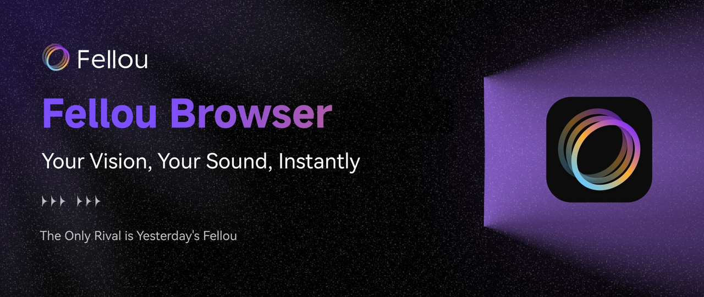
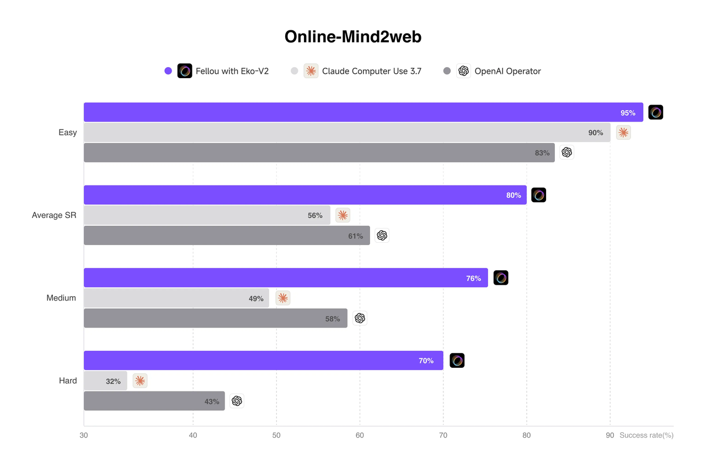
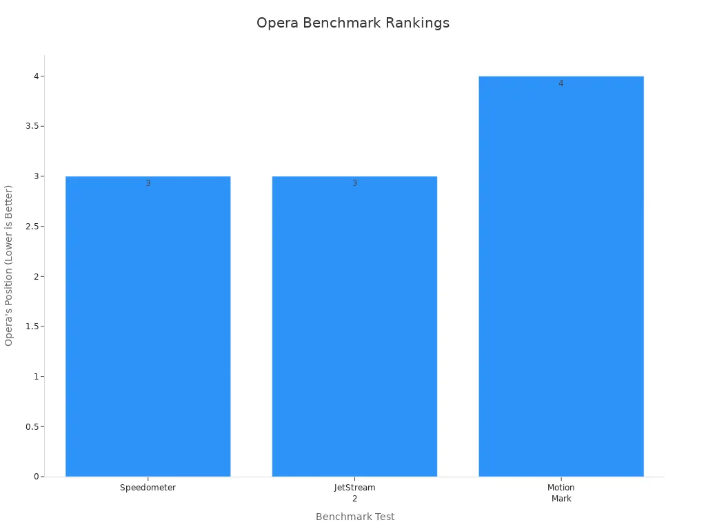
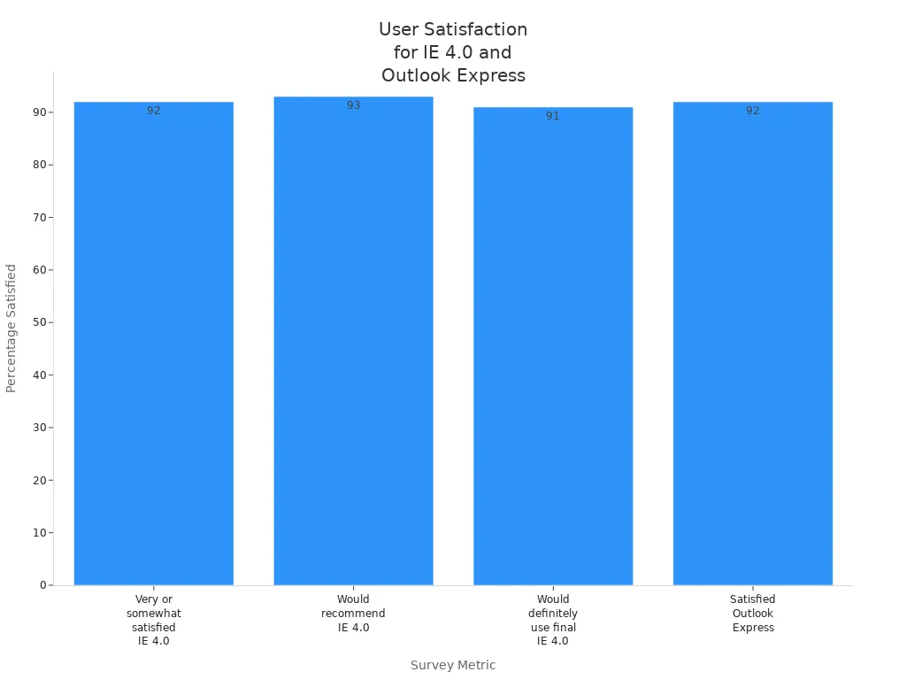

Wondering which window browser works best for your Windows device? The answer depends on what you care about most. You might want a browser that loads pages quickly or keeps your personal info safe. Some people look for strong privacy controls. Others want lots of extensions or easy setup.

> When you pick a window browser, you get to [choose your default browser](https://research.mozilla.org/browser-competition/choicescreen/), not just the one that comes with your computer. You’ll see several options, and the way these choices appear can make you feel more in control. Think about speed, privacy, and features as you decide which browser fits your style.

## Key Takeaways

*   Choose a browser based on what matters most to you, like speed, privacy, or features.
    
*   Try different browsers to find one that feels right and fits your daily needs.
    
*   Browsers like Chrome and Edge offer fast performance and many extensions.
    
*   Firefox and Fellou focus on strong privacy and block trackers by default.
    
*   Fellou lets you customize your browser to match your personal style and workflow.
    

## Window Browser Options

### Quick Comparison

You have many choices when picking a window browser for your Windows device. Each browser brings something special to the table. Here are the top options you will see most often:

*   **Google Chrome**: Popular for speed and a huge library of extensions.
    
*   **Microsoft Edge**: Built into Windows, offers smooth integration and strong performance.
    
*   **Mozilla Firefox**: Known for privacy controls and open-source design.
    
*   **Opera**: Features a built-in VPN and unique sidebar tools.
    
*   **Brave**: Focuses on privacy and blocks ads by default.
    
*   **Vivaldi**: Lets you customize almost everything, from layout to shortcuts.
    

> Tip: You do not have to stick with the browser that came with your computer. Try a few and see which one feels right for you.

Here is a quick table to help you compare these window browser choices:

| Browser | Productivity | Speed | Privacy | Extensions | Customization | Windows Integration |
| --- | --- | --- | --- | --- | --- | --- |
| Fellou | ⭐⭐⭐⭐⭐ | ⭐⭐⭐ | ⭐⭐⭐⭐ | ⭐⭐⭐ | ⭐⭐⭐⭐⭐ | ⭐⭐⭐ |
| Chrome | ⭐⭐ | ⭐⭐⭐⭐ | ⭐⭐ | ⭐⭐⭐⭐⭐ | ⭐⭐ | ⭐⭐ |
| Edge | ⭐⭐ | ⭐⭐⭐⭐ | ⭐⭐⭐ | ⭐⭐⭐⭐ | ⭐⭐ | ⭐⭐⭐⭐⭐ |
| Firefox | ⭐⭐ | ⭐⭐⭐ | ⭐⭐⭐⭐⭐ | ⭐⭐⭐⭐ | ⭐⭐⭐ | ⭐⭐ |
| Opera | ⭐⭐ | ⭐⭐⭐ | ⭐⭐⭐ | ⭐⭐⭐ | ⭐⭐⭐ | ⭐⭐ |
| Brave | ⭐⭐ | ⭐⭐⭐ | ⭐⭐⭐⭐⭐ | ⭐⭐ | ⭐⭐ | ⭐⭐ |

### Feature Highlights

You might wonder what makes each window browser stand out. Chrome gives you fast browsing and lots of add-ons. Edge works well with Windows and has handy tools like Collections. Firefox puts privacy first and lets you block trackers. Opera comes with a free VPN and a sidebar for quick access to apps. Brave blocks ads and trackers automatically. Vivaldi lets you change almost every part of your browser, so you can make it truly yours.

> Note: If you care about privacy, look at browsers like Firefox or Brave. If you want lots of extensions, Chrome is a strong choice. For deep Windows integration, Edge is hard to beat.

## Key Factors

When you pick a window browser for your Windows device, you want to make sure it fits your needs. Let’s break down the [most important things to look for](https://www.corporatevision-news.com/how-to-choose-the-best-browser-for-your-windows-system/). Each factor can make a big difference in your daily browsing experience.

### Speed

Speed matters when you browse the web. You want pages to load fast, videos to play smoothly, and downloads to finish quickly. Some browsers, like Chrome and Edge, are known for their quick performance. If you open many tabs at once, you might notice some browsers slow down more than others. Fast browsers help you get things done without waiting.

> Tip: If you often stream videos or play games online, choose a window browser that handles speed well.

### Security

Security keeps you safe from online threats. A good window browser protects you from harmful websites, phishing scams, and malware. Look for features like automatic updates, warning messages, and built-in protection tools. Microsoft Edge, for example, uses SmartScreen to block dangerous sites. Firefox and Brave also offer strong security settings.

You should always keep your browser updated. Updates fix security holes and add new safety features.

### Privacy

Privacy is about keeping your personal information safe. Some browsers collect more data than others. If you care about privacy, look for browsers that block trackers, stop ads, and let you browse in private mode. Firefox and Brave focus on privacy and give you tools to control what gets shared.

Privacy-focused users want to block trackers and control their data. If this sounds like you, pick a browser with strong privacy controls.

### Compatibility

Compatibility means your browser works well with your Windows device and the websites you visit. Most top browsers support the latest web standards, so you can use your favorite sites without problems. Microsoft Edge is built for Windows and offers the best integration. Chrome and Firefox also work well on most Windows versions.

If you use older software or special web apps, check if your window browser supports them before making a switch.

### Features

Features make your browsing easier and more fun. Some browsers come with built-in tools like ad blockers, VPNs, or reading modes. Others let you add extensions to customize your experience. For example, Chrome has a huge library of add-ons, while Opera includes a free VPN and sidebar apps.

Productivity users often want features like profile separation, syncing across devices, and easy tab management. If you like to personalize your browser, look for one with lots of customization options.

### Resource Use

Resource use means how much RAM and CPU your browser needs. If you have an older computer or open many tabs, you want a browser that runs smoothly without slowing down your device. Some browsers use less memory and power, which helps your computer last longer and run cooler.

Here’s a quick look at [how some top browsers handle resources](https://1gbits.com/blog/which-browsers-use-the-least-memory/):

| Browser | RAM Usage Characteristics | CPU Usage Characteristics | Efficiency Features |
| --- | --- | --- | --- |
| Microsoft Edge | Optimized for Windows; uses less RAM than Chrome | Efficiency Mode reduces CPU consumption | Sleeping Tabs suspend inactive tabs to free RAM |
| Fellou | Low RAM usage due to blocking ads and trackers | Reduced CPU load by blocking resource-heavy scripts | Built-in ad and tracker blockers |
| Firefox | Uses less RAM than Chrome, especially with many tabs | Efficient CPU usage via Gecko engine | Memory management optimizations |
| Opera | Reduces RAM usage with built-in ad blocker | Lowers CPU usage by preventing heavy scripts | Turbo Mode compresses pages; built-in ad blocker |

If you want your window browser to run fast and not slow down your computer, pay attention to how much memory and CPU it uses.

> Note: The right browser for you depends on what you value most. [Privacy-focused users often pick Firefox or Brave](https://gibraltarsolutions.com/blog/web-browsers-and-data-privacy-balancing-enterprise-and-personal-use/). Productivity fans may like Edge or Chrome for their features and syncing. If you want a lightweight browser, look at resource use before deciding.

## Top Browsers

### Fellou

Fellou is different from other browsers because it uses [agentic computing](https://fellou.ai/blog/agentic-browser-fellou-next-evolution-beyond-ai-browsers/). Instead of one AI assistant, Fellou has a [team of AI agents](https://digitaldigest.com/fellou-ai-browser-review/). These agents work together and do many jobs at once. You can keep browsing while the AI works in a hidden workspace called a ”shadow window.” This helps you stay focused and not get distracted. And Fellou is the only AI Browser that can search private sites which requires strict user identity confirmation.

*   You can set up Fellou to handle things like:
    
    *   Researching products and making detailed reports at once
        
    *   Filling out forms across different websites
        
    *   Gathing information, generate posts and post on social medias at once
        
    *   Organizing files and even building websites
        
    *   Create beautiful images and lovely song
        

Fellou’s [Deep Action feature](https://sourceforge.net/software/compare/Augment-AI-Logistics-vs-Fellou/) lets you give simple commands, like “Find the best robot vacuum under $600 and order it.” The browser takes care of every step, from searching to buying. You don’t have to click through each page or copy and paste information. Fellou also lets you create your own agents for special tasks with Eko Agentic framework, and you can share them with your colleagues.

> _Imagine a group of robots in a warehouse. Each one picks up items, packs boxes, and moves things around. They talk to each other so nothing gets missed. Fellou works the same way, but with your online tasks. This teamwork means you get more done in less time._

Fellou uses the [Eko 2.0 framework](https://fellou.ai/blog/post/eko20-launch/), which has achieved SOTA performance on the widely recognized Online-Mind2web benchmark in the industry.

*   Easy Tasks: 95% success rate (vs 80-90% for other products)
    
*   Average Success Rate: 80% success rate (vs 56-61% for other products)
    
*   Medium Complexity: 76% success rate (vs 49-58% for other products)
    
*   Hard Tasks: [70% success rate](https://fellou.ai/blog/eko20-launch/) (vs 32-43% for other products)
    

### Microsoft Edge

If you use Windows, you probably notice Microsoft Edge right away. Edge stands out for its speed and smooth Windows integration. It ranks near the top in speed tests and offers a clean, easy-to-use interface. You get features like vertical tabs, a powerful PDF reader, and [AI tools such as Copilot and Bing Chat](https://www.microsoft.com/en-us/edge). Edge also lets you [keep work and personal browsing separate](https://learn.microsoft.com/en-us/deployedge/microsoft-edge-for-business), syncs your data across devices, and supports Chrome extensions. Security is strong, with SmartScreen and tracking prevention.

| Benchmark Test | Result Summary |
| --- | --- |
| Speedometer | Edge ranks second fastest after Chrome, outperforming other major browsers like Opera, Brave, and Firefox. |
| JetStream 2 | Edge slightly outperforms Chrome, confirming its fast performance as a Chromium-based browser. |

> Tip: Edge works best if you want a window browser that feels like part of Windows and helps you stay organized.

### Google Chrome

Chrome is the most popular window browser for a reason. It loads pages quickly, handles lots of tabs, and has a simple design. Chrome’s extension library is huge, so you can add tools for almost anything. You can sync bookmarks and settings across devices, and Chrome works well with Google services like Gmail and Drive.

| Advantages | Disadvantages |
| --- | --- |
| Fast browsing, easy interface, strong security, huge extension library, sync across devices | High RAM use, privacy concerns, tabs close without warning, less history control |

> Chrome is a great pick if you want speed, lots of add-ons, and use Google tools every day.

### Mozilla Firefox

Firefox puts privacy first. It blocks trackers, isolates cookies, and encrypts your DNS requests. You get features like [Enhanced Tracking Protection](https://support.mozilla.org/en-US/kb/firefox-privacy-and-security-features), Containers for separating activities, and a private browsing mode. Firefox also alerts you about data breaches and forces secure connections.

| Privacy Feature | Description |
| --- | --- |
| Enhanced Tracking Protection | Blocks known trackers and third-party cookies. |
| Total Cookie Protection | Isolates cookies by website. |
| DNS over HTTPS | Encrypts DNS requests. |
| Containers | Separates browsing activities into isolated tabs. |

> Choose Firefox if you care about privacy and want control over your online data.

### Opera

Opera brings lots of built-in tools. You get a [free VPN, ad blocker, sidebar messengers](https://www.opera.com/features), and even a music player. Opera’s workspaces and tab islands help you organize tabs. It runs fast and saves battery on laptops. Opera GX is a special version for gamers.

> Opera fits you if you want a feature-packed browser with privacy tools and multitasking options.

### Brave

[Brave blocks ads and trackers by default](https://www.cloudwards.net/brave-review/). It upgrades connections to HTTPS and protects against fingerprinting. You can earn rewards for viewing privacy-respecting ads. Brave supports Chrome extensions and syncs data securely. It is fast, but not the fastest, and may use more resources on older PCs.

| Privacy Feature | Brave Browser (Default) | Microsoft Edge (Default) |
| --- | --- | --- |
| Blocks third-party ads | Yes | No |
| Blocks cross-site trackers | Yes | No |
| Blocks third-party cookies | Yes | No |
| Protects against fingerprinting | Yes | No |
| Auto-upgrades to HTTPS | Yes | No |

> Brave is for you if privacy is your top concern and you want a browser that blocks most trackers out of the box.

## Best Choice for You

Choosing the right window browser depends on what you want most. Let’s match the top browsers to your needs so you can find your perfect fit.

### Privacy

If you care about privacy, you want a browser that blocks trackers and keeps your data safe. Firefox and Brave both focus on privacy. They block ads and trackers by default and give you strong control over your information. You can browse in private mode and feel more secure online. If privacy is your top concern, start with one of these browsers.

### Speed

Do you want the fastest browsing experience? Chrome and Microsoft Edge lead the pack. Recent speed tests show [Chrome as the fastest window browser for Windows](https://www.cloudwards.net/fastest-browser/), with Edge just behind. Both handle lots of tabs and heavy websites with ease. If you stream videos, play games, or just hate waiting, try Chrome first. You’ll notice quick page loads and smooth performance.

### Productivity

You might need a browser that helps you stay organized and get things done. Edge offers features like vertical tabs, Collections, and deep Windows integration. Chrome also supports many productivity extensions and syncs across devices. If you switch between work and personal tasks, these browsers make it easy to keep everything in order.

### Customization

Love to make your browser your own? [Vivaldi stands out here](https://gridfiti.com/aesthetic-browsers/). You can change colors, move toolbars, and set up your workspace just how you like it. Vivaldi gives you more control than any other browser, letting you adjust almost every part of your browsing experience.

> Tip: If you want a browser that feels unique, Vivaldi is the best place to start.

### Everyday Use

For daily browsing, you want something reliable and easy to use. Many users have praised Microsoft browsers for their simple design and smooth experience. Take a look at this chart showing [high satisfaction with Internet Explorer 4.0](https://news.microsoft.com/source/1997/10/16/microsoft-internet-explorer-4-0-user-satisfaction-high-as-demand-continues/):

You might find that trying a few browsers helps you discover which one feels best for your everyday needs. Each browser has its own strengths, so don’t be afraid to experiment until you find your favorite.

Choosing the right browser is all about what works best for you. Think about your needs—speed, privacy, or cool features. Try out a few browsers to see which one feels right. You might like one today and switch later as new updates come out. Technology keeps changing, so your favorite browser might change too.

> Tip: Make a list of what matters most to you, then test browsers that match your style.

## FAQ

### What is the easiest way to change my default browser on Windows?

You can open the Windows Settings app, go to "Apps," then "Default apps." Find your favorite browser in the list. Click it and set it as your default. Now, links will open in your chosen browser.

### How do I import my bookmarks from another browser?

Most browsers have an "Import" tool. Open your new browser, look for "Bookmarks" or "Favorites," then choose "Import." Pick your old browser from the list. Your bookmarks will move over in seconds.

### Can I use more than one browser on my computer?

Yes! You can install and use as many browsers as you want. Try different ones for work, school, or fun. Switching between browsers is easy. Just click the icon for the one you want to use.

### Which browser is best for low-end or older PCs?

Browsers like Brave and Firefox use less memory. They run smoothly on older computers. You can also try Opera, which has features to save resources. Test a few to see which one feels fastest on your device.

### Do I need to update my browser manually?

Most browsers update themselves automatically. You can check for updates in the browser’s settings menu. Keeping your browser up to date helps protect you from security risks and gives you the newest features.